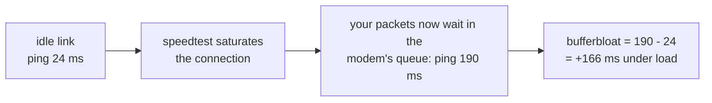
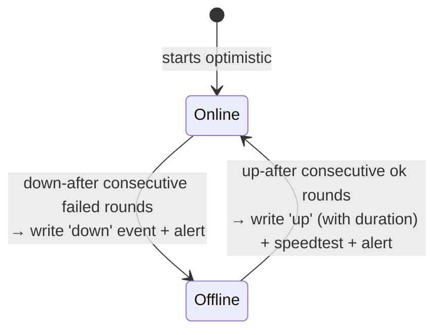
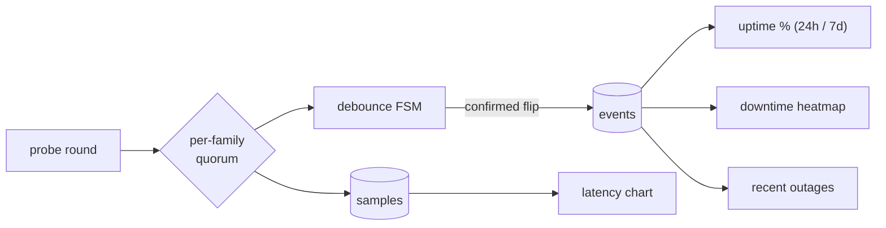

# Pingularity

**[pingularity.dev](https://pingularity.dev)** · **[Live demo](https://demo.pingularity.dev)** · **[Install](https://install.pingularity.dev)** · **[Docs](https://docs.pingularity.dev)**

Pingularity watches your internet connection and shows you what it is
doing: when it went down and for how long, how fast it is at 3pm versus 3am,
how your latency and DNS behave through the day, and where your traffic leaves
your provider's network. It runs on your own machine as a single program with
a dashboard in your browser. Every reading stays in a local database - no
account, no cloud, no telemetry.


*A real install. The [live demo](https://demo.pingularity.dev) is the same dashboard on made-up data.*

## Contents

- [What it does](#what-it-does)
- [Install](#install)
- [First run](#first-run)
- [The dashboard](#the-dashboard)
- [Speed tests](#speed-tests)
- [Alerts and notifications](#alerts-and-notifications)
- [Settings](#settings)
- [Running it as a service](#running-it-as-a-service)
- [Your data](#your-data)
- [Updating](#updating)
- [Privacy: who it talks to](#privacy-who-it-talks-to)
- [Prometheus, the API and the command line](#prometheus-the-api-and-the-command-line)
- [How it works](#how-it-works)
- [Documentation](#documentation)
- [Help](#help)

## What it does

- **Outages.** Every few seconds it opens a connection to
  several always-on internet landmarks at once. It only calls an outage when
  most of them stop answering, and only after a few rounds in a row, so a
  single lost packet is never mistaken for the internet going down. Every real
  outage lands on a calendar heatmap, timed to the second, with uptime figures
  worked out from what was actually observed.
- **Speed tests.** Download, upload, ping, jitter, packet
  loss and bufferbloat, tracked over time against your plan. Uses Ookla's
  servers (the same ones as speedtest.net) or your own iperf3 box, on a
  schedule or when you press Run.
- **Latency and DNS.** Round-trip time to the landmarks, plus
  how long your DNS resolver takes to answer, sampled every few seconds and
  kept for a month.
- **Your connection.** Your public IP, your ISP and where it sits, the
  DNS resolver actually answering you (not just the one you configured), and
  the path your traffic takes out of your provider's network, hop by hop.
- **Alerts.** A webhook for Discord, Slack, ntfy, Gotify and anything
  Apprise can reach; a heartbeat for an external watchdog; a daily or weekly
  summary if you want one.
- **Prometheus and an API.** A Prometheus `/metrics` endpoint
  with a ready-made Grafana dashboard and alert rules, a JSON API for
  everything the dashboard does, CSV and full-database export.
- **Private by default.** Every install answers only the machine it
  runs on until you turn network access on and set a password. Nine themes,
  keyboard and screen-reader friendly, and one file to install.

## Install

Go to **[install.pingularity.dev](https://install.pingularity.dev)**. Pick
your platform and it gives you the exact download and the exact commands -
Linux packages (Debian, Ubuntu, Fedora, RHEL, openSUSE), a plain binary,
Homebrew on macOS, a one-line winget install on Windows, and Docker with or
without compose, for amd64 and arm64. The same page covers updating and
uninstalling.

**Requirements.** Linux with systemd, macOS 13 Ventura or newer, or Windows
10 or newer. No runtime, no database server, nothing else to install. The
optional iperf3 engine needs the `iperf3` program on the machine.

### Docker

Run it with `--network=host` so the readings
describe *your machine's* connection rather than the container's own
network (that also puts the dashboard on the host's port 9000 without
publishing a port), and `--cap-add=NET_RAW` so the Exit panel can trace the route out of
your ISP - the container won't start without it. Keep your history in a named
volume so updates carry it across. Docker Desktop on a Mac or PC runs
containers inside a VM, so it measures the VM's connection and caps fast
links; install natively there instead. The default image deliberately ships
without iperf3 - use the `-iperf` image if you want that engine. Bind mounts,
Kubernetes, health checks and read-only root filesystems are all in
[docs/install.md](docs/install.md#docker).

Forgot the password in a container? `pingularity reset-auth` needs the
database, and in a container that means the volume, so run it from a one-off
container that shares it, then restart the running one (it caches settings in
memory). Use the tag your container runs, so the one-off binary matches the
database it opens:

```bash
docker run --rm --entrypoint /pingularity \
  -v pingularity-data:/var/lib/pingularity \
  ghcr.io/pingular/pingularity:<tag> \
  reset-auth -db /var/lib/pingularity/pingularity.db
docker restart pingularity
```

### Build from source

Pure Go, no C compiler needed:

```bash
go build -o pingularity .   # requires Go 1.27.0+ (go.mod); pure Go, no cgo
./pingularity               # dashboard on http://localhost:9000
```

`./pingularity` runs it in the foreground. To make your build a service that
starts with the machine, copy it somewhere permanent and run
`sudo pingularity install` - see [Running it as a service](#running-it-as-a-service).

## First run

Open **http://localhost:9000**. A new install measures nothing until you
answer **Quick Setup**: how often to run speed tests (each choice shows what it
costs in data per month), whether other devices may reach the dashboard, a
theme, and whether to check for updates once a day. Press **Start
monitoring** to save your answers, or close the dialog to keep every default.
If nobody answers, monitoring starts on its own after 48 hours; a headless install can
skip the dialog with `-quick-setup=skip`. If you picked a speed-test pace, the
first test runs about ten seconds after you start, once the connection lookup
has found the servers nearest you.

From then on it checks the connection every 5 seconds, over IPv4 and IPv6
separately. IPv6 is detected automatically and skipped on a network without
it, and the two are judged on their own, so an IPv6-only problem shows up in
the status dots without the whole connection being reported down.

**Reaching it from other devices.** Every install starts private: the
dashboard answers only the machine it runs on, and anything else on your
network gets a `403` - containers included; a published port is not enough. To
allow it, click the logo (top right) to open the settings drawer, go to the
**Access** tab, turn on **Network access**, set a password, and Save. The tab
shows the address to use from your other devices. A container can opt in at
start with `-e PINGULARITY_ACCESS=network`; a native install can start with
`-access network`. Either way, set the password at the same time.

## The dashboard

### The top bar

Live status at a glance: a dot per address family (IPv4, IPv6) for latency
and one for DNS, how long the daemon has been running, uptime over the last
24 hours and 7 days, and how much data speed tests have used (click it for a
breakdown by day, week and month). The dots are the theme's accent colour at
full strength when things are healthy and fade as latency climbs or DNS
struggles, so the bar only draws attention when something is wrong. The data figure
counts every byte a test moved, including tests that failed partway or that
you cancelled, since they still used the traffic, but not protocol overhead,
so on a metered link treat it as a minimum.

### Connection

Your public IPv4 and IPv6 address with its reverse name, your ISP and where it
sits, and the DNS resolver that is actually answering you - the provider and
its location, which is often not the one you configured. Then the **internet
exit**: the router where your traffic leaves your ISP's network and the one it
hands off to, found by a built-in traceroute that walks hop by hop to the
edge of your provider's network, with each hop's latency and city, and the
Cloudflare site that serves you. A refresh button (top right of the panel)
re-runs all of it; on its own it refreshes hourly and after a reconnect. If
IPv4 disappears for a quarter of an hour while IPv6 keeps working, the panel
switches to describing the IPv6 side until IPv4 comes back. On Linux the
traceroute needs a privilege the packages and the Docker image grant; run as
an ordinary user it is simply left out.

### Speed

Tiles for download, upload, ping, jitter, packet loss and bufferbloat in each
direction, above three stacked charts: speed against your plan's threshold
lines, a ping-and-jitter band, and bufferbloat. Choose a window of a day, a
week, a month or a year, a custom duration, or type a date range in plain
words - `jul 1 to jul 8`, `2026-07-01 to 2026-07-08`, `since jul 1`,
`yesterday`, `2026`, `9am to 5pm`, `3d ago to now` - and it echoes back the
span it understood. An end date includes the whole day. While a fixed range is
pinned the tiles follow it rather than the newest run, and **Live** returns to
the rolling window. Below the charts, an expandable table lists every run with
the server it used, why that server was chosen, a health badge against your
thresholds, and a CSV export; hover a point on any chart for the exact figure.


### Latency

The lowest round-trip across the landmarks over time, with a separate line for
DNS, over 5 minutes to 7 days or any range you type. The DNS line times a
lookup through the machine's own resolver each round - a random made-up name,
so no cache can answer it, which times the real path your apps use. A gap in
the DNS line means "online, but DNS was failing"; on the wider windows a
point averages many lookups and only the ones that succeeded count. Red bands
mark rounds that failed their checks - including blips too short to count as
an outage, since they come from the raw samples rather than the outage log.
Click a landmark's pill under the chart to see just that one.

### Downtime and outages

A year of days, GitHub style, each shaded by **how many** outages it had - not
how long they lasted, so one long outage and one one-second blip shade the
same, and three blips shade darker than either. Hover a day for the real
figures: how long the connection was down and how much of that day was
actually watched. Below it, the outage log: each outage with when it started
and how long it lasted, and a delete button for an outage you don't want counted,
such as planned maintenance. Deleting one removes it from the log, the heatmap
and the uptime figures together. Durations are *observed* time: a stretch
where monitoring was paused, the machine was asleep, or a schedule had it off
is not counted, so a row can be shorter than the wall-clock time
it spans.


What exactly each figure counts and what it leaves out is in [docs/dashboard.md](docs/dashboard.md), and the
[docs site](https://docs.pingularity.dev) walks through each one.

## Speed tests

### What a run records

Download, upload, ping, jitter, packet loss where it could be measured, and
bufferbloat in each direction, plus the bytes the run used, the connection it
ran on (public IP, ISP, resolver), which address family it actually used
(IPv4, IPv6, or both), and which server it tested against and why. A figure
that couldn't be measured is stored as missing, not as zero, so a chart can
tell "not measured" from "measured, and it was bad". A run that failed
outright is not a measurement at all: it is kept only so its bytes count
toward the data-used figure, and never appears in a chart, table or average.

The **ping** on the tile is the engine's own number - a mean over ten samples,
so it matches what speedtest.net would say. One stalled sample can inflate a
mean badly, though, so everything that *decides* on latency - which server
wins a race, whether your ping threshold was breached - uses the fastest of
those same samples instead. One slow sample should not choose your server or
send an alert; a genuinely slow link is slow in every sample, and still
breaches.

### Bufferbloat

Bufferbloat is the extra lag that appears only while the line is busy - the
reason a video call breaks up the moment a big download starts. Your packets
are waiting in a queue in the modem behind the download's. Pingularity
measures it by pinging a fixed target before the test (idle) and again during
each direction of the transfer (loaded); the headline number is the
difference between the two medians.



The chart also plots a 95th-percentile figure per direction, the sustained worst
case. It is not the maximum: a single worst sample is usually a
retransmission, which says more about packet loss than about buffering. The
idle figure is measured against a fixed target of its own, so it won't match
the ping tile - only the gap between idle and loaded is meaningful.

### Two engines

- **Ookla** (speedtest.net) - the default. Same servers and same numbers as
  speedtest.net, nothing to set up. Its knobs: how many parallel connections
  to use (auto sizes it from your CPU count; worth raising on a fast or
  far-away link) and a short packet-loss probe.
- **iperf3** - for testing against your *own* server: a box on your LAN, a
  homelab, or a small VPS. It measures what Ookla can't, like an internal link,
  or an upload measured against a server you control. It needs the
  `iperf3` program on the machine (a Homebrew, MacPorts or Linuxbrew one is
  found), or the `-iperf` Docker image, and otherwise falls back to Ookla. Its
  knobs: streams, duration, warm-up, TCP window, and per server the IP
  version, a source address to bind, and optional RSA authentication. The
  loss-and-jitter pass uses UDP on the same port as the test, so open that
  port for **UDP as well as TCP** on the server; otherwise throughput is
  reported but loss and jitter never are. Setting up a server of your
  own on a small VPS is a [docs page of its own](https://docs.pingularity.dev/iperf3/).

Each engine keeps its own **direction** (both, download only, upload only)
and **retries**, so tuning one never disturbs the other.

### When tests run

Scheduled tests are off until you turn them on (Quick Setup asks). Once on, a
test runs at the interval you choose - hourly by default - and:

- **after a reconnect**, once the connection comes back from an outage (on by
  default; spaced out so a flapping line can't fire tests back to back);
- **while degraded**, optionally, when latency stays high for two rounds in a
  row without the link actually dropping (off by default);
- **more often while failing**, optionally: while the last run breaches an
  alert threshold, the interval drops to a quarter of what you set, between
  one and five minutes, until a run passes.

Tests can be confined to a weekly **schedule**, and scheduled ones can be
**skipped while the link is busy** (traffic above a rate you set). Only one
test runs at a time: a scheduled slot that comes due while another test is
running is skipped, not run late; a slot held back by a closed schedule window
or a busy link waits and fires as soon as it can. **Run** always works.

### Which server

Leave it on **Auto** and each run works out where you are - from your ISP's
exit router, your IP's location, any servers you have starred, the city that
won last time, and where speedtest.net places you - and races the nearest
servers from each of those places, pinging one of each provider rather than an
arbitrary few. The fastest wins. Two things keep your history comparable: the
run keeps the server it used last time as long as its ping is still close to
the fastest, so equivalent servers don't alternate; and your own ISP's
server, when Ookla lists one, is always in the race, since traffic to it never
leaves your provider's network. A server that pings well but can no longer
move data is caught by a fallback that takes over the moment it fails. Ping
alone can't tell which server *transfers* fastest, so every twelfth automatic
run measures the strongest rival instead, and the rival takes the seat only if
it clearly beats the incumbent's own recent record. Each run records which
server it used and why, and the runs table shows it.

Or **pin** one server, or **star** a few favourites. **Best of** measures
several servers per test - your pin, then your stars, then the fastest of the
rest - and keeps the best result, for when one server is slow that day.
"Best" is a score that weighs download and upload relative to each other and
discounts ping, so a server that measured a fifth of your real upload can't
hide behind a big download number. It costs that many times the data and
time, so only the runs on your interval and the Run button use it; the quick
automatic tests always measure one server.

The full detail - every recorded field, the exact rules, and running iperf3
inside a container - is in
[docs/speedtests.md](docs/speedtests.md).

## Alerts and notifications

**Thresholds** (Alerts tab): a minimum download and upload, and a maximum
ping, jitter, packet loss and bufferbloat per direction. Each run is marked
healthy or not against the values in force when it ran, and the runs table
says which threshold it failed. **Breaches in a row** (1 to 10) decides how
many failing runs it takes before you're told; it defaults to 1; raise it if
one bad run should not trigger an alert.

**Webhook.** One URL, and the message is shaped for the receiver:

| Target | Set the webhook URL to | Notes |
|---|---|---|
| **Discord / Slack** | the channel's incoming-webhook URL | shaped automatically |
| **ntfy** | `https://ntfy.sh/your-topic` (or self-hosted) | title, priority and an emoji tag; for your own ntfy domain choose **Webhook format: ntfy** |
| **Gotify** | `https://gotify.example/message?token=APP_TOKEN` | uses title / message / priority |
| **Apprise** (email, Telegram, Pushover, and 100+ more) | `http://apprise:8000/notify/your-key` | run the Apprise API server and point at a key |

Any other receiver gets a JSON body with the text, a title, a type and a
priority. You get a message when the connection goes down and when it comes
back (with how long it was out), when a speed test breaches a threshold, and -
if you turn it on - a **daily or weekly summary** of uptime, typical speeds and
outages that says how much of the period was actually watched. A **Test**
button sends a sample. Receivers on your own LAN are fine.

**Heartbeat.** A URL Pingularity fetches every minute while monitoring is on,
for a watchdog like Healthchecks.io or Uptime Kuma. That covers the case a
webhook cannot: Pingularity itself, or the whole machine, stopping. It
follows the power button only - it keeps ticking through a closed schedule
window - so a green watchdog means "the process is alive", not "the link is
being measured".

## Settings

The logo (top right) opens a tabbed drawer. Changes apply live - no restart -
and persist across restarts. Beside the tabs, a **power** button pauses and
resumes all monitoring.

![The settings drawer, open on its Ookla tab: a row of tabs (Speedtest, Ookla, iperf3, Latency, Schedule, Data, Alerts, Access, Appearance, About) above the per-test knobs - Best of, Discard losers, Retries, Packet-loss probe, Direction and Parallel connections, each with a hover-help dot; below them the Saved pane with Auto selected, a Find box that takes a place or an Ookla server ID, and the server list with ID, ping and distance columns and a star on each row; Save and Discard sit at the bottom left, Reset to defaults and Reset tiles at the bottom right](https://raw.githubusercontent.com/pingular/pingularity/main/docs/settings-ookla.png)

- **Speedtest** - the engine, how often to test, the extra triggers above,
  and a live estimate of the data your schedule will use per day and month,
  based on what your recent runs actually moved.
- **Ookla** - the server picker: Auto, a pinned server, stars, **Find** by
  place or Ookla ID with live pings; plus direction, retries, parallel
  connections, the packet-loss probe, Best of, and **Discard losers** (keep
  only the winner of a Best-of round, or every server's result as a row of its
  own).
- **iperf3** - the same layout for your own servers: address, IP version,
  bind address and authentication per server, with a status light that checks
  each one; plus streams, duration, warm-up, window and the loss/jitter pass.
- **Latency** - how often to probe and how long to wait for an answer, how
  many failed rounds make an outage and how many good ones end it, IPv6 on,
  off or automatic, the DNS probe, the connection lookups, and the target the
  exit trace heads toward.
- **Schedule** - confine latency probing and speed tests to certain days and
  hours, each with its own list of windows (a window can wrap past midnight),
  presets for weekdays, weekends and 24/7, and a week-at-a-glance strip. Off
  means around the clock.
- **Data** - how long to keep each kind of history: latency samples 30 days,
  speed runs and outages a year by default, `0` keeps forever. Export and
  import (below), and a delete button per category.
- **Alerts** - thresholds and notifications, above.
- **Access** - network access, the login, and the addresses that reach the
  dashboard. With **Require login** on, browsers get a login page and a
  30-day session, and scripts and Prometheus use the same username and
  password over HTTP Basic. Signing out signs out every browser, so a lost
  laptop can be signed out from anywhere; failed logins are logged with their address and
  rate-limited. Once a login is on, changing anything on this tab needs the
  current password, so someone at an unlocked browser cannot change them.
  Local-only cannot block a reverse proxy on the same machine (cloudflared,
  nginx), because it delivers visitors as local connections, so put a login
  on any proxied install.
- **Appearance** - nine themes, flat or round corners, a full-width layout,
  brightness and fade, and every colour recolourable: the UI's building
  blocks, the top bar's dots and power button, and each chart's series, line
  thickness, fill, grid and labels. All preview live and apply on Save.
- **About** - the version, the daily update check, and the log viewer: turn
  logging on, read it, copy or download it, clear it. Personal details (your
  addresses, names) are masked in the viewer by default; the download honours
  that, `journalctl` and `docker logs` don't, so share the viewer's download.


Most settings can also be given as flags on the command line (`-interval`,
`-speedtest-interval`, `-retain`, …) to seed a fresh install; the drawer
overrides them once you change something. The [flags reference](docs/cli.md)
lists them all.

## Running it as a service

The Linux packages and the Windows installer register the service for you.
For a Homebrew install, a plain binary, or one you built yourself:

```bash
sudo cp pingularity /usr/local/bin/
sudo pingularity install     # registers and starts it (systemd, launchd, or the Windows service manager)
pingularity status           # running | stopped | not installed
sudo pingularity restart     # after an upgrade, to switch to the new binary
sudo pingularity uninstall   # removes the service; your data stays
```

Flags you pass to `install` are kept with the service: `sudo pingularity
install -listen :8080` keeps the dashboard on port 8080. On Linux you
can also put flags in `/etc/default/pingularity` (`PINGULARITY_OPTS="-listen
:8080"`) and restart. Running `install` over a service that already exists
doesn't reinstall it - it tells you to `restart` instead; to change the flags
on macOS or Windows, `uninstall` and `install` again. On Linux and macOS,
`sudo systemctl reload pingularity` (or a `HUP` signal) makes a running daemon
re-read its settings without restarting; Windows has no reload, so restart the
service there. On macOS, `status` needs `sudo` like the other commands,
because launchd only shows system services to root.

Where the database goes depends on who runs it: the service runs as root and
uses the system location in the table below; run by hand as a normal user, it
uses your own profile. Windows always uses the machine-wide location, so the
service and an admin prompt see the same database. The Linux package's
service is sandboxed: it can write only inside
`/var/lib/pingularity` and can't bind a port below 1024 - so keep the database
there and the dashboard on a high port, or put a reverse proxy in front.

## Your data

Everything lives in one SQLite file, with a small key file beside it:

| | Where |
|---|---|
| Linux (package or service) | `/var/lib/pingularity/pingularity.db` |
| macOS (service) | `/Library/Application Support/pingularity/pingularity.db` |
| Windows | `%ProgramData%\pingularity\pingularity.db` |
| Docker | the `pingularity-data` volume |
| run by hand, as a normal user | `~/.config/pingularity/` on Linux, `~/Library/Application Support/pingularity/` on macOS |

**The key file** (`pingularity.key`) encrypts the one secret that has to stay
readable: each saved iperf3 server's password, which iperf3 needs in the clear
at test time. Your dashboard password is hashed and needs no key. Lose the key
and you re-enter those passwords; a fresh key is made at the next start, and
every signed-in browser is signed out, because session cookies are signed from
the same file, so a copy of the database on its own cannot mint a login. Back the key up with the database.

**Backups.** The Data tab's **Export** writes a JSON file with any mix of
settings, latency history, speed runs and outages; **Import** restores it -
history is merged (nothing you already have is overwritten), settings are
replaced and applied live. It never contains passwords, but it does carry your
webhook and heartbeat URLs, which are as good as passwords for those services,
so treat the file as a secret. Restoring onto a machine with no password
leaves login off and closes network access until you set one; restoring onto
another machine keeps that machine's own "monitoring since" date, so its
uptime never claims time it didn't watch; an older release refuses a backup it
can't fully read rather than restoring half of it. For a very large backup,
copy the database file by hand instead, with the service stopped - a copy
taken while it runs misses the recent rows in the `-wal` sidecar - and copy
the key file with it.

**Forgot the password?** Run `pingularity reset-auth` on the host to clear it
and disable auth, then reload or restart the service, which caches settings in
memory. In Docker, run it from a one-off container sharing the volume to clear
it and disable auth, then restart the container - the exact command is in the
[Docker section](#docker) above.

**A damaged database** - usually a hard power-off mid-write - stops the daemon
rather than being silently replaced, and the message names the file and the
`sqlite3 .recover` command that gets the data back. Under a service manager
that means restarting until you act, which is deliberate: a refusal can be
undone, a replacement can't. If you'd rather an unattended box kept
monitoring, start with `-on-corrupt rebuild`: the old file is set aside with a
timestamp, never deleted, and monitoring carries on with a fresh database -
blank, with every setting back at its default. Because the password went with
the old file, a rebuilt install stays local-only until you set a new one from
the machine itself.

The full detail - symlinked databases, restore edge cases, recovery step by
step - is in [docs/install.md](docs/install.md#run-in-the-background-systemd--launchd--windows-service).

## Updating

- **apt / dnf** - download the newer `.deb`/`.rpm` and reinstall it the same way
  (`sudo apt install ./pingularity_*.deb` / `sudo dnf install ./pingularity_*.rpm`);
  your data and env file are preserved, and the running service is restarted
  onto the new binary automatically. If it does not come back, the install says
  so and points you at `systemctl status pingularity`; apt and dnf themselves
  report a clean success either way.
- **Homebrew** - `brew upgrade pingularity`, then `sudo pingularity restart`.
- **winget** - re-run the one-shot
  (`irm https://install.pingularity.dev/winget.ps1 | iex`); it stops the
  service, upgrades, and starts it again.
- **Docker** - `docker pull ghcr.io/pingular/pingularity`, then `docker rm -f
  pingularity` and re-run it (the named volume carries your data across).
- **tarball** - copy the new file alongside the old one and rename it over,
  then `sudo pingularity restart`. (Linux won't let you overwrite a program
  that is running, and macOS refuses to launch one that was.)

The dashboard shows a badge when a newer release exists - a daily poll of a
feed the maintainer publishes, sending no identifiers. It only tells you; it
never changes your install. Coming from 0.61 or earlier, or rolling back to an
older release? Read [Updating](docs/install.md#updating) first; some of those steps
cannot be undone.

## Privacy: who it talks to

Nothing is ever *pushed* anywhere you didn't configure yourself, and every
service it picks for you is keyless public infrastructure - no account, no
token, no identifier of yours beyond the IP address any connection carries.
What goes out:

- **The connectivity checks themselves** - a bare connection to `1.1.1.1`,
  `8.8.8.8` and `9.9.9.9` (IPv4 and IPv6) and one throwaway DNS lookup through
  your own resolver, every few seconds. No payload.
- **The connection lookups** - hourly, and after a reconnect: "what's my IP"
  (ipify), who owns it and where it is (ipwho.is or geojs, Team Cymru, RIPE
  IPmap), the traceroute toward `1.1.1.1`, reverse DNS for the routers it
  finds, and one fetch to Cloudflare to learn which of its sites serves you.
  These are the requests that carry your public IP, because that is what they
  look up.
- **Speed tests** - to Ookla's servers, or your own iperf3 box; a city you
  type into the server picker goes to OpenStreetMap's geocoder.
- **The update check** - one fetch a day to `update.pingularity.dev` with no
  identifiers, if you leave it on.
- **Your webhook and heartbeat**, if you set them.

Turn off speed tests, the update check, or the connection lookups (Latency
tab) and those rows stop. Speed tests honour `HTTP_PROXY`/`HTTPS_PROXY`; the
webhook, heartbeat and update check deliberately dial direct. The full table -
every service, exactly what it receives and when - is in
[docs/dashboard.md](docs/dashboard.md), and the security model (what it
trusts, and how to put it behind a proxy safely) in
[docs/security-model.md](docs/security-model.md).

## Prometheus, the API and the command line

- **`/metrics`** - the current link state, latency histograms, the last speed
  test's figures, outage counters, speed-test failures by stage, and worker
  health - enough to alert on a wedged prober, a failing schedule, or a link
  that is up but slow. It sits behind the same access rules as the dashboard,
  with an optional read-only token (`-metrics-token`) for scrapers. `/healthz`
  and `/readyz` sit beside it and answer before the access guard, so a
  container probe needs no credentials. Worked alert rules and an importable
  Grafana dashboard ship with it. → [docs/metrics.md](docs/metrics.md)
- **The JSON API** - everything the dashboard does, it does over this API, so
  anything you can click you can script: status, history, runs, settings,
  exports, running a test. → [docs/api.md](docs/api.md)
- **The command line** - `pingularity run` with flags for the port and access
  mode, the database path, probe timing and sensitivity, speed-test scheduling
  and retention; `install`, `start`, `stop`, `restart`, `status` and
  `uninstall` for the service; `reset-auth`, `healthz` and `version`. →
  [docs/cli.md](docs/cli.md)

## How it works

Every few seconds the daemon opens a connection to several independent
internet landmarks at once - `1.1.1.1`, `8.8.8.8` and `9.9.9.9`, over IPv4
and IPv6 as two separate votes. A family counts as up while most of its
landmarks answer, and the connection counts as up while either family is. A
change has to hold for a few rounds in a row before it is believed - that is
what keeps one dropped packet, or one flaky landmark, from becoming a false
outage.



Each round writes the raw latency samples, and only a confirmed change writes
an outage event. The latency chart reads the samples; uptime, the heatmap and
the outage log all read the events - which is why they always agree with each
other, and why a probe success rate is not what uptime means here.



Inside, one static binary runs a handful of independent loops that share a
SQLite database and a live settings store: the prober and the outage state
machine, the speed-test scheduler, the connection lookups, the notifier, and
the web server that serves the dashboard, the API and `/metrics`. Every
request passes an access guard before anything else runs: a check that the
`Host` header is one it should answer (DNS-rebinding protection), then the
local-only filter, judged on the real connection rather than any forwarded
header, then the login. The database is tuned for a process that writes every
few seconds around the clock and is read by a dashboard at the same time; the
UI, its font and its icon are embedded, so the whole thing is one file with no
runtime and no CDN.

The package map, the database tables and the reasoning behind each default
are in [docs/architecture.md](docs/architecture.md).

## Documentation

- **[docs.pingularity.dev](https://docs.pingularity.dev)** - the manual: every
  panel and every setting, in plain language.
- [docs/install.md](docs/install.md) - installs in depth, Docker and
  Kubernetes, updating and rolling back, the service, backups, and damaged
  databases.
- [docs/speedtests.md](docs/speedtests.md) - what a run measures, the two
  engines, scheduling, how a server is chosen, iperf3 in a container.
- [docs/dashboard.md](docs/dashboard.md) - each panel and settings tab in
  detail, every outside service the daemon talks to, proxies, notification
  recipes.
- [docs/architecture.md](docs/architecture.md) - how it works and why.
- [docs/cli.md](docs/cli.md) · [docs/api.md](docs/api.md) ·
  [docs/metrics.md](docs/metrics.md) · [docs/security-model.md](docs/security-model.md)
- [CHANGELOG.md](CHANGELOG.md) - what each release changed.

## Help

Found a bug or want something added? [Open an issue](https://github.com/pingular/pingularity/issues) -
a screenshot and a log download from the **About** tab make it quick to
reproduce. Security reports: see [SECURITY.md](SECURITY.md).

MIT licensed - see [LICENSE](LICENSE).
