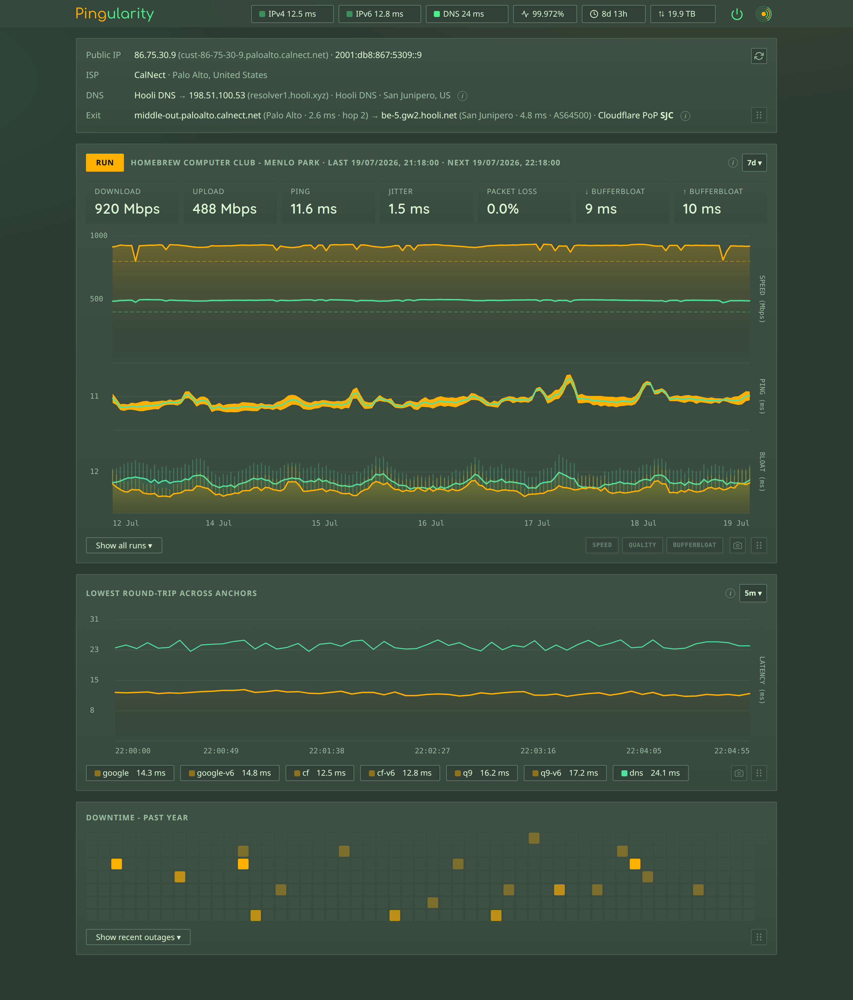
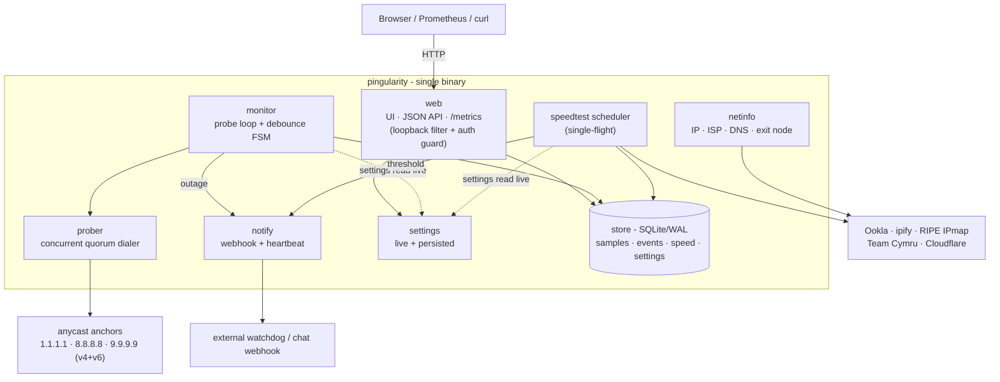
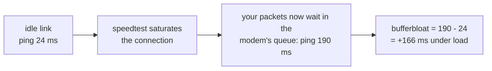
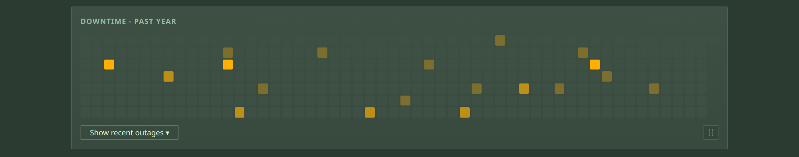
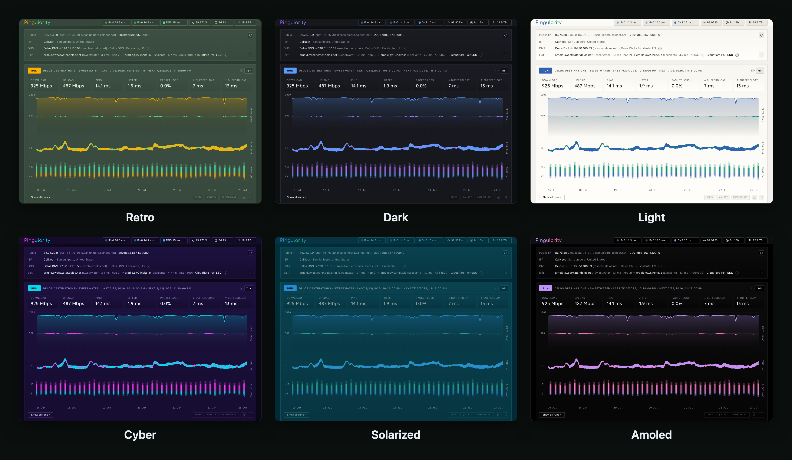
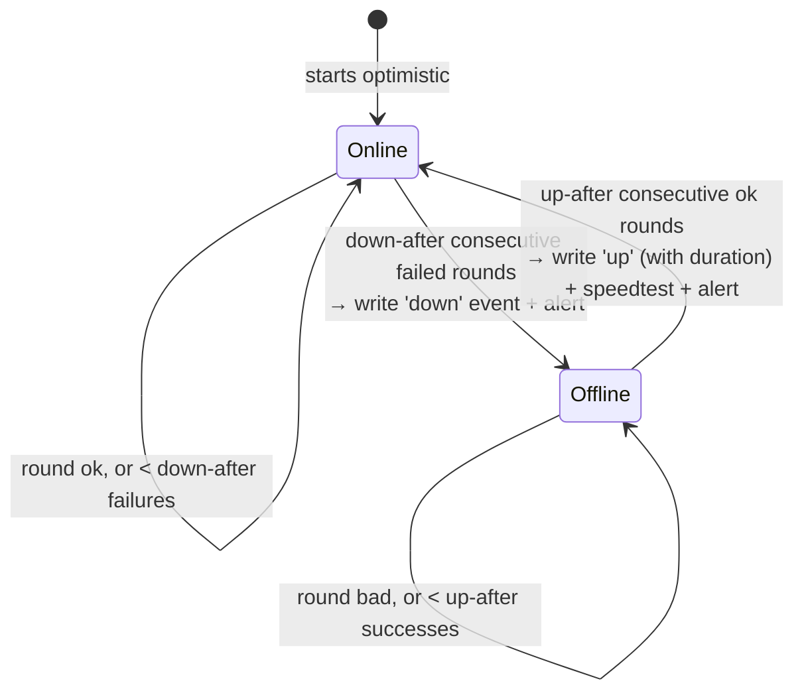
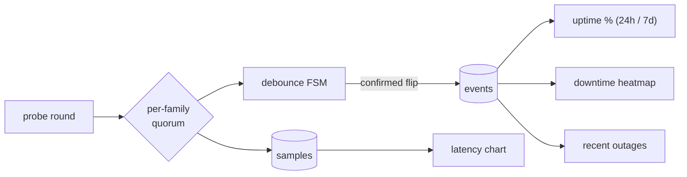
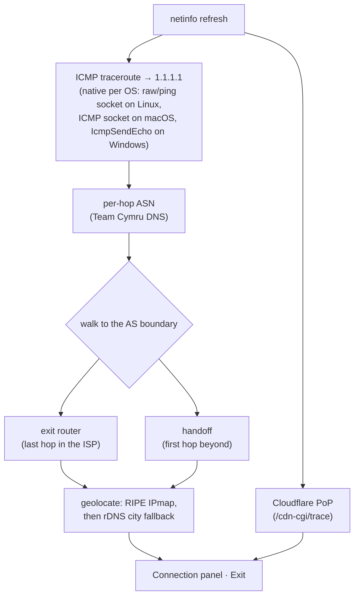
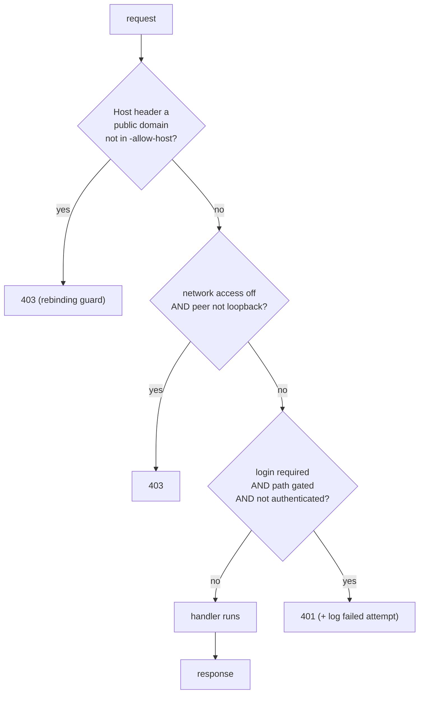

# Pingularity

A single-binary internet connectivity monitor with a built-in web dashboard,
native speedtests, and a Prometheus `/metrics` endpoint. It continuously checks
your connection by pinging several always-on internet landmarks at once and going
by majority vote (a *quorum* across multiple *anchors*), with anti-flapping
(*debounce*) so a single blip isn't mistaken for a real outage. It records
latency, uptime, and speed to SQLite and shows it all in a live UI - no runtime
to install.



## Quick start

```bash
go build -o pingularity .   # requires Go 1.25.12+; pure Go, no cgo
./pingularity               # probes every 5s; UI on http://localhost:9000
```

No flags needed. The UI binds `:9000` by default, but a fresh native install
starts **private**: a built-in filter answers only the machine it runs on, and
other devices get `403` until you flip **Network access** on in the settings
drawer's Access tab (flip it on and hit Save; the tab shows the address to use). Docker
installs skip the filter - it can't work behind container networking - so
there the dashboard is LAN-reachable immediately. `-listen 127.0.0.1:9000`
hard-pins it to local-only at the socket level.

Connectivity is probed over **both IPv4 and IPv6** (each as an independent
quorum of three anycast anchors). IPv6 is auto-detected - skipped on IPv4-only
hosts - and the families are tracked separately, so an IPv6-only outage is
visible without falsely reporting the whole link down. Overall status is
"online" when *either* family has connectivity. Be precise about where that
shows up: a single-family outage appears in the live status bubbles, the raw
latency samples, and the `monitor.v4_only_down_s` / `monitor.v6_only_down_s`
counters - but **outage events, the downtime heatmap, and the uptime ratios are
driven by the overall state**, so a loss of just one family is not recorded as
downtime there. That is the intended reading of "either family": the link still
carried traffic.

## Install

Prebuilt binaries and packages for Linux, macOS, and Windows (amd64 + arm64) are
published on every tagged release. Pick the channel that fits your OS - each one
lands the same single static binary. The `.deb`/`.rpm` packages also register
and start the background service for you; Homebrew and winget install the binary
and leave `pingularity install` to you (each section below says which).

### Linux

Fastest path is a native package (sets up and starts the systemd service, drops
an `EnvironmentFile` for flags, and runs the daemon as a dedicated unprivileged
`pingularity` user granted just an ambient `CAP_NET_RAW` - enough for the
raw-socket traceroute behind the **Exit** panel - inside a systemd sandbox, so
it is never root):

```bash
# Debian / Ubuntu (.deb)
sudo apt install ./pingularity_*.deb

# Fedora / RHEL (.rpm)
sudo dnf install ./pingularity_*.rpm

# openSUSE (.rpm) - same package, openSUSE's own package manager
sudo zypper install ./pingularity_*.rpm
```

Both start `pingularity.service` immediately (`systemctl status pingularity`),
put the database in `/var/lib/pingularity`, and read flags from
`/etc/default/pingularity` (`EnvironmentFile`) - edit that and
`systemctl restart pingularity` to change them.

Prefer no package manager? Grab the `.tar.gz` for your arch from the
[Releases page](https://install.pingularity.dev), extract it,
and use the binary's own installer:

```bash
tar xzf pingularity_*_linux_amd64.tar.gz
sudo cp pingularity /usr/local/bin/
sudo pingularity install    # registers, configures, and starts the systemd service
```

Or run it as a container (see [Docker](#docker) for why the flags matter):

```bash
docker run -d --name pingularity \
  --network=host --cap-add=NET_RAW \
  -v pingularity-data:/var/lib/pingularity \
  ghcr.io/pingular/pingularity
```

### macOS

```bash
brew install pingular/tap/pingularity
sudo pingularity install    # registers the launchd service and starts it
```

`brew upgrade` later pulls new versions; `sudo pingularity uninstall` removes the
service (data untouched).

### Windows

```powershell
irm https://install.pingularity.dev/winget.ps1 | iex
```

One paste from **any** PowerShell. The script elevates itself (one UAC click),
updates a too-old winget first (fresh Windows images ship one that fails zip
installs silently), points winget at the maintainer-hosted package source
(`winget.pingularity.dev` - so installs and upgrades never wait on app-store
moderation), installs under `Program Files`, and registers + starts the
Windows service. Re-running the same paste later **updates**: it stops the
service, upgrades, and starts it again. Prefer to run the steps yourself?
This is what it does, from an **elevated** PowerShell:

```powershell
winget source add -n pingularity -a https://winget.pingularity.dev -t Microsoft.Rest --accept-source-agreements
winget install pingular.pingularity -s pingularity --scope machine
& "$env:ProgramFiles\WinGet\Links\pingularity.exe" install    # registers the Windows service and starts it
```

The `source add` is one-time (re-running it just reports the source already
exists). `--scope machine` matters - it installs under `Program Files`, where
the Windows service expects its binary; keep it on upgrades too. The last line
spells out the exe's path because winget adds `pingularity` to the PATH of
*new* shells only - from your next terminal onward, plain `pingularity` works.
If the install fails silently right after "Successfully verified installer
hash", your winget is outdated: update **App Installer** in the Microsoft
Store and re-run.

> **Downloaded a raw binary in a browser?** macOS Gatekeeper or Windows
> SmartScreen may block it as "unidentified". Clear the quarantine flag once and
> it runs:
> ```bash
> xattr -d com.apple.quarantine ./pingularity      # macOS
> ```
> ```powershell
> Unblock-File .\pingularity.exe                    # Windows
> ```
> Installs via **brew**, **winget**, **apt/dnf**, and **docker** don't trip this
> at all - the prompt only appears for a file you fetched directly with a browser.

### Docker

```bash
docker run -d --name pingularity \
  --network=host --cap-add=NET_RAW \
  -v pingularity-data:/var/lib/pingularity \
  ghcr.io/pingular/pingularity
```

The image is multi-arch (amd64 + arm64). Two flags matter:

- **`--network=host`** (load-bearing) - Pingularity measures *your host's*
  internet path. Behind Docker's default bridge network you'd instead measure
  the container's NAT'd view (extra hop, wrong latency, and a traceroute that
  dead-ends at the Docker gateway). Host networking also means the UI is
  reachable on the host's `:9000` directly - no `-p` needed.
  **Docker Desktop (macOS, Windows) can't reproduce this the same way.** Desktop
  runs the container inside its own Linux VM, so `--network=host` attaches to
  *that VM's* network namespace, not your Mac's or PC's interfaces. Docker
  Desktop 4.34+ does add opt-in host networking (enable it under **Settings ->
  Resources -> Network**), but it only bridges **TCP and UDP** flows between the
  host and the VM - it still does not expose the host's own interfaces or
  anything below L4, so the raw-ICMP traceroute behind the **Exit** panel and
  true native-host parity remain unavailable. Even with it turned on, the
  readings describe the VM's path rather than your machine's. Speedtest numbers
  are capped the same way: the VM's traffic leaves through a user-space network
  proxy that terminates every connection and re-opens it from the host, so on a
  fast link the measured throughput can sit well below what the machine gets
  natively. A small VM compounds it - the Ookla engine sizes its parallel
  streams from the CPUs it can see, and VM defaults are often just 2. Giving
  the VM more cores and memory (Docker Desktop: **Settings -> Resources**;
  colima: `colima start --cpu 6 --memory 8`) wins back the streams and some
  headroom, but the proxy ceiling stays. All of
  this applies to every VM-backed runtime, not only Docker Desktop: colima,
  OrbStack, Rancher Desktop, and Podman machine share the design. Run Pingularity
  natively on macOS or Windows if you want the measurements to match the host.
  (The dashboard's container notice is raised for a *bridged* container, which is
  the case it can detect; it does not detect Docker Desktop's host-networking
  mode specifically.)
- **`--cap-add=NET_RAW`** (keep it for portability) - the **Exit** panel walks
  a raw-socket ICMP traceroute to find where traffic leaves your ISP. Stock
  Docker still grants `NET_RAW` by default, so plain `docker run` works without
  the flag today - but Podman 4+, hardened Kubernetes pod specs, and
  `--cap-drop` setups don't, and there the trace can't send its packets and the
  Exit row shows as unavailable (everything else still works). Spelling it out
  keeps the command correct everywhere.

The **`-v pingularity-data:/var/lib/pingularity`** volume is what makes updates
safe: the SQLite database *and* `pingularity.key` (which encrypts saved iperf3
passwords) live there. Skip the volume and a `docker pull` + recreate throws
away your history and key. Pass flags as arguments after the image name, e.g.
`ghcr.io/pingular/pingularity -speedtest-interval 30m`.

Two image variants ship to the same repo. The default
`ghcr.io/pingular/pingularity` is a lean distroless image and deliberately ships
**no iperf3** - its base has no package manager, so the opt-in iperf3 speedtest
engine can't run there and speedtests fall back to Ookla. If you use the iperf3
engine, pull the `-iperf` variant instead
(`ghcr.io/pingular/pingularity:latest-iperf`), a debian-slim image that bundles a
working `iperf3` and is otherwise identical - same non-root uid 65532, same
`CAP_NET_RAW` binary, same volume layout, so every flag above carries over.

### Updating

- **apt / dnf** - download the newer `.deb`/`.rpm` and reinstall it the same way
  (`sudo apt install ./pingularity_*.deb` / `sudo dnf install ./pingularity_*.rpm`);
  your data and env file are preserved, and the running service is restarted
  onto the new binary automatically.
- **Homebrew** - `brew upgrade pingularity`, then `sudo pingularity restart`.
- **winget** - re-run the one-shot
  (`irm https://install.pingularity.dev/winget.ps1 | iex`), or by hand from an
  elevated PowerShell, in this order: `pingularity stop`, then
  `winget upgrade pingular.pingularity -s pingularity --scope machine`, then
  `pingularity start`. Stop first - winget cannot replace a running
  service's binary - and keep `--scope machine`, or winget reinstalls into
  your user profile and the service loses its program.
- **Docker** - `docker pull ghcr.io/pingular/pingularity`, then `docker rm -f
  pingularity` and re-run it (the named volume carries your data across).
- **tarball** - Linux won't let you overwrite a *running* program file
  ("text file busy"), so either stop the service first, or copy alongside and
  rename over it (rename always works):
  ```bash
  sudo cp pingularity /usr/local/bin/pingularity.new
  sudo mv -f /usr/local/bin/pingularity.new /usr/local/bin/pingularity
  sudo pingularity restart
  ```

The in-app **update badge** notifies you when a newer release exists - it's a
poll of a maintainer-controlled feed (`latest.json`), notify-only, and never
touches your install. See [RELEASING.md](RELEASING.md) for how that feed is
published.

## Run in the background (systemd / launchd / Windows service)

The `.deb`/`.rpm` packages already do this for you; the steps below are for the
tarball, a `go build`, or a fresh binary you dropped in yourself.

```bash
sudo cp pingularity /usr/local/bin/
sudo pingularity install    # no flags - DB goes to /var/lib/pingularity, UI on 0.0.0.0:9000; starts the service
pingularity status          # running | stopped | not installed
```

The database path and its directory are chosen and created automatically. On
Windows that is always `%ProgramData%\pingularity\` - service or not - so the
installed service and an admin prompt (`reset-auth`) find the same database.
On Linux and macOS what decides is root, not the service: as root (which is how
`install`'s service runs) it is `/var/lib/pingularity/` on Linux and
`/Library/Application Support/pingularity/` on macOS; as a regular user it is a
per-user data dir - `~/.config/pingularity/` on Linux (`$XDG_CONFIG_HOME`
honoured), `~/Library/Application Support/pingularity/` on macOS - with a
temp-dir path as the last resort when there is no home directory at all.
Any flags you *do* pass to `install` are persisted into the service definition.
Manage with `pingularity start | stop | restart | status | uninstall`.

Alongside the database sit `logs.txt` (the log viewer's ring, so it survives a
restart) and **`pingularity.key`** (0600) - the key that encrypts the one secret
that has to be kept recoverable: each saved iperf3 server's password. iperf3 needs
it in the clear at test time (it encrypts it with the server's RSA key itself), so
unlike your dashboard login it can't be hashed. Two things follow:

- **Back up the key with the database** if you want those passwords to survive a
  restore. Delete or lose the key and you simply re-enter them; nothing else breaks.
- The key lives next to the database, so this does **not** protect you from someone
  who can read the host. What it does protect is the database travelling on its own -
  a backup, a snapshot, a stray copy - which now carries ciphertext, not your password.

Backup exports never contain passwords at all (neither the login nor the iperf3
ones). **They are still sensitive files.** A config export deliberately carries
your **webhook URL** and **heartbeat URL** so that a restore is complete, and for
both of those the URL *is* the credential - there is no separate token to
withhold. Anyone holding an export file can post to your alert channel or tick
your dead-man's-switch (masking a real outage), so store and share it like a
secret, and rotate both URLs at their provider if one leaks. Two more
consequences worth knowing before you need them:

- **Copying the database files by hand?** Stop the service first. While it runs,
  recent rows live in a sidecar file (`pingularity.db-wal`) that a copy of just
  `pingularity.db` misses - on a young install that can be *everything*. A clean
  stop folds the sidecar back into the main file. (The Data tab's **Export** is
  the safe way to back up a *running* instance - it streams a single consistent
  read-snapshot, so categories can't skew across it. **A full-retention export
  round-trips**, however large - import puts no ceiling on the total file, only on
  a single record (8 MiB) or a single JSON element (256 MiB), which no real backup
  reaches.)
- **Restoring a backup where login was enabled?** The export carries the
  "login on" preference but never the password, so on a machine that doesn't
  already have one the restore leaves login **off**, **forces access to
  local-only** so it can't fall open to the LAN, and tells you so - set a
  new password in the Access tab, then re-enable Network access. (Restoring onto
  the same machine, where the password still exists, keeps login working untouched
  and access unchanged.)
- **Restoring onto a *different* machine?** A backup never carries the source's
  install date, so the destination keeps its own answer to "monitoring since".
  That date is the denominator behind every uptime figure, and importing it would
  have this box reporting uptime over a stretch it did not watch. Restore the
  **history** too and the date moves anyway - derived from the earliest row that
  actually arrived, which is a claim the restored data backs up.

## Architecture

One static binary runs a handful of independent goroutine loops that share a
SQLite store and a live settings controller. Nothing else is required - the UI,
web font, and favicon are embedded; outbound calls are the probes themselves,
optional enrichment (geo/ISP/exit), speedtests, and the update check - the
full inventory is the outbound-calls table below.



| Package | Responsibility |
| --- | --- |
| `main` | CLI, OS-service lifecycle (`kardianos/service`), wiring |
| `config` | flags, defaults, the anchor target list |
| `prober` | concurrent IPv4/IPv6 quorum dialer |
| `monitor` | probe loop + debounced up/down state machine |
| `store` | SQLite persistence + the uptime/aggregate queries |
| `settings` | runtime-adjustable values, persisted and broadcast live |
| `speedtest` | Ookla + iperf3 testers, single-flight scheduler |
| `netinfo` | public IP/ISP/DNS + exit-node discovery (traceroute) |
| `notify` | webhook alerts + dead-man's-switch heartbeat |
| `web` | embedded UI, JSON API, `/metrics`, access/auth guard |

## Speedtests

A run records download, upload, ping, **jitter**, (best-effort) **packet loss**,
and **bufferbloat**, plus the bytes used and the connection it ran on (public IP,
ISP, DNS resolver). Not every field is present on every run: a download-only or
upload-only run has no figures for the direction it skipped, packet loss is
optional and not always measurable, and bufferbloat is absent when a transfer
phase was too short to sample, returned too few samples, or the latency target
was unreachable. Missing is stored as missing rather than as a zero, so charts
and thresholds can tell "not measured" from "measured, and it was bad".

The **ping** shown is the engine's own number, a mean over ten samples, so it
keeps matching what speedtest.net would report. A mean has no defence against an
outlier, though: one stalled handshake among nine fast ones reports several times
the real latency (and lands in jitter, which is their standard deviation, as a
much larger distortion still). So the run also keeps the **fastest** of those
same samples - no extra probes - and everything that *decides* on latency uses
that floor instead: which server wins a best-of round, which server the very
first run picks, and whether your ping threshold breached. A pothole shouldn't
pick your server or page you, but a genuinely distant link has a high floor too
and still breaches. iperf3 reports no per-sample values, so it is judged on its
mean exactly as before.


**Bufferbloat** is the extra lag that appears only while the line is busy - the
reason a video call breaks up the moment a big download starts. Pingularity
measures it by pinging before the test (idle) and during it (loaded) - both
against a fixed target of its own rather than the speedtest server, so only the
gap between them is meaningful, and the idle figure will not match the **ping**
recorded above:



Both figures are **medians** of their probes, and the headline bufferbloat number
- the one the tiles show and the one your **max bufferbloat** threshold is
compared against - is `median(loaded) - median(idle)`. The chart also plots a
**p95** per direction, the sustained bad end of the distribution. p95 is
deliberately not the maximum: these are TCP-connect probes, and a single worst
sample on one is usually a SYN retransmission (a fixed ~1000 ms OS retry, and
~2000 ms for a second one) rather than queue delay, so a max-based number
reports round figures that say more about packet loss than about buffering.

There are two engines, picked in the settings drawer:

- **Ookla (speedtest.net)** - the default. Numbers match speedtest.net; no setup.
  Its own knobs: parallel connections and the packet-loss probe.
- **iperf3** - opt-in, run against your own `iperf3 -s` box (LAN, homelab, or
  VPS). It measures what Ookla can't: internal/LAN links and honest upload. Used
  only when the `iperf3` binary is installed (otherwise it falls back to Ookla) -
  present on a native install once you've installed iperf3, and in the container
  only in the `-iperf` image variant, not the default image.
  Its own knobs: parallel streams, duration, warm-up, TCP window, congestion
  control, MSS, DSCP, the loss/jitter UDP pass, and optional RSA auth.

**Direction** (both / download / upload, plus iperf3's simultaneous `--bidir`) and
**retries** apply to whichever engine is selected.

Scheduled speedtests are **off by default** - turn them on in the Speedtest
settings (or with `-speedtest`). Once enabled, they run on startup and on a
schedule (`-speedtest-interval`, default `1h`). Two extra triggers are governed
separately: a test runs **after a reconnect** (on by default;
`-speedtest-on-reconnect=false` to disable) - spaced out so a flapping line
cannot fire tests back to back: at most one reconnect test per
`-speedtest-interval`, or per 15 minutes when that interval is shorter. There is
also an optional **while degraded**
toggle in the Speedtest settings (off by default, needs scheduled tests on)
fires a test when latency stays high without the link fully dropping. **Run
now** (or `POST /api/speedtest`) always works.

Only one speedtest runs at a time, and the triggers do not queue behind each
other. If a **scheduled** slot comes due while any other test is already
running, that slot is **skipped** and the schedule advances to the next one - it
is not retried, and not run late (the counter
`pingularity_stat_total{stat="speed.scheduled_skipped"}` records it). A slot
held back by a **closed window** or a **busy link** behaves the opposite way:
nothing was measured, so it keeps polling and fires as soon as the condition
clears.

For iperf3, the separate UDP loss/jitter pass probes the same direction you
test: downstream normally, upstream for an upload-only run - so a one-direction
test on an asymmetric line reports loss for the direction you asked about.

For Ookla, choose a server (search a city) or leave **Auto - fastest near you**
(it reads **Auto - fastest in \<city\>** once you've searched one). Auto
isn't just "nearest": every server that's effectively equidistant gets to race
(in a big city, a dozen providers all sit "0 km away" - one of each is pinged
rather than an arbitrary few) and the lowest latency wins. Your own ISP's
server, when Ookla lists one nearby **and the sponsor name can be matched to
your ISP**, is guaranteed a place in the race - traffic to it never leaves your
provider's network, so it's the most likely winner - but it still has to win on
ping like everyone else. (That match is a name heuristic: if your ISP is unknown
or trades under a different name than it sponsors servers under, its server
simply competes on distance like any other.) The **centre** of that search is
measured, not guessed: the candidate cities your connection names - your
**ISP's exit-router city** (found by traceroute), the city your **IP's
geolocation** puts you in, and the one **speedtest.net itself** places you in -
each enter their six closest servers into one deduplicated ping race, and the
city whose server answers fastest becomes the centre. (Ookla returns the
servers *around* a coordinate, so a different centre yields a genuinely
different list rather than the same one reordered - picking the wrong city can
hide the fast servers entirely, which is why it's raced. The lists usually
overlap, and where two candidate cities are close enough to be
interchangeable they collapse, so a server never gets to race twice.) A
**city you searched** overrides the race and becomes the centre directly.

## Dashboard

The dashboard is built into the binary (no extra services, no CDN - the UI, web
font, and favicon are all embedded) and served at the `-listen` address. The top
bar carries the live status bubbles - per-family (IPv4/IPv6) latency, process
runtime, 24h/7d uptime, and cumulative speedtest data used (click it for a
breakdown by window). The latency and DNS dots are the theme accent at varying
**intensity** - full = healthy, fading as latency or DNS gets worse - so the
bar stays calm at a glance and only the dot that needs attention dims. The
uptime, runtime, and data bubbles use plain icons (a pulse line, a clock, and
up/down arrows); their numbers carry the state.

Below that:

- **Connection** - public IP (v4·v6), ISP + geolocation, the actual upstream
  DNS resolver (provider + location), the **internet exit**: where traffic
  leaves the ISP's network - the exit router and peering handoff found by a
  built-in traceroute walked to the AS boundary (per-hop RTTs + city; on Linux
  this needs root, `CAP_NET_RAW`, or a suitable `ping_group_range` and is
  silently omitted otherwise -
  Windows and macOS need no privileges), plus the Cloudflare PoP serving the
  connection. A refresh button (top-right) re-runs all of it on demand. A
  dual-stack host that loses IPv4 for 15+ minutes while IPv6 still works is
  treated as IPv6-only (identity switches to the IPv6 side) until IPv4 returns.
- **Speed** - Download / Upload / Ping / Jitter / Packet-loss cards plus
  **bufferbloat** (idle vs loaded latency); three stacked history charts (speed
  with plan-threshold lines, a ping/jitter quality band, and bufferbloat) with
  per-chart **Speed / Quality / Bufferbloat** show-hide toggles, over a window of
  1d / 7d / 30d / 1y, a **custom** duration, or a typed **date range** - the custom
  box takes plain language (`jul 1 to jul 8`, `2026-07-01 to 2026-07-08`,
  `since jul 1`, `yesterday`, `2026`, `9am to 5pm`, `3d ago to now`) and echoes
  back the span it read. An end date includes that whole day, and a bare
  four-digit year means that year. The charts fit whatever data the span
  actually holds, so picking a wide range with only a little data in it zooms to
  the data rather than drawing empty margins; a span with no runs says so.
  While a fixed range is pinned the stat cards follow it rather than the newest
  run, and a **Live** button returns to the rolling window, and an expandable **all-runs** table
  (paginated, with **CSV export** and a per-run health badge).
- **Latency** over time - the lowest round-trip across your anchors, plus a
  separate **DNS-resolution** line. Each round resolves a random throwaway name
  through the host's own *system* resolver (the random label dodges caches, so it
  times the real lookup path your apps use; an NXDOMAIN answer is healthy - the
  resolver replied). That line **gaps wherever a lookup failed** (timeout /
  SERVFAIL / no resolver), so a DNS gap with the latency line intact means
  "online, but DNS was struggling." Selectable window (5m / 1h / 6h / 1d / 7d,
  a **custom** duration, or a typed **date range** exactly like the Speed panel;
  rolling windows are capped at the relevant retention), with red bands marking
  **rounds that failed their checks**. Those come from the latency samples
  themselves, not from the debounced outage log below - so a blip too short to
  become an outage event still shows a band, and deleting an outage does not
  erase the bands underneath it. Hover either chart to read the exact point.
- **Downtime heatmap** - a GitHub-style year of daily outages. A cell's shade is
  **how many outages that day**, not how long they lasted: one 23-hour outage and
  one 1-second blip are both a single event and shade identically, while three
  blips shade darker than either. Hover a cell for the figure that answers "how
  bad was it" - the actual downtime, and how much of the day was observed.
- **Recent outages** - the debounced up/down event log. Each resolved outage has a
  ✕ to delete it (removes it from the log, heatmap, and uptime stats -
  handy after planned maintenance you don't want counted).



> **Who does Pingularity talk to?** Only keyless public infrastructure - no API
> token, no signup, and nothing is ever *pushed* anywhere. The complete list of
> outbound calls, so you can audit or firewall them:
>
> | Service | What it receives | When |
> |---|---|---|
> | anchors (`1.1.1.1`, `8.8.8.8`, `9.9.9.9` + v6) | a TCP handshake, no payload | every probe round |
> | your own DNS resolver | one random throwaway lookup | every probe round (DNS line) |
> | **ipify** | a "what's my IP" request | connection refresh |
> | **Team Cymru** (DNS) | IPs from the traceroute path, to name their ASN | exit discovery |
> | **RIPE IPmap** | router IPs from the traceroute, for geolocation | exit discovery |
> | **ipwho.is**, then **geojs.io** | your public IP, for the ISP/geo line | connection refresh |
> | **Cloudflare** (`/cdn-cgi/trace`) | a plain fetch, to learn the serving PoP | connection refresh |
> | reverse DNS | router/host IPs, for names | connection refresh |
> | **Ookla** servers | the speedtest traffic itself, plus a server-list lookup | when a speedtest runs, and when the Server settings tab is opened or a city is searched |
> | **nominatim.openstreetmap.org** | the city text you type | only when you search a city for a server |
> | **update.pingularity.dev** | a version-check fetch (no identifiers) | daily, if the update check is on (until the first check succeeds: retried at 1m/5m/15m, then hourly) |
>
> The six **connection refresh** and **exit discovery** rows are the ones that
> carry your public IP. They stop when monitoring is paused, and the
> **Connection info** toggle (Latency tab) stops them for good. Both cover the
> automatic lookups only - the Connection panel's refresh button still fetches
> on demand, and the panel says when it is no longer refreshing itself.
>
> Everything else - dashboard, charts, history, alerts evaluation - is fully
> local. Turn speedtests, the update check, or the DNS probe off and those rows
> simply never fire. (Alert webhooks and the heartbeat post only to URLs you
> configure yourself.)

The **logo** (top-right) opens a tabbed settings drawer; a **power** toggle in
the tab row starts/stops all monitoring. Changes apply **live** (no restart)
and persist across restarts:

- **Latency** → latency interval, probe timeout, and sensitivity (failures→down /
  successes→up, IPv6 mode auto/on/off).
- **Speedtest** → automatic runs on an interval, plus on-reconnect and
  when-degraded triggers and a skip-when-busy option. Changing the interval shows a
  live estimate of the daily/monthly data the tests will use (based on your recent
  runs).
- **Server** → engine (**Ookla** or **iperf3**, each with its own servers and
  per-test options), server selection (with city search), test direction, and
  retries. **Best of 3 servers** (Ookla only, off by default) tests your chosen
  server plus the two fastest by ping *near it* - the search is centred on the
  server you picked, not on your exit, so the round stays in the area you asked
  for (with nothing pinned, they come from the auto location instead). It keeps
  only the best result - handy when one server has a bad day and you'd rather
  it didn't define your history. The best result is the highest *score*: a
  capacity figure weighting download 70% and upload 30% **relative to each
  other** (not as raw Mbps, so it means the same on a symmetric line and a 20:1
  asymmetric one), discounted by ping (roughly 1% per millisecond, topping out
  at 20ms). So a server that measured a fifth of your real upload can't hide
  behind a big download number, a near-tie on speed goes to the lower-ping
  server, and a clearly faster one still wins. Ties break on ping, then jitter, then
  bufferbloat; the other two runs are discarded (their
  data volume is still counted, since it was really spent). The run that is kept
  is one real test, so its **ping, jitter and bufferbloat are the winner's too**:
  when a round is decided on throughput, those columns can jump because the round
  changed hands, not because your connection did. It is not averaged across
  servers - that would describe a test that never happened - so read latency and
  jitter from the charts, which sample continuously and do not depend on who won.
  One guard runs before the comparison: when one server reports a direction far
  beyond what the rest of the round agrees on (buffer absorption at the server,
  not your line), that reading is **held to what the round agrees on** - for the
  decision and for what lands in history - so a speed you never had can't set a
  record or pass a threshold. And every round keeps its receipts: which servers
  were ranked, raced, measured, or failed, each one's numbers, and why the
  winner won - stored next to the run (`GET /api/speed/runs/servers?ts=`) and
  summarised in the logs. Each server gets 90
  seconds before it is dropped and the next is tried, so a stalled server can't
  hold up the round; a whole round budgets 6 minutes of work (3 servers x 90s, plus 90s to pick them), under a 7-minute hard ceiling. It costs roughly **3x
  the time and data** of a normal test, so only the runs worth being thorough
  about use it: the ones on your chosen interval, and the **RUN** button. The
  quick automatic tests - at startup, after a reconnect, and the while-degraded
  one - always measure a single server. The data estimate on the Speedtest tab
  accounts for it.
- **Schedule** → optionally restrict *when* monitoring runs. **Latency** probing and
  **speedtests** are scheduled independently (each off by default = run 24/7); when on,
  each gets a list of windows, and a window is a weekday selection + a time-of-day range
  (windows may wrap past midnight). Add multiple windows for split or per-day schedules,
  with Weekdays / Weekends / Every day / 24/7 / Clear presets, and a "week at a glance"
  strip under each list shows the merged coverage. Manual "Run now" always works.
- **Data** → retention: three independent windows - **latency** samples (default
  **30** days), **speed** history (default **365** days), and **downtime**/outage
  history (the heatmap, default **365** days); `0` = keep forever - plus
  per-kind "delete data" buttons, and **Export** / **Import** on the same tab: pick any of
  config / latency / speed / downtime, export them to a JSON file, and import one
  back - time-series data is **merged** (existing/newer local rows are kept, only
  missing rows are added) while **config is overwritten** and reloaded live.
  Both ends stream, so even a multi-hundred-MB export of years of history
  round-trips. The import warns you when it matters: restored rows older than
  your current retention windows will be pruned within the hour (raise
  retention first to keep them), and a config restore that carried "login on"
  without a password leaves login off until you set one.
- **Alerts** → *Thresholds* (min download/upload, max ping/jitter/packet-loss, and
  max bufferbloat per direction; each run is marked healthy/unhealthy against the
  values in effect when it ran, with a debounce so one blip doesn't page) and
  *Notifications* (alert-on-outage, a generic **webhook** with a Test button, an
  optional **periodic summary** posted to the webhook - off / daily / weekly, a
  "how it went" report of uptime, median speeds, and outage count/downtime; it
  always goes out on its cadence and states the span it actually observed, so a
  period spent scheduled-off or paused is reported as such rather than as a
  confident 100% - and a dead-man's-switch **heartbeat** URL).
- **Access** → access controls (changes here apply on **Save**).
  **Network access** decides whether other devices can reach the dashboard /
  API / `/metrics`, or only this machine - a live loopback filter, so remote
  clients get 403. It starts **off on native installs** (localhost-only until
  you flip it) and **on in Docker**. In a *bridged* container the network hides
  who a request really came from, so there the filter cannot be enforced -
  publish the port narrowly and use the login password instead (the API reports
  the difference as `local_only` vs `local_only_active`, and the tab says so). A
  `--network=host` container sees real peer addresses, so local-only is enforced
  there exactly as on a native install. The tab shows the **reachable
  address(es)** with port plus a static-IP hint. **Require login** (off by
  default) gates
  everything behind a password: browsers get a login form + session cookie,
  while API clients and Prometheus use HTTP Basic with the same credentials
  (passwords are capped at 72 bytes, the bcrypt limit). Failed logins are
  recorded (with source IP) in the log and rate-limited per client. Once a
  login is active, changing **any** Access setting - password, username, the
  login toggle, or Network access - requires re-entering the **current
  password** (API callers send `current_password`), so a stolen or walked-up
  browser session cannot quietly take over the account. Forgot the
  password? Run `pingularity reset-auth` on the host to clear it. **Local-only
  cannot block a same-host reverse proxy** (cloudflared, nginx): it delivers
  internet visitors as loopback connections, so pair any proxy with login.
- **Appearance** → nine themes - Retro (the default), Light, Dark, Amoled,
  Cyber, Slate (flat greyscale), Solarized, Parchment, and Ember - plus a
  Full-width layout toggle and a Corners toggle (Flat squares the panels and
  controls, Round keeps them rounded), content brightness and
  fade sliders, **UI colours** (recolour any of the theme's building blocks:
  backgrounds, panels, borders, text, status colours, accents - every pixel
  derives from them), **top bar** (a colour for the latency and DNS dots - each
  keeping its health shading - the power button in each state, and the two
  halves of the wordmark), and
  **chart customization** - per-series colours, line thickness and area fill, plus
  two rows of switches under **Thresholds and labels**: one to show or hide each
  threshold line, and one for the chart furniture (**Grid lines**, **Y labels**
  for the numbers up the left, **X labels** for the times along the bottom, and
  **Y title**, which prints what the axis measures sideways down the right edge -
  LATENCY (ms), SPEED (Mbps), PING (ms), BLOAT (ms)). Turning the Y labels off
  hands their space back to the chart. All preview live and
  apply on Save; each picker resets to the theme.
- **About** → version, the **daily update-check** toggle, and the **log viewer**
  (logging on/off, PII redaction, and copy/download/clear).

**Nine built-in themes**, every one fully recolourable (backgrounds, panels,
status colours, chart series - each picker previews live and resets to the theme):



> **Notifications** post JSON to one webhook URL, shaped per host so the common
> targets just work. Discord → `{content}`, Slack → `{text}`; every other
> receiver gets a rich body carrying the alert text under `text`/`content`/
> `message`/`body` plus a `title`, a `type` (`info`/`success`/`warning`/
> `failure`), and a numeric `priority` (1 low - 5 urgent). The heartbeat pings an
> external watchdog (Healthchecks.io, Uptime Kuma push, …) every minute *while
> monitoring is on*, so the watchdog can alert you if Pingularity or the whole
> host goes silent - the one failure the in-band outage alert can't deliver.

Notification recipes (set the **webhook URL** to):

| Target | URL | Notes |
|---|---|---|
| **Discord / Slack** | the channel's incoming-webhook URL | shaped automatically |
| **Gotify** | `https://gotify.example/message?token=APP_TOKEN` | uses `title` / `message` / `priority` |
| **ntfy** | `https://ntfy.sh/your-topic` (or self-hosted) | spoken natively: the alert text arrives as the notification body with title, priority (1-5, mapped from severity), and an emoji tag. ntfy.sh is auto-detected; for ntfy on your own domain set **Webhook format: ntfy** in the Alerts tab |
| **Apprise** → email, Telegram, Pushover, Gotify, ntfy, … | run the Apprise API server, point at `http://apprise:8000/notify/your-key` | one gateway to 100+ services; uses `title` / `body` / `type` |

For **email, Telegram, or Pushover**, the simple path is Apprise: run the Apprise
API server, add those services to an Apprise config key, and point Pingularity's
webhook at that key. Self-hosted receivers on your LAN/localhost are allowed (only
link-local/cloud-metadata addresses are blocked). For "is Pingularity even alive?"
use the separate **Heartbeat URL**, not the webhook.

Initial values can also be set via flags (`-interval`, `-timeout`, `-latency`,
`-down-after`, `-up-after`, `-speedtest`, `-speedtest-interval`,
`-speedtest-on-reconnect`, `-ipv6`, `-retain`, `-retain-speed`,
`-retain-downtime`); the UI overrides them once changed. `-ipv4` is flag-only -
it has no UI setting.

## Commands & flags

```
pingularity [run] [flags]    monitor + serve the UI (default)
pingularity install [flags]  install as a service and start it (flags are persisted)
pingularity start|stop       start / stop the installed service
pingularity restart|status   restart / show status
pingularity uninstall [-y]   remove the service (data untouched)
pingularity reset-auth       clear the password + disable auth (recovery)
pingularity version          print version
```

Flags only **seed** the initial values - almost everything is adjustable live in
the settings drawer afterward and persists across restarts.

| Flag | Default | Purpose |
| --- | --- | --- |
| `-listen` | `:9000` | UI + metrics address (`127.0.0.1:9000` = local-only at the socket) |
| `-db` | per-OS ([details](#run-in-the-background-systemd--launchd--windows-service)) | SQLite path (dir auto-created) |
| `-interval` | `5s` | time between probe rounds, `1s`-`1h` (a value saved in the UI takes precedence) |
| `-timeout` | `3s` | per-target dial timeout, `1s`-`30s` (a value saved in the UI takes precedence) |
| `-down-after` / `-up-after` | `2` / `1` | consecutive rounds to confirm down / up (1-10) |
| `-latency` | `true` | probe latency/connectivity at all (`-latency=false` = speedtest-only mode) |
| `-ipv4` | `auto` | IPv4 probing: `auto` \| `on` \| `off` (`auto` = only while the host has an IPv4 address) |
| `-ipv6` | `auto` | IPv6 probing: `auto` \| `on` \| `off` (live) |
| `-speedtest` | `false` | run scheduled speedtests (startup + interval); opt-in. On-reconnect tests are governed separately by `-speedtest-on-reconnect`, the while-degraded trigger by its own UI toggle |
| `-speedtest-interval` | `1h` | time between scheduled speedtests, `1m`-`24h` |
| `-speedtest-on-reconnect` | `true` | speedtest after a reconnect (at most one per `-speedtest-interval`, or per 15m if that is shorter) |
| `-retain` / `-retain-speed` / `-retain-downtime` | `720h` (30 days) / `8760h` (1 year) / `8760h` | prune windows in Go duration units (`0` = keep forever) |
| `-allow-host` | *(none)* | extra `Host` header values the DNS-rebinding guard accepts - only needed behind a reverse proxy on a public domain |
| `-trusted-proxy` | *(none)* | proxy IPs/CIDRs whose `X-Forwarded-For` identifies the real client, so one visitor's failed logins can't rate-limit everyone behind the proxy |
| `-metrics-token` | *(none)* | optional read-only token a scraper presents to `/metrics` (Bearer or Basic password) instead of the admin login, so Prometheus needn't hold an account that can change settings; only consulted when Require login is on |

Out-of-range numeric flags are rejected at startup (and at `pingularity
install`) rather than silently adjusted.

## Metrics (optional)

> **Grafana users:** there is an official importable dashboard (latency
> heatmap, speed/bufferbloat history, outage annotations, a multi-instance
> fleet view) and a ready-made alert-rules file - see
> [docs.pingularity.dev/grafana](https://docs.pingularity.dev/grafana/).

A Prometheus endpoint is exposed at `GET /metrics` if you already run a
Prometheus/Grafana stack and want to scrape Pingularity - but nothing external is
required; the built-in dashboard is fully standalone. `/metrics` is a passive
**pull** endpoint - Pingularity never pushes metrics or any telemetry anywhere;
the data only leaves the box if you scrape it.

`GET /metrics` exposes (every gauge has a `# HELP` line in the output, so it's
self-describing):

- `pingularity_build_info{version,goversion}` - constant 1, build version and Go
  toolchain in the labels
- `pingularity_runtime_seconds` - process uptime
- `pingularity_up` - overall connectivity (1/0)
- `pingularity_latency_seconds` - headline latency: lowest across the anchors that
  answered (your base internet latency); absent when nothing answered
- `pingularity_monitoring_paused` - 1 while stopped via the power button
  (stored gauges freeze and the live per-family/DNS series go absent while
  paused)
- `pingularity_probing_active` - 1 while probe rounds are actually running:
  the "can I trust the data" signal. It goes 0 for every way rounds can stop -
  the power button, the latency toggle, a closed schedule window, or all
  address families switched off - while `pingularity_up` and
  `_state_since_timestamp_seconds` hold their last values
- `pingularity_state_since_timestamp_seconds` - when the current up/down state began
- `pingularity_current_outage_seconds` - length of the outage in progress; absent
  while online, and absent while probing is paused (paused time is excluded from the
  outage the monitor finally records, so the live value would otherwise run ahead of
  history). Use `_state_since_timestamp_seconds` to see when the outage began
- `pingularity_family_up{family}` / `pingularity_family_latency_seconds{family}` /
  `pingularity_family_state_since_timestamp_seconds{family}` - per-address-family
  connectivity, latency (only while that family is up), and when that family's
  current state began - so "how long has IPv6 alone been down" is answerable.
  All three go absent (not frozen) while probing isn't running
- `pingularity_target_latency_seconds{target}` / `pingularity_target_up{target}` -
  per anchor; the latency line appears only for a successful probe (a down target
  has no reading, not a misleading 0)
- `pingularity_target_last_probe_timestamp_seconds{target}` /
  `pingularity_probe_last_round_timestamp_seconds` - per-target and overall probe
  freshness. `target_up` deliberately holds its last value while paused, so a
  timestamp that stops advancing is how you tell a frozen reading from a live one
- `pingularity_probe_latency_seconds` / `pingularity_dns_latency_seconds` -
  **histograms** (`_bucket{le}` + `_sum` + `_count`) of anchor RTT and DNS
  resolve-time, so `histogram_quantile()` gives real p95/p99 and catches spikes that
  fall between scrapes - which the last-value latency gauges lose
- `pingularity_dns_up` / `pingularity_dns_resolve_seconds` - the DNS-resolution
  probe (the chart's second line): whether a cache-busted lookup succeeded and how
  long it took, via the host's own resolver. Present only while the probe is
  actually running and has produced a result (in short: while
  `pingularity_probing_active` is 1, the DNS toggle is on, and the first lookup
  has answered) - a probe that isn't running, or hasn't resolved yet, reads as
  absent, not a fake 0
- `pingularity_uptime_ratio{window}` - up-fraction over `6h`, `24h`, `7d`, `30d`,
  `1y`, and `all`. This is **observed** downtime / **observed** time: paused,
  scheduled-off, families-off, and process-down wall time is excluded from the
  denominator (it's neither up nor down), so it can't inflate uptime. Two small
  gaps are deliberately *not* booked, and so stay in the denominator (and are
  normally credited as up): a restart that took **2 minutes or less**, and a
  suspend/freeze shorter than **one probe interval plus 10 minutes** - below
  that, a gap can't be told apart from ordinary scheduler overshoot, and the
  error is bounded and self-limiting where a spurious unobserved row would not
  be. A window that
  observed **nothing** is omitted entirely rather than published as a misleading
  100%. Each window is also clamped to the outage-retention horizon, so it can't
  reach past where the downtime events behind it were pruned.
- `pingularity_uptime_coverage_ratio{window}` - the fraction of each window that was
  actually observed (0..1). A low value means the window was mostly paused/unobserved
  and its `uptime_ratio` is thin evidence; `0` means the ratio is absent.
- `pingularity_uptime_since_timestamp_seconds` - the earliest time the uptime figures
  can vouch for (later of first observation and the retention horizon); the `all`
  window reaches back only to here
- `pingularity_speed_last_run_timestamp_seconds` - freshness anchor for the speed
  gauges; `pingularity_speed_info{engine}` names the backend (ookla / iperf3)
- `pingularity_speed_next_run_timestamp_seconds` - when the next scheduled
  speedtest is due (absent when scheduled tests are off); pairs with the last-run
  timestamp to catch a wedged scheduler before the next run would even land
- `pingularity_speed_download_mbps` / `_upload_mbps` / `_ping_ms` / `_jitter_ms` /
  `_packet_loss_percent` - the last run (loss only when measured). These use the
  dashboard's human units (ms, Mbit/s, %) so the numbers match the UI and speedtest
  sites. For Prometheus base-unit conventions, the same values are also emitted as
  `pingularity_speed_download_bytes_per_second` / `_upload_bytes_per_second` /
  `pingularity_speed_ping_seconds` / `pingularity_speed_packet_loss_ratio` (0..1) -
  use whichever your dashboards expect, but don't mix the two unit systems in one
  expression
- `pingularity_speed_ping_best_ms` - the **fastest** of the ping samples
  `_ping_ms` averages. The engine reports a mean over ten samples, so one stalled
  handshake moves it several-fold; this is the floor beneath it. Alert on this
  one to mean "the link really is far", and watch the **gap** between the two to
  spot a lossy path. Absent on iperf3 runs, which report no per-sample values
- `pingularity_speed_healthy` - 1/0, did the last run pass your configured
  thresholds (lets alerting reuse the in-app verdict instead of re-encoding it);
  **absent** when no thresholds are configured *or* when the run couldn't measure
  something a threshold covers. A check that never ran is not a check that
  passed, so those runs get no verdict rather than a green one - alert on
  `absent()` if a silently unjudged run matters to you
- `pingularity_speed_idle_latency_ms` / `pingularity_speed_loaded_latency_ms{direction}`
  (+ `_p95_ms`) - latency idle vs under load; **loaded minus idle is bufferbloat**.
  Present only when the engine measured them
- `pingularity_speed_data_used_bytes` (total within retention),
  `pingularity_speed_data_used_window_bytes{window}` (per `6h`/`24h`/`7d`/`30d`/`1y`
  window - the total is non-monotonic under pruning, so metered-link budgets
  should use these), `pingularity_speed_last_run_bytes{direction}` (what the
  last run itself consumed), and `pingularity_speed_avg_run_bytes{direction}`.
  Treat all of these as a **measured lower bound on wire usage, not a bill**:
  they count the payload the engine reports moving, so they exclude warm-up
  traffic, the UDP loss/jitter probe, runs that failed or were abandoned partway,
  TCP/TLS/IP overhead, and retransmits. On a metered link, budget with headroom
  above these numbers rather than against them
- `pingularity_process_start_time_seconds` - process start (the Prometheus-conventional
  form; `pingularity_runtime_seconds` kept for compatibility)
- `pingularity_goroutines` / `pingularity_memory_heap_bytes` / `_memory_sys_bytes` /
  `pingularity_gc_cycles_total` / `pingularity_gomaxprocs` / `pingularity_open_fds`
  (Unix) - process self-health: leak and GC trends, and an FD-leak early warning
- `pingularity_db_bytes` - on-disk database size incl. WAL/SHM (watch your retention)
- `pingularity_disk_free_bytes` - free space on the filesystem holding the
  database, where the platform supports it - an early disk-full warning long
  before writes start failing
- `pingularity_worker_up{worker}` / `pingularity_worker_restarts_total{worker}` -
  per background worker (`scheduler`, `pruner`, `netinfo`, `update-check`,
  `heartbeat`, `digest`, and `settings-retry` when a failed settings load armed
  it): `up` is 1 while its loop runs and 0 once it dies - gives up after
  repeated panics, or the process shuts down. A one-shot worker that COMPLETES
  its job (settings-retry succeeding) removes its series instead of reporting
  0, so `worker_up == 0` alerts match only real deaths; `restarts_total`
  climbing means it's thrashing
- `pingularity_stat{stat="monitor.pending_events"}` (a gauge) /
  `pingularity_stat_total{stat="monitor.event_dropped"}` - the outage-persistence
  retry queue's depth (0 = healthy) and a counter of transitions dropped for good
  when the DB stayed unwritable past the buffer cap (each drop leaves a gap in
  uptime history). `pending_events` is a depth, not a counter, so it is not seeded
  at startup: the series appears the first time an event has to be queued
- `pingularity_metrics_data_valid` - **1 only when every store read on this scrape
  succeeded**; 0 when any failed (so a DB outage that would otherwise be a silent
  `200` with missing/stale series is directly alertable). Paired with
  `pingularity_metrics_collector_success{collector}` / `_errors_total{collector}` /
  `_duration_seconds{collector}` / `_last_success_timestamp_seconds{collector}` for
  the `targets` / `aggregates` / `speed` / `uptime_floor` reads (`aggregates`
  tracks the LAST refresh attempt, so a store that fails after the cache once
  warmed still reads 0)
- **Well-named families** (Prometheus-conventional, one quantity + labels each,
  emitted alongside the generic `stat_total` below): `pingularity_probe_rounds_total`,
  `pingularity_probe_failures_total{reason}`, `pingularity_dns_attempts_total`,
  `pingularity_dns_failures_total{reason}`, `pingularity_outages_total`,
  `pingularity_outage_duration_seconds_total`, `pingularity_speed_runs_total{trigger}`,
  `pingularity_speed_failures_total{stage}`, `pingularity_notification_deliveries_total{destination}`
  / `_failures_total{destination}` / `_blocked_total{destination}`,
  `pingularity_database_errors_total{reason}`, `pingularity_database_prunes_total`,
  `pingularity_database_prune_duration_seconds_total`,
  `pingularity_speed_run_duration_seconds` (a `_sum`/`_count` summary),
  `pingularity_probe_blips_total`, `pingularity_login_failures_total`,
  `pingularity_rate_limit_trips_total`
- `pingularity_stat_total{stat}` / `pingularity_stat{stat}` - the internal
  **operational** registry, keyed by a `stat` label. These are two families: the
  **counters** `pingularity_stat_total{stat}` (monotonic totals + float sums;
  query with `rate()` / `increase()`) and the **gauges** `pingularity_stat{stat}`
  (point-in-time values: high-water marks like `monitor.blip_streak_max`, the
  probe/DNS freshness timestamps, and the per-worker `worker.<name>.up` flags -
  so the family is present on every install from boot). Together they
  cover probe rounds (`monitor.rounds` - the liveness denominator - and
  `monitor.bad_rounds`), the probe-failure taxonomy (`probe.fail.<class>` -
  timeout/refused/dns/…), the DNS-resolve failure taxonomy (`dns.fail.<class>`),
  family flaps, IPv4-only vs IPv6-only downtime (`monitor.v4_only_down_s` /
  `monitor.v6_only_down_s`), brownouts (`monitor.degraded_episodes`), pause
  accounting (`monitor.pauses` / `monitor.paused_s` - why gauges froze),
  speedtest **runs by trigger** (`speed.run.<trigger>`) and **failures by
  stage** (`speed.fail.<stage>` - server_fetch/ping/download/…), exit-discovery
  traces and geo lookups (`netinfo.trace_ok` / `netinfo.trace_fail` /
  `netinfo.ipmap_*`), webhook delivery (`.ok` / `.fail` / `.blocked` per
  destination), DB health (`db.*`), import/restore repairs (`import.*` - rows a
restore refused rather than silently dropped), the /metrics self-disclosures
(`web.metrics_targets_capped`, `web.metrics_label_collisions` - the operator's
sign that the target-series view was truncated or a normalized label collided),
notification-queue loss (`notify.outage_dropped`), and security signals
(`web.login_fail`, `web.stepup_fail`,
  `web.limiter_trips`). Always-on and monotonic. Product-usage counters (which
  settings change, dashboard loads) are **not recorded at all** - those
  emitters were removed; the `promStat` allowlist stays only as a guard so a
  future product counter can't leak onto `/metrics`.

### Health endpoints

Two unauthenticated liveness/readiness probes for a load balancer or orchestrator
(they expose no data, just a verdict, and bypass the DNS-rebinding guard, the
local-only filter, and auth so a bare-IP health check from an LB reaches them):

- `GET /healthz` - liveness: `200 ok` while the process serves. No dependency
  checks, so a transient DB hiccup can't trigger a restart loop.
- `GET /readyz` - readiness: `200 ready` once the store answers and the first status
  aggregate is warm; `503` otherwise, so an LB holds traffic until the daemon is warm.

### Scraping it

**Step zero for a remote Prometheus:** on a native install, flip **Network
access** on in the dashboard's Access tab first - it starts off, and until then
every scrape from another machine gets `403`. (A Prometheus on the same host
scraping `127.0.0.1:9000`, or a Docker install, needs nothing.)

A minimal job (scrape by IP so the DNS-rebinding guard doesn't get in the way -
see the gotchas below):

```yaml
scrape_configs:
  - job_name: pingularity
    scrape_interval: 30s
    static_configs:
      - targets: ["192.168.1.10:9000"]   # the host running Pingularity
```

Three access controls can turn a scrape into a `401`/`403`:

- **Network access still off?** (the native default) - remote scrapes get
  `403`. Enable it in the Access tab, or run the scraper on the same host.

- **Login enabled?** `/metrics` then sits behind auth, and scrapes get `401`.
  Either add the admin credentials as HTTP Basic, or (better) start Pingularity with
  `-metrics-token=<token>` and give the scraper a read-only token that can't change
  settings:

  ```yaml
      # admin credentials …
      basic_auth:
        username: admin
        password: your-password
      # … or a read-only token (with -metrics-token):
      authorization:
        credentials: your-metrics-token
  ```

- **Scraping by a public hostname?** The always-on DNS-rebinding guard rejects a
  `Host` header that's a public domain with `403`. IP targets and `*.local`/
  `*.lan`/etc. pass automatically; for a real domain, start Pingularity with
  `-allow-host=pinger.example.com`.

Starter queries and alerts against the operational series:

```promql
# Link down right now (alert if true for 2m)
min_over_time(pingularity_up[2m]) == 0

# Outage count / downtime seconds over a day - robust even when an outage is
# shorter than the scrape interval (counts confirmed transitions, not samples)
increase(pingularity_outages_total[24h])
increase(pingularity_outage_duration_seconds_total[24h])

# The probe loop itself stopped (wedged/crashed prober, NOT a quiet link):
# no completed rounds for 5m while probing should be running.
rate(pingularity_probe_rounds_total[5m]) == 0 and pingularity_probing_active == 1

# 30-day uptime under 99.9% - but only trust it where the window was actually
# observed (coverage guards against a mostly-paused window reading falsely high)
pingularity_uptime_ratio{window="30d"} < 0.999
  and pingularity_uptime_coverage_ratio{window="30d"} > 0.95

# p95 anchor latency over 5m (from the histogram)
histogram_quantile(0.95, rate(pingularity_probe_latency_seconds_bucket[5m]))

# A background worker died, or the scrape returned incomplete data (DB failing).
# A worker that FINISHED its job (the one-shot settings-retry succeeding) removes
# its series instead of reporting 0, so this matches only real deaths.
pingularity_worker_up == 0
pingularity_metrics_data_valid == 0

# Speedtests have stopped landing (wedged scheduler / always failing)
time() - pingularity_speed_last_run_timestamp_seconds > 7200   # 2x the default 1h interval; raise if yours is longer

# The next scheduled speedtest is overdue (only present when scheduled tests are on)
time() > pingularity_speed_next_run_timestamp_seconds + 600

# Download below 100 Mbit/s on the last speedtest
pingularity_speed_download_mbps < 100

# DNS resolution failing while the link itself is up (name resolution broke)
pingularity_dns_up == 0 and pingularity_up == 1

# Last speedtest failed its configured thresholds, or a long current outage
pingularity_speed_healthy == 0
pingularity_current_outage_seconds > 300

# Speedtests failing by stage, per hour (server_fetch / ping / download / …)
sum(rate(pingularity_speed_failures_total[1h])) * 3600

# Webhook deliveries failing or SSRF-blocked - series exist at 0 from startup,
# so the first event is a visible 0->1 step for rate()/increase()
rate(pingularity_notification_failures_total[15m]) > 0
rate(pingularity_notification_blocked_total[15m]) > 0

# Average speedtest duration over 6h (the _sum/_n summary pair)
rate(pingularity_stat_total{stat="speed.duration_s_sum"}[6h])
  / rate(pingularity_stat_total{stat="speed.duration_n"}[6h])
```

## HTTP API

Responses are gzip-encoded when the client sends `Accept-Encoding: gzip` and the
body is at least 1 KiB (smaller ones are sent as-is - gzip's framing can make a
short body bigger, and it already fits in one packet). Every such response
carries `Vary: Accept-Encoding`. The two streaming downloads, `/api/export` and
`/api/speed/runs.csv`, are always sent uncompressed so they keep streaming at
constant memory.

- `GET /api/status` - current status, uptime, per-family state, targets, latest
  speed, and live speedtest progress. Every uptime figure ships with its
  observation coverage (`uptime_coverage` per window, `uptime_custom_coverage`
  for `?upMins=`); a coverage of `0` means the window observed nothing and has no
  uptime to report, exactly as `pingularity_uptime_ratio` is then absent. A
  running speedtest is reported as `speedtest_running` plus `speedtest_run_id`
  (`0` when idle) - that id is what `/api/speedtest/abort` takes, so a stop can
  name the run it was decided against
- `GET /api/series?mins=…[&exclude=…]` - latency / online time series (server-side
  bucketed); `exclude` drops targets from the lowest-latency line. Also takes an
  absolute window as `?from=&to=` (unix seconds, half-open `[from, to)`; omit `to`
  for an open end), which wins over `mins`. The bucket width follows the part of
  the window that can hold data - `[from, min(to, now))` - so an omitted or
  future `to` buckets as if the window ended now rather than coarsening the lot
- `GET /api/events?limit=&offset=` - paginated up/down transition (outage) log
- `POST /api/outages/delete` - `{ts}` delete one resolved outage (`ts` = the unix
  seconds of its closing up event); removes it from the log, heatmap, and
  uptime stats. Idempotent
- `GET /api/speed?mins=…` - speedtest history for the chart, capped at about 1500
  points. A window holding fewer runs than that is returned in full; a larger one
  is thinned by taking an even stride through the runs *by position* (not by
  time), always keeping the newest. Every point is a real recorded row, never a
  derived value - unlike `/api/series`, which buckets by time and reduces each
  bucket to one number (the lowest latency measured in it, and the mean DNS time). The stride is positional, so widening a window past 1500 runs re-picks
  from scratch: the newest run is always kept, but the other points are generally
  *different* runs rather than a superset of the narrower window's. The body stays
  a bare array; the disclosure is
  in the headers - `X-Total-Count` (runs in the window), `X-Returned-Count` and
  `X-Sampled` (`true` when thinned), so a client can tell a thinned answer from a
  complete one. For every run, use `/api/speed/runs` (paginated) or
  `/api/speed/runs.csv` - both cover the whole history rather than a window, so a
  caller that wants one window filters on `ts` itself. Also
  takes an absolute window as `?from=&to=` (unix seconds, half-open `[from, to)`;
  omit `to` for an open end), which wins over `mins` when present
- `GET /api/speed/runs?limit=&offset=` - paginated run history (full detail)
- `GET /api/speed/runs.csv` - all runs as CSV
- `POST /api/speed/runs/delete` - `{ts}` delete one speedtest run
- `GET /api/speed/runs/servers?ts=` - the server-selection report for one
  best-of run (`ts` = the run's unix seconds): every candidate that was ranked,
  raced, measured, or failed - each with its own numbers, the capacity the
  round believed, any direction it refused to believe, and the rule that made
  the winner win
- `GET /api/speed/usage` - cumulative data used per window
- `POST /api/speedtest/servers?city=` - list Ookla servers (near a city; by
  default centred where auto last tested, else near you; JSON content-type like
  the other network-side-effect endpoints)
- `POST /api/iperf/check?addr=` - check that an iperf3 server is reachable (POST
  with an `application/json` content-type, like the other network-side-effect endpoints)
- `GET /api/heatmap?days=366` - per-day downtime, plus `window_s`/`observed_s`
  per day (how much of it was in range and how much was actually monitored)
- `GET /api/netinfo` - connection info (IP/ISP/DNS); `POST` forces a full refresh
- `GET|POST /api/settings` - read / update live settings
- `GET|POST /api/access` - read / update access controls (local-only, auth, password); once auth is active, any change must carry `current_password`
- `POST /api/auth/login` / `POST /api/auth/logout` - session login / logout
- `POST /api/speedtest` - run a speedtest now
- `POST /api/speedtest/abort[?run=…]` - stop a speedtest in flight. A bare POST
  stops whatever is running when it arrives; `run=` (the `speedtest_run_id` from
  `/api/status`) stops only that run, and is **recommended for any client that
  might be delayed** - a stop decided seconds ago would otherwise kill a run that
  started in between. `204` = stopped, `409` = nothing matching to stop (idle, or
  that run already ended), `400` = `run` was not a run id. A best-of-N run that
  has already measured a server keeps that result; an abort before the first
  result stores nothing
- `GET|POST /api/monitoring` - read / set `{enabled}` master start/stop (the power toggle)
- `GET|POST /api/update` - update-check status / toggle the daily release poll
- `GET|POST /api/logs` - the About-tab log viewer: read recent lines (or
  `?download=1` for a text file, still the complete buffer) / set log level, PII
  redaction, or clear the buffer. A bare read returns the newest 500 lines;
  `?limit=` asks for a different window (capped at 1000, `?limit=0` for the whole
  buffer). Responses carry `limit` (the cap applied) and `buffered` (lines held),
  so a short answer can be told from a complete one, plus `epoch`, `first_seq`,
  `next_seq` and `dropped`, so a
  poller can pass `?since=<next_seq>&epoch=<epoch>` and be sent only what has
  arrived since - `since` is ignored unless `epoch` matches, because a restart
  reseeds the buffer and re-uses the same sequence numbers for different lines
- `POST /api/data/delete` - `{type: latency|speed|downtime}` clear that data
- `GET /api/export?…` / `POST /api/import` - export / import config + history
  (JSON; export streams a single consistent snapshot with a small manifest; import
  streams in bounded batches and is **not atomic** - a mid-file error leaves earlier
  categories applied and returns `{partial:true, committed:{…}}`. Import puts no
  cap on the total request (a default install's own export outgrows any fixed one)
  and bounds the pieces instead: 8 MiB per record, 256 MiB per JSON element
  (413), 8 MiB per batch held in memory. In a file from Pingularity's own
  exporter, config is applied last, so a data failure can't half-change your
  settings; a hand-built or third-party file is applied in *its* key order, so put
  `config` last yourself)
- `POST /api/notify/test` - `{url}` send a test alert to a webhook

> All endpoints are **unauthenticated** by default; what protects a fresh
> native install is the **Network access** filter starting off (localhost
> only). Once you open network access for other devices or Prometheus, every
> device on the LAN can use every endpoint - the **Access** tab's **login**
> (cookie for browsers, HTTP Basic for API/Prometheus) is the fix if that LAN
> isn't fully trusted. Either way, the dashboard speaks plain HTTP: for
> exposure over untrusted networks, still front it with a TLS reverse proxy.
> The webhook test posts to a URL you supply, so treat access to the dashboard
> as access to that capability.
>
> **DNS-rebinding protection** is always on: requests whose `Host` header is a
> public domain are refused (403), which stops malicious web pages from using
> a local browser as a proxy into the API. IP addresses, `localhost`, dotless
> LAN names (`plex:9000`), and `.local`/`.lan`/`.home`/`.internal`/`.home.arpa`
> all work without configuration. Serving the dashboard behind a reverse proxy
> on a real domain? Set `-allow-host=ping.example.com` (comma-separate several)
> and have the proxy **preserve** the `Host` header - it must reach Pingularity
> as the public domain so the rebinding guard can vet it and the session cookie
> is marked `Secure`. Add `-trusted-proxy` with the proxy's address so the login
> rate limiter keys on the real client instead of the proxy.
>
> **Secrets at rest:** the database stores the login password hash and
> webhook/heartbeat URLs - so Pingularity creates its data directory `0700`
> and the database file `0600` (owner-only).
> Keep it that way if you relocate the DB with `-db`.
>
> The full picture - what the trust boundary is, what privilege each install
> channel runs with, what the defaults protect and how to deploy it safely - is in
> [docs/security-model.md](docs/security-model.md). To report a vulnerability,
> see [SECURITY.md](SECURITY.md).

## How it works

**Connectivity is a debounced state machine.** Every round, the prober dials all
anchors concurrently; each address family is "up" on a strict majority of its
targets, and overall is up when *either* family is. A confirmed flip needs
`down-after` / `up-after` consecutive rounds, which is what suppresses flapping.



**Each round fans out into the raw series and the derived records.** Outage
*events* - not per-probe success - drive uptime and the heatmap, so those views
all agree.



**The store is seven independent time-series tables** (plus a key/value settings
table), tuned for a constant writer with WAL + `synchronous=NORMAL`.


**Exit-node discovery** traces toward `1.1.1.1`, attributes each hop to an ASN,
and finds the ISP boundary - then geolocates the two boundary hops. The trace is
IPv4-only: on an IPv6-only host the Exit row shows as unavailable, and an
exit-path target that doesn't resolve to an IPv4 address falls back to tracing
the default `1.1.1.1` path (flagged in the UI).



**Every request passes the access guard** before any handler runs: the
DNS-rebinding `Host` check first, then the loopback filter (judged on the real
TCP peer, never the spoofable `X-Forwarded-For`), then authentication - so a
`403` on a public hostname is the rebinding guard talking, not the filter.



## Design notes

- **Quorum + debounce.** Each round dials several independent anycast anchors and
  applies a majority rule, and a confirmed up/down flip needs `down-after` /
  `up-after` consecutive rounds - so one flapping anchor or a single dropped
  packet can't manufacture a false outage.
- **Address families are independent.** IPv4 and IPv6 are each their own quorum;
  overall status is online when *either* is up, so an IPv6-only outage is
  recorded and shown without falsely reporting the whole link down. (IPv6 is
  skipped entirely on hosts without working IPv6.)
- **Uptime is real downtime, not a probe success rate.** The 24h/7d figures are
  derived from the debounced outage events (so they match the heatmap and outage
  log), clamped to the period actually observed - not the fraction of individual
  probes that succeeded, which would dip whenever a single family flapped.
- **Self-contained on purpose.** Pure-Go SQLite (no cgo) plus an embedded UI, web
  font, and favicon mean a single static binary with no runtime, no CDN, and no
  external database - install and run.
- **SQLite is tuned for a 24/7 writer.** WAL + `synchronous=NORMAL` keep the
  constant probe-write load cheap, a small connection pool lets dashboard reads
  proceed without blocking the writer, and the expensive uptime aggregation is
  cached briefly so the 3-second status poll stays light.
