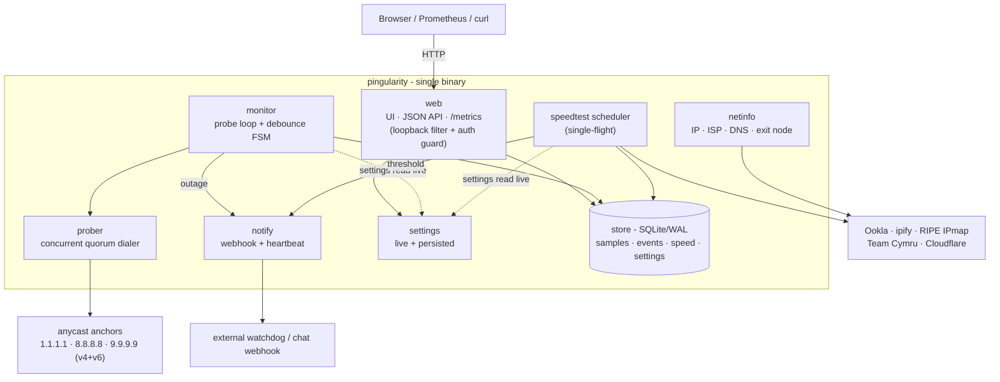
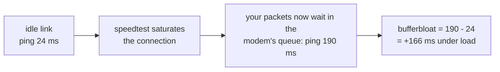
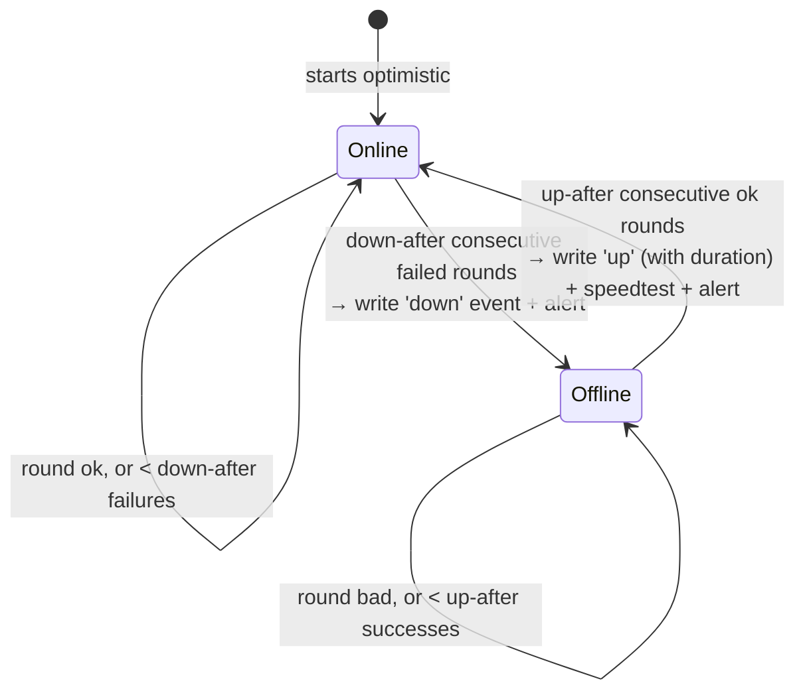
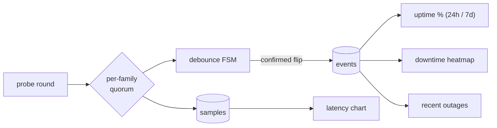
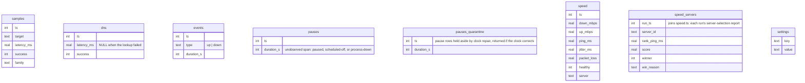
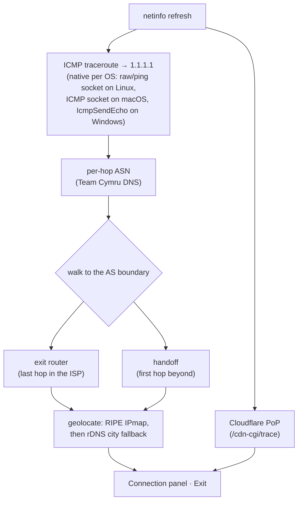
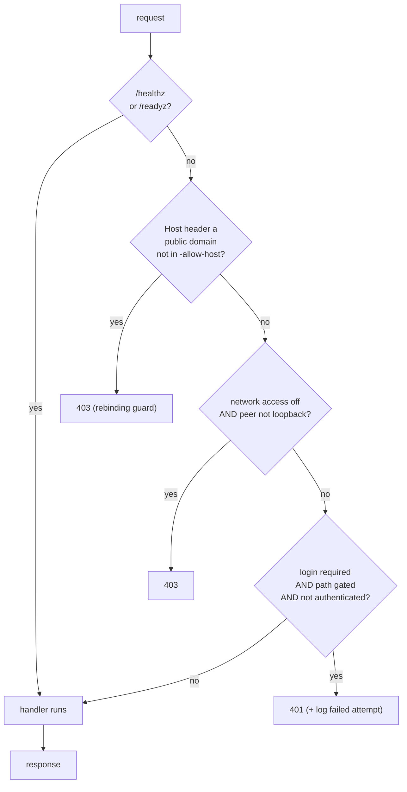

# Pingularity

**[pingularity.dev](https://pingularity.dev)** · **[live demo](https://demo.pingularity.dev)**

A single-binary internet connectivity monitor with a built-in web dashboard,
native speedtests, and a Prometheus `/metrics` endpoint. It continuously checks
your connection by pinging several always-on internet landmarks at once and going
by majority vote (a *quorum* across multiple *anchors*), with anti-flapping
(*debounce*) so a single blip isn't mistaken for a real outage. It records
latency, uptime, and speed to SQLite and shows it all in a live UI - no runtime
to install.

This is the [live demo](https://demo.pingularity.dev) - same dashboard, synthetic data:


## Quick start

```bash
go build -o pingularity .   # requires Go 1.27.0+ (go.mod); pure Go, no cgo
./pingularity               # UI on http://localhost:9000
```

No flags needed - but a fresh install measures nothing until you open the
dashboard and answer **Quick Setup** (headless: start with `-quick-setup=skip`);
left unanswered it starts on its own 48h after first launch. Once started it
probes every 5s. The UI binds `:9000` by default, but every install starts
**private**: a built-in filter answers only the machine it runs on, and other
devices get `403` until you flip **Network access** on in the settings drawer's
Access tab (flip it on and hit Save; the tab shows the address to use), or start
with `-access network`. This is true in a container too - a published port
returns `403` until you set `-access network` (or `-e PINGULARITY_ACCESS=network`),
so a container is never accidentally exposed. `-listen 127.0.0.1:9000` hard-pins
it to local-only at the socket level regardless.

Connectivity is probed over **both IPv4 and IPv6** (each as an independent
quorum of three anycast anchors). IPv6 is auto-detected - skipped on IPv4-only
hosts - and the families are tracked separately, so an IPv6-only outage is
visible without falsely reporting the whole link down. Overall status is
"online" when *either* family has connectivity. Be precise about where that
shows up: a single-family outage appears in the live status bubbles, the raw
latency samples, and the `monitor.v4_only_down_s` / `monitor.v6_only_down_s`
counters - but **outage events, the downtime heatmap, and the uptime ratios are
driven by the overall state**, so a loss of just one family is not recorded as
downtime there. That is the intended reading of "either family": the link still
carried traffic.

## Install

Prebuilt binaries and packages for Linux, macOS, and Windows (amd64 + arm64) are
published on every tagged release. Pick the channel that fits your OS - each one
lands the same single static binary. The `.deb`/`.rpm` packages also register
and start the background service for you; Homebrew and winget install the binary
and leave `pingularity install` to you (each section below says which).

### Linux

Fastest path is a native package (sets up and starts the systemd service, drops
an `EnvironmentFile` for flags, and runs the daemon as a dedicated unprivileged
`pingularity` user granted just an ambient `CAP_NET_RAW` - enough for the
raw-socket traceroute behind the **Exit** panel - inside a systemd sandbox, so
it is never root):

```bash
# Debian / Ubuntu (.deb)
sudo apt install ./pingularity_*.deb

# Fedora / RHEL (.rpm)
sudo dnf install ./pingularity_*.rpm

# openSUSE (.rpm) - same package, openSUSE's own package manager
sudo zypper install ./pingularity_*.rpm
```

Both start `pingularity.service` immediately (`systemctl status pingularity`),
put the database in `/var/lib/pingularity`, and read flags from
`/etc/default/pingularity` (`EnvironmentFile`) - edit that and
`systemctl restart pingularity` to change them. Two kinds of flag won't work
there, because that unit is sandboxed: `/var/lib/pingularity` is its only
writable path, so a `-db` pointing anywhere else fails on a read-only
filesystem, and `CAP_NET_RAW` is its only capability, so a `-listen` port below
1024 can't be bound. Keep the database on the state directory and the dashboard
on a high port, or put a reverse proxy in front.

Prefer no package manager? Grab the `.tar.gz` for your arch from the
[Releases page](https://install.pingularity.dev), extract it,
and use the binary's own installer:

```bash
tar xzf pingularity_*_linux_amd64.tar.gz
sudo cp pingularity /usr/local/bin/
sudo pingularity install    # registers, configures, and starts the systemd service
```

Or run it as a container (see [Docker](#docker) for why the flags matter):

```bash
docker run -d --name pingularity --restart unless-stopped \
  --network=host --cap-add=NET_RAW \
  -v pingularity-data:/var/lib/pingularity \
  ghcr.io/pingular/pingularity
```

### macOS

> Requires macOS 13 Ventura or newer (the Go 1.27 toolchain's floor).

```bash
brew install pingular/tap/pingularity
sudo pingularity install    # registers the launchd service and starts it
```

`brew upgrade` later pulls new versions; `sudo pingularity uninstall` removes the
service (data untouched).

### Windows

```powershell
irm https://install.pingularity.dev/winget.ps1 | iex
```

One paste from **any** PowerShell. The script elevates itself (one UAC click),
updates a too-old winget first (fresh Windows images ship one that fails zip
installs silently), points winget at the maintainer-hosted package source
(`winget.pingularity.dev` - so installs and upgrades never wait on app-store
moderation), installs under `Program Files`, and registers + starts the
Windows service. Re-running the same paste later **updates**: it stops the
service, upgrades, and starts it again. Prefer to run the steps yourself?
This is what it does, from an **elevated** PowerShell:

```powershell
winget source add -n pingularity -a https://winget.pingularity.dev -t Microsoft.Rest --accept-source-agreements
winget install pingular.pingularity -s pingularity --scope machine
& "$env:ProgramFiles\WinGet\Links\pingularity.exe" install    # registers the Windows service and starts it
```

The `source add` is one-time (re-running it just reports the source already
exists). `--scope machine` matters - it installs under `Program Files`, where
the Windows service expects its binary; keep it on upgrades too. The last line
spells out the exe's path because winget adds `pingularity` to the PATH of
*new* shells only - from your next terminal onward, plain `pingularity` works.
If the install fails silently right after "Successfully verified installer
hash", your winget is outdated: update **App Installer** in the Microsoft
Store and re-run.

> **Custom certificate stores (macOS, Windows):** if `SSL_CERT_FILE` or
> `SSL_CERT_DIR` is set in the daemon's environment, its outbound TLS
> (webhooks, speedtests, the update check) now trusts the roots in those files
> instead of the operating system's keychain - a Go 1.27 behavior change. A
> stale or truncated file there breaks every TLS connection with certificate
> errors; unset the variable, or start with
> `GODEBUG=x509sslcertoverrideplatform=0` to restore the old behavior.

> **Downloaded a raw binary in a browser?** macOS Gatekeeper or Windows
> SmartScreen may block it as "unidentified". Clear the quarantine flag once and
> it runs:
> ```bash
> xattr -d com.apple.quarantine ./pingularity      # macOS
> ```
> ```powershell
> Unblock-File .\pingularity.exe                    # Windows
> ```
> Installs via **brew**, **winget**, **apt/dnf**, and **docker** don't trip this
> at all - the prompt only appears for a file you fetched directly with a browser.

### Docker

```bash
docker run -d --name pingularity --restart unless-stopped \
  --network=host --cap-add=NET_RAW \
  -v pingularity-data:/var/lib/pingularity \
  ghcr.io/pingular/pingularity
```

The image is multi-arch (amd64 + arm64). `--restart unless-stopped` is there
because a connectivity monitor that stays down after a reboot is silently
useless - Docker brings it back with the daemon unless you stopped it
yourself. Two more flags matter:

- **`--network=host`** (load-bearing) - Pingularity measures *your host's*
  internet path. Behind Docker's default bridge network you'd instead measure
  the container's NAT'd view (extra hop, wrong latency, and a traceroute that
  dead-ends at the Docker gateway). Host networking also means the UI is
  reachable on the host's `:9000` directly - no `-p` needed.
  **Docker Desktop (macOS, Windows) can't reproduce this the same way.** Desktop
  runs the container inside its own Linux VM, so `--network=host` attaches to
  *that VM's* network namespace, not your Mac's or PC's interfaces. Docker
  Desktop 4.34+ does add opt-in host networking (enable it under **Settings ->
  Resources -> Network**), but it only bridges **TCP and UDP** flows between the
  host and the VM - it still does not expose the host's own interfaces or
  anything below L4, so the raw-ICMP traceroute behind the **Exit** panel and
  true native-host parity remain unavailable. Even with it turned on, the
  readings describe the VM's path rather than your machine's. Speedtest numbers
  are capped the same way: the VM's traffic leaves through a user-space network
  proxy that terminates every connection and re-opens it from the host, so on a
  fast link the measured throughput can sit well below what the machine gets
  natively. A small VM compounds it - the Ookla engine sizes its parallel
  streams from the CPUs it can see, and VM defaults are often just 2. Giving
  the VM more cores and memory (Docker Desktop: **Settings -> Resources**;
  colima: `colima start --cpu 6 --memory 8`) wins back the streams and some
  headroom, but the proxy ceiling stays. All of
  this applies to every VM-backed runtime, not only Docker Desktop: colima,
  OrbStack, Rancher Desktop, and Podman machine share the design. Run Pingularity
  natively on macOS or Windows if you want the measurements to match the host.
  (The dashboard's container notice is raised for a *bridged* container, which is
  the case it can detect; it does not detect Docker Desktop's host-networking
  mode specifically.)
- **`--cap-add=NET_RAW`** (keep it - without it the container won't start) -
  the **Exit** panel walks a raw-socket ICMP traceroute to find where traffic
  leaves your ISP. The images grant that privilege through a file capability
  stamped on the binary (`cap_net_raw+ep`), and the effective (`+e`) bit makes
  it mandatory: when `NET_RAW` is missing from the container's capability set,
  the kernel refuses to execute the binary at all, so the container **exits
  immediately with "operation not permitted"** - it does not come up with a
  degraded trace. Stock Docker still grants `NET_RAW` by default, so plain
  `docker run` works without the flag today - but Podman 4+ dropped it from its
  default set, and `--cap-drop=ALL` / a Kubernetes `capabilities: {drop:
  [ALL]}` remove it too, so all of those need it added back
  (`--cap-add=NET_RAW`; Kubernetes `add: [NET_RAW]`) for the container to
  start. Spelling it out keeps the command correct everywhere. Two related
  setups behave differently, and the difference is that file capability:
  - **`--security-opt no-new-privileges`** (Kubernetes
    `allowPrivilegeEscalation: false`) does not stop the start: it blocks a
    file capability from raising privileges at exec even when `NET_RAW` is
    granted, so the daemon runs *without* the capability and only the trace
    degrades - the Exit row shows as unavailable, everything else works. The
    unprivileged ICMP fallback that can save the trace natively is normally
    closed in a container (a fresh network namespace's `ping_group_range`
    admits no group), but you can open it and win the trace back without the
    capability: `--sysctl net.ipv4.ping_group_range="65532 65532"` on a
    bridged container (the same sysctl via `securityContext.sysctls` on
    Kubernetes). Under `--network=host` the namespace is the host's, so
    Docker refuses `--sysctl` there - widen the host's own
    `ping_group_range` instead.
  - A **native** binary without the privilege degrades gracefully, because
    the release binaries carry no file capability - the deb/rpm unit grants
    an ambient `CAP_NET_RAW` instead, and a tarball binary run unprivileged
    just loses the trace. Only the container images make the capability a
    start condition.

> **Reaching the dashboard from other devices.** Every install starts
> loopback-only, containers included - it is never guessed open from the network
> setup. With `--network=host` the dashboard answers on the *host's*
> `localhost:9000`, but other devices on your LAN get `403` until you opt in with
> `-access network` (or `-e PINGULARITY_ACCESS=network`) - set a login at the same
> time. A bridged container that publishes a port with `-p` needs the same flag,
> or the published port returns `403`. An explicitly passed `-access` /
> `PINGULARITY_ACCESS` is authoritative at every start: it updates a disagreeing
> saved setting (in either direction) and logs the change, so
> `-e PINGULARITY_ACCESS=network` also recovers an install whose saved
> local-only would otherwise lock its published port out. The flip side: while
> the flag or env stays pinned in your unit/compose file, changing **Network
> access** in the UI is overridden again at the next restart - drop the flag to
> let the UI choice stick.

> **Upgrading a container from 0.61 or earlier?** Up to 0.61 a container
> answered the network by default; every install now starts private -
> **upgrades included**. An existing container install is *not* kept
> network-reachable across the upgrade: it starts local-only like everything
> else, so its published port answers `403` until you opt in, and that `403`
> body names the setting that refused you and both ways out (the **Access** tab
> from the machine itself, or `-access network` / `-e
> PINGULARITY_ACCESS=network` at start). The one-step fix is the env var: add
> `-e PINGULARITY_ACCESS=network` and recreate the container - an explicitly
> passed access mode is authoritative at every start, so it opens the port
> immediately, at that start and every later one. It does not write the choice
> into the database, though: keep the env var in your `docker run` / compose
> file, or - to make it stick without one - open the **Access** tab while the
> port is open, leave **Network access** on, enter your **current password**
> and hit **Save**, which does store it (a saved value persists even when it
> matches what the env var supplies), then drop the env var. Set a password at
> the same time. Your volume, database and history are untouched either way.
>
> The current password is the point of that step, not a formality: storing
> "network" is what makes the open port outlive the variable, so it is a real
> access change and is priced like one. Save it without the password and the
> setting still applies - nothing breaks, and every other setting on the page
> saves normally - but the choice is not written down, so dropping the env var
> returns the install to local-only. If a login is not configured yet, there is
> no password to enter and Save stores it as before.
>
> Why you have to say it, rather than the daemon working it out: what it can
> see is an established database that never stored an access choice, and more
> than one kind of install looks exactly like that. A container upgraded from
> 0.61 or earlier is one - its dashboard did answer the network. But so is any
> database that simply lacks the birth marker stamped on new installs,
> including one whose marker could not be written when it was created. The
> first wants opening; the rest were private all along, and guessing "open"
> for them would put an unauthenticated dashboard on the LAN. So the ambiguity
> fails closed. (A container carrying the marker is not ambiguous and is never
> warned about.) The daemon does say so when it sees the
> ambiguous shape: one warning in the log, `container install with no recorded
> access choice: access stays LOCAL-ONLY, so a published port answers 403 until
> you opt in`, with the same fix attached. It only explains - it never changes
> access on its own.

The **`-v pingularity-data:/var/lib/pingularity`** volume is what makes updates
safe: the SQLite database *and* `pingularity.key` (which encrypts saved iperf3
passwords) live there. Skip the volume and a `docker pull` + recreate throws
away your history and key. Pass flags as arguments after the image name, e.g.
`ghcr.io/pingular/pingularity -speedtest-interval 30m` - in compose, that means
under `command:`, e.g. `command: ["-allow-host=your.domain"]`. Pingularity does
not interpret `PINGULARITY_OPTS` as flags: that variable is expanded by the
native Linux systemd units from `/etc/default/pingularity`, and the container
images ignore it.

A **named volume** is the happy path: on first use Docker copies the image's
data directory into it - owner `65532:65532`, mode `0700`, plus a marker file
the daemon uses to recognize its own directory - so an unprivileged container
just works. (Some Docker engines loosen a fresh volume's root during that
copy; at boot the daemon re-tightens exactly that directory - its own path,
its own owner, the image's marker - back to `0700` and logs that it did.) A
**bind mount** is whatever host directory you point at it, and the image's
user won't own it: `chown 65532:65532` it first (and `chmod 700`), or run
with `--user <uid>:<gid>` matching the directory's owner. Either way the data
lands on the mount - the image's entrypoint pins
`-db /var/lib/pingularity/pingularity.db`, so a `--user` override changes who
writes, never where. On **Kubernetes**, mount the PVC at
`/var/lib/pingularity` and set `securityContext: fsGroup: 65532` so the
kubelet makes the volume writable for the pod (add `fsGroupChangePolicy:
OnRootMismatch` to skip the re-chown on every mount). The daemon notices the
resulting group-writable volume root at each boot and says exactly that: the
shape is how an fsGroup pod writes at all, so it explains it and leaves it
alone, and the database file itself stays owner-only. To make the directory
owner-only and end the notice, chown the volume root to uid 65532 once and
drop fsGroup.

Two image variants ship to the same repo. The default
`ghcr.io/pingular/pingularity` is a lean distroless image and deliberately ships
**no iperf3** - its base has no package manager, so the opt-in iperf3 speedtest
engine can't run there and speedtests fall back to Ookla. If you use the iperf3
engine, pull the `-iperf` variant instead
(`ghcr.io/pingular/pingularity:latest-iperf`), a debian-slim image that bundles a
working `iperf3` and is otherwise identical - same non-root uid 65532, same
`CAP_NET_RAW` binary, same volume layout, so every flag above carries over. If
you run it bridged rather than with `--network=host`, read
[iperf3 in a container](#iperf3-in-a-container) first: several iperf3 settings
name things only the host has, and the compose file there maps
`host.docker.internal` so a host-side `iperf3 -s` stays reachable.

**What `docker logs` shows.** Logging is off by default, but the daemon always
prints one startup line to stdout - version, listen address, access mode, and
dashboard URL, e.g. `pingularity 0.70.0: listening on :9000, access
local-only, dashboard at http://localhost:9000` - so a healthy container is
distinguishable from a hung one. A genuinely fresh install prints a second line
beside it - `first run: monitoring is on hold - nothing is being measured yet` -
naming the dashboard URL and `-quick-setup=skip`, because that is the state
where `docker ps` reads `(healthy)` and nothing is being recorded. Warnings and
errors (the ambiguous-access warning above, security warnings) still surface at
the default level; routine detail needs the log level raised in the About tab.

**Health check.** Both images bake in a
`HEALTHCHECK ["/pingularity", "healthz"]` (every 30s, 5s timeout, 10s start
period): the `healthz` subcommand fetches `http://127.0.0.1:9000/healthz`
from inside the container and exits 0 on a `200`, so `docker ps` reports
`(healthy)`/`(unhealthy)` with no curl or shell in the image. If you change
`-listen`'s **port**, or bind it to an address that excludes `127.0.0.1`, the
baked-in probe misses the daemon and the container reads unhealthy while it is
fine: in compose, override it with the exec form -
`healthcheck: { test: ["CMD", "/pingularity", "healthz", "-addr",
"127.0.0.1:8080"] }` - and with plain `docker run`, pass `--no-healthcheck`
on the default image (`--health-cmd` needs a shell, which distroless does not
have; the `-iperf` image has one). A bind that keeps port 9000 and still answers
on loopback - `:9000`, `0.0.0.0:9000`, `127.0.0.1:9000` - needs no override at
all.

**Read-only root filesystem.** The default image runs under
`docker run --read-only`: everything the daemon writes - the database and its
`-wal`/`-shm` sidecars, `pingularity.key`, and the `logs.txt` log snapshot -
lives beside the pinned `-db` path, on the volume. The `-iperf` variant wants
one addition, `--tmpfs /tmp`, if you use iperf3 **RSA auth**: the server's
public key is staged as a temp file for the iperf3 child, and with nowhere to
write it those runs fail with a clear `iperf3 auth: temp key` error (nothing
else is affected).

**Forgot the password?** `pingularity reset-auth` needs the database, and in
a container that means the volume - run it from a one-off container sharing
the volume (the image's entrypoint pins the `run` subcommand, so override it):

```bash
docker run --rm --entrypoint /pingularity \
  -v pingularity-data:/var/lib/pingularity \
  ghcr.io/pingular/pingularity:<tag> \
  reset-auth -db /var/lib/pingularity/pingularity.db
docker restart pingularity   # the running daemon caches settings in memory
```

Use the tag your container runs (`docker inspect pingularity --format
'{{.Config.Image}}'`), so the one-off binary matches the database it opens.

**Locked out of a published port?** A restore that forces access to
local-only (see [the restore notes](#run-in-the-background-systemd--launchd--windows-service))
leaves a bridged container's published port answering `403` - including to
the browser that ran the restore. Recreate or restart the container with
`-e PINGULARITY_ACCESS=network`: an explicit access choice at start overrides
the stored setting. Then set things right in the Access tab.

### Updating

- **apt / dnf** - download the newer `.deb`/`.rpm` and reinstall it the same way
  (`sudo apt install ./pingularity_*.deb` / `sudo dnf install ./pingularity_*.rpm`);
  your data and env file are preserved, and the running service is restarted
  onto the new binary automatically.
- **Homebrew** - `brew upgrade pingularity`, then `sudo pingularity restart`.
- **winget** - re-run the one-shot
  (`irm https://install.pingularity.dev/winget.ps1 | iex`), or by hand from an
  elevated PowerShell, in this order: `pingularity stop`, then
  `winget upgrade pingular.pingularity -s pingularity --scope machine`, then
  `pingularity start`. Stop first - winget cannot replace a running
  service's binary - and keep `--scope machine`, or winget reinstalls into
  your user profile and the service loses its program.
- **Docker** - `docker pull ghcr.io/pingular/pingularity`, then `docker rm -f
  pingularity` and re-run it (the named volume carries your data across).
  Coming from **0.61 or earlier** and reaching the dashboard from other
  devices? Add `-e PINGULARITY_ACCESS=network` to that re-run: every install
  starts private and the upgrade is not grandfathered, so without it the
  published port answers `403` (see [Docker](#docker)).
- **tarball** - Linux won't let you overwrite a *running* program file
  ("text file busy"), so either stop the service first, or copy alongside and
  rename over it (rename always works):
  ```bash
  sudo cp pingularity /usr/local/bin/pingularity.new
  sudo mv -f /usr/local/bin/pingularity.new /usr/local/bin/pingularity
  sudo pingularity restart
  ```

The in-app **update badge** notifies you when a newer release exists - it's a
poll of a maintainer-controlled feed (`latest.json`), notify-only, and never
touches your install. See [RELEASING.md](RELEASING.md) for how that feed is
published.

> **Rolling back to an older release?** Stepping the binary back (and forward
> again) is fine on its own - a downgrade does not rewrite your history. The one
> boundary that matters is **0.70**. That release added a marker on the
> bookkeeping rows a failed or partly-retried speedtest leaves behind so their
> bytes still count toward **Speedtest data used** without being shown as runs;
> builds older than 0.70 don't know the column is there. Point one at a database
> a 0.70-or-newer build has written and it reads those rows as real runs: a
> `0 Mbps / 0 ms` speedtest at the top of the dashboard, folded into the run
> averages, and published on `/metrics` as `pingularity_speed_download_mbps 0` -
> enough to fire a "download below X" alert. *Reading* is safe: nothing is
> damaged, the marker is left untouched, and coming back up on 0.70+ hides those
> rows again. *Deleting* is not: the older build removes only the row you
> clicked. Delete the bogus `0 Mbps` row and you have deleted an accounting row
> 0.70+ keeps on purpose, so its bytes leave **Speedtest data used** for good.
> Delete the real run it was billing for and that row is stranded instead -
> hidden again on 0.70+, still counting, with no run left to delete it by until
> retention prunes it. Do your deleting before you step down, or after you come
> back up. What does *not* heal is a **backup taken by the older build**: its
> export has no marker to carry, so restoring that file onto an install that
> does not already hold those rows - a fresh box, a rebuilt volume - brings them
> back as permanent 0 Mbps runs. Take the backup with the newer build, before
> you step down - though that file is your way back *up*, not a rescue while you
> are down: any run carrying the new columns stamps the export for 0.70+, and an
> older build refuses a newer stamp outright rather than restoring half of it.

## Run in the background (systemd / launchd / Windows service)

The `.deb`/`.rpm` packages already do this for you; the steps below are for the
tarball, a `go build`, or a fresh binary you dropped in yourself.

```bash
sudo cp pingularity /usr/local/bin/
sudo pingularity install    # no flags - DB goes to /var/lib/pingularity, UI on :9000 (loopback-only until you turn Network access on); starts the service
pingularity status          # running | stopped | not installed
```

The database path and its directory are chosen and created automatically. On
Windows that is always `%ProgramData%\pingularity\` - service or not - so the
installed service and an admin prompt (`reset-auth`) find the same database.
On Linux and macOS what decides is root, not the service: as root (which is how
`install`'s service runs) it is `/var/lib/pingularity/` on Linux and
`/Library/Application Support/pingularity/` on macOS; as a regular user it is a
per-user data dir - `~/.config/pingularity/` on Linux (`$XDG_CONFIG_HOME`
honoured), `~/Library/Application Support/pingularity/` on macOS - with a
temp-dir path as the last resort when there is no home directory at all.
Any flags you *do* pass to `install` are persisted into the service definition.
On systemd you can change them later without re-installing: the unit that
`install` writes also reads `/etc/default/pingularity`, if you create one, so
`PINGULARITY_OPTS="-speedtest -listen 127.0.0.1:9000"` plus
`sudo systemctl restart pingularity` is enough. macOS and Windows have no
equivalent, and re-running `install` is not one: over a service that already
exists it fails with an "already exists" error and leaves the flags it was
installed with exactly as they were - on macOS, on Windows, and on a systemd
unit this CLI installed alike. Wherever `/etc/default` isn't an option, then,
changing a flag means `uninstall` first, then `install` with the new set. Manage
with `pingularity start | stop | restart | status | uninstall`. On Linux and macOS a
reload signal (`sudo systemctl reload pingularity`, or `kill -HUP <pid>`)
re-reads settings from the database without restarting - how you pick up an
out-of-band change like `reset-auth`, and the way back from the `503` a daemon
serves when it couldn't load its settings at all. Windows has no reload signal;
restart the service there.

Alongside the database sit `logs.txt` (the log viewer's ring, so it survives a
restart) and **`pingularity.key`** (0600) - the key that encrypts the secret
that has to be kept recoverable: each saved iperf3 server's password. iperf3 needs
it in the clear at test time (it encrypts it with the server's RSA key itself), so
unlike your dashboard login it can't be hashed. Two things follow:

- **Back up the key with the database** if you want those passwords to survive a
  restore. Delete or lose the key and you re-enter them - the daemon mints a fresh
  one at the next start. That also signs out every logged-in browser, because
  session cookies are signed with a second secret derived from this same file;
  which is the point, since it means a database travelling *without* its key can't
  mint a valid session for whoever picks it up. Your password, settings and history
  are untouched. (A key file that is present but not 32 bytes - a truncated copy, a
  half-restored backup - is refused rather than used: the daemon still starts and
  still monitors, but stores iperf3 passwords in the clear and says so on stderr
  until you move the file aside and let it make a new one.)
- The key lives next to the database, so this does **not** protect you from someone
  who can read the host. What it does protect is the database travelling on its own -
  a backup, a snapshot, a stray copy - which now carries ciphertext, not your password.

Backup exports never contain passwords at all (neither the login nor the iperf3
ones). **They are still sensitive files.** A config export deliberately carries
your **webhook URL** and **heartbeat URL** so that a restore is complete, and for
both of those the URL *is* the credential - there is no separate token to
withhold. Anyone holding an export file can post to your alert channel or tick
your dead-man's-switch (masking a real outage), so store and share it like a
secret, and rotate both URLs at their provider if one leaks. Two more
consequences worth knowing before you need them:

- **Copying the database files by hand?** Stop the service first. While it runs,
  recent rows live in a sidecar file (`pingularity.db-wal`) that a copy of just
  `pingularity.db` misses - on a young install that can be *everything*. A clean
  stop folds the sidecar back into the main file. (The Data tab's **Export** is
  the safe way to back up a *running* instance - it streams a single consistent
  read-snapshot, so categories can't skew across it. **A full-retention export
  round-trips**, however large - import puts no ceiling on the total file, only on
  a single record (8 MiB) or a single JSON element (256 MiB), which no real backup
  reaches.)
- **A database that won't open is set aside, not repaired.** A torn file - typically
  a hard power-off mid-write - would otherwise crash-loop the service forever, so
  instead the daemon renames it and its `-wal`/`-shm` sidecars to
  `pingularity.db.<UTC timestamp>.corrupt`, starts again on an empty store, and logs
  which file it moved. Nothing is deleted, so the old data is still there to inspect
  or hand to a recovery tool - but the dashboard comes back blank, and the
  quarantined copy keeps taking up its space until you remove it. This is the
  failure a periodic **Export** exists for.
- **Restoring a backup where login was enabled?** The export carries the
  "login on" preference but never the password, so on a machine that doesn't
  already have one the restore leaves login **off**, **forces access to
  local-only** so it can't fall open to the LAN, and tells you so - set a
  new password in the Access tab, then re-enable Network access. (Restoring onto
  the same machine, where the password still exists, keeps login working untouched
  and access unchanged.) Restoring onto a machine that already has its *own*
  password works the other way round: the backup's login **name** is ignored and
  yours is kept, and a backup that turns login **off** does not disable it. The
  import says so in both cases - the password never travels, so a foreign name
  paired with your hash would lock you out of the only page that can fix it.
  In a container, the local-only forced by that FIRST case - a backup with login
  on, restored where no password exists - can lock you out
  of a published port - `403`, including for the browser that ran the restore -
  and the import response says so; the way back in is restarting the container
  with `-e PINGULARITY_ACCESS=network`, then setting things right in the
  Access tab.
- **Restoring onto a *different* machine?** A backup never carries the source's
  install date, so the destination keeps its own answer to "monitoring since".
  That date is the denominator behind every uptime figure, and importing it would
  have this box reporting uptime over a stretch it did not watch. Restore the
  **history** too and the date moves anyway - derived from the earliest row that
  actually arrived, which is a claim the restored data backs up. A backup does
  not carry **who can reach the dashboard** either: whether a machine answers
  only itself or the whole network is a decision about *that* machine, so a
  restore never opens a dashboard to the network, and closes one only in the
  fail-closed case above - a backup with login on, restored where no password
  exists. Set it in the Access tab on the destination.
- **Restoring on an *older* version?** It will refuse the file rather than
  restore half of it. A backup is stamped with the oldest version that can read
  it, and that stamp is worked out from what the file actually contains - so a
  backup whose runs use nothing new still restores on an older build, and one
  that doesn't is turned away up front, before anything is written.

## Architecture

One static binary runs a handful of independent goroutine loops that share a
SQLite store and a live settings controller. Nothing else is required - the UI,
web font, and favicon are embedded; outbound calls are the probes themselves,
optional enrichment (geo/ISP/exit), speedtests (Ookla, or the iperf3 server you
point it at), the update check, and the alert webhook and heartbeat if you
configure them - the full inventory is the outbound-calls table below.



| Package | Responsibility |
| --- | --- |
| `main` | CLI, OS-service lifecycle (`kardianos/service`), wiring |
| `config` | flags, defaults, the anchor target list |
| `prober` | concurrent IPv4/IPv6 quorum dialer |
| `monitor` | probe loop + debounced up/down state machine |
| `store` | SQLite persistence + the uptime/aggregate queries |
| `settings` | runtime-adjustable values, persisted and broadcast live |
| `speedtest` | Ookla + iperf3 testers, single-flight scheduler |
| `netinfo` | public IP/ISP/DNS + exit-node discovery (traceroute) |
| `notify` | webhook alerts + dead-man's-switch heartbeat |
| `web` | embedded UI, JSON API, `/metrics`, access/auth guard |

## Speedtests

A run records download, upload, ping, **jitter**, (best-effort) **packet loss**,
and **bufferbloat**, plus the bytes used and the connection it ran on (public IP,
ISP, DNS resolver). A run also records two facts that used to be
invisible: the **address family** the transfer actually used (IPv4, IPv6, or
`mixed` when one run genuinely used both) - read back from the run's own
connections, never guessed - and **which direction** its
loss/jitter probe sampled. Not every field is present on every run: a download-only
or upload-only run has no figures for the direction it skipped, packet loss is
optional and not always measurable, family and probe direction are recorded
only when the run really established them (the engine notes below say when
that is), and bufferbloat is absent when a transfer
phase was too short to sample, returned too few samples, or the latency target
was unreachable. Missing is stored as missing rather than as a zero, so charts
and thresholds can tell "not measured" from "measured, and it was bad". A run
that failed outright isn't a measurement at all: it is kept only as a flagged
data-usage row, which every measurement view filters out (see the data-usage
bullet under [Metrics](#metrics-optional)).

The **ping** shown is the engine's own number, a mean over ten samples, so it
keeps matching what speedtest.net would report. A mean has no defence against an
outlier, though: one stalled handshake among nine fast ones reports several times
the real latency (and lands in jitter, which is their standard deviation, as a
much larger distortion still). So the run also keeps the **fastest** of those
same samples - no extra probes - and everything that *decides* on latency uses
that floor instead: which server wins a best-of round, which server the very
first run picks, and whether your ping threshold breached. A pothole shouldn't
pick your server or page you, but a genuinely distant link has a high floor too
and still breaches. iperf3 exposes no per-sample values of its own, so a run
measures the latency itself: five bare TCP handshakes to the server before the
transfer, reported as their **median** (if none of them land, iperf3's own
`min_rtt`, and failing that the idle baseline). There is no separate fastest
figure on those runs, so that median is both what is shown and what decides.


**Bufferbloat** is the extra lag that appears only while the line is busy - the
reason a video call breaks up the moment a big download starts. Pingularity
measures it by pinging before the test (idle) and during it (loaded) - both
against a fixed target of its own rather than the speedtest server, so only the
gap between them is meaningful, and the idle figure will not match the **ping**
recorded above:



Both figures are **medians** of their probes, and the headline bufferbloat number
- the one the tiles show and the one your **max bufferbloat** threshold is
compared against - is `median(loaded) - median(idle)`. The chart also plots a
**p95** per direction, the sustained bad end of the distribution. p95 is
deliberately not the maximum: these are TCP-connect probes, and a single worst
sample on one is usually a SYN retransmission (a fixed ~1000 ms OS retry, and
~2000 ms for a second one) rather than queue delay, so a max-based number
reports round figures that say more about packet loss than about buffering.

There are two engines, picked in the settings drawer:

- **Ookla (speedtest.net)** - the default. Numbers match speedtest.net; no setup.
  Its own knobs: parallel connections (`0` = auto, which is one per logical CPU
  for downloads and at most 8 for uploads; a value you set instead applies to
  both directions, up to 16 - worth raising on a fast or high-latency link, or in
  a small VM that can only see two cores) and the packet-loss probe.
- **iperf3** - opt-in, run against your own `iperf3 -s` box (LAN, homelab, or
  VPS). It measures what Ookla can't: internal/LAN links and honest upload. Used
  only when the `iperf3` binary is installed (otherwise it falls back to Ookla) -
  present on a native install once you've installed iperf3, and in the container
  only in the `-iperf` image variant, not the default image.
  Its own knobs: parallel streams, duration, warm-up, TCP window, congestion
  control, MSS, DSCP, the loss/jitter UDP pass, and - per server - IP version,
  bind source, and optional RSA auth. In a bridged container several of those
  knobs point at things only the host has - see
  [iperf3 in a container](#iperf3-in-a-container) below.

**Direction** (both / download / upload, plus iperf3's simultaneous `--bidir`) and
**retries** (default `1`, at most `3`) are kept **per engine**: the Ookla and iperf3
tabs each carry their own pair, so tuning one never disturbs the other, and
switching engines switches which pair is in force. On Ookla, retries are also what
let a very slow uplink finish at all: when parallel upload streams are too slow for
any of them to complete inside the capture window, the retry falls back to a single
stream. Set Ookla's retries to `0` and that fallback cannot run, so on a link that
slow the upload always fails and records nothing. The run's download half is kept
either way - a "both" run that loses only its upload stores its download, ping and
jitter as a partial result, with the upload shown as unmeasured (the same contract
iperf3 has always had) - and the warning in the log says why and names the setting.

That UDP pass needs the iperf3 port open for **UDP as well as TCP** - the same
port, both protocols (`ufw allow 5201/tcp` and `ufw allow 5201/udp`, or the
equivalent security-group rules). Allowing only TCP is the usual reason a server
reports throughput perfectly while loss and jitter stay blank forever: the
control connection and both transfers are TCP and connect fine, and the UDP
datagrams are dropped without a refusal, so the pass waits out its window and
gives up. The daemon logs `iperf3 udp pass failed, loss and jitter unrecorded`
each time, and when the run's TCP transfers succeeded it names the firewall as
the likely cause. Nothing is retried later, so runs taken while the port was
closed have no loss or jitter to recover.

For iperf3, the separate UDP loss/jitter pass probes the same direction you
test: downstream normally, upstream for an upload-only run - so a one-direction
test on an asymmetric line reports loss for the direction you asked about. That
also means loss and jitter describe **one direction per run**, never both, and
loss on an asymmetric path genuinely differs by direction - so each sample now
records which way its probe ran. The loss and jitter readouts name the path on
hover, the run tooltip carries it in its Quality line, and it's exported as
`udp_direction` (`down`/`up`) in the API and CSV. An Ookla run records a
direction too: its packet-loss probe sends the datagrams from the client to
the server, so a probe that succeeded is recorded as `up`. Runs that never
measured loss/jitter - either engine's - and rows recorded before the field
carry no direction and are shown unlabeled rather than guessed at.

### iperf3 in a container

A bridged container (the default `docker run`/compose network) has its own
network namespace: its own `localhost`, its own interfaces and addresses, its
own `/etc/hosts`, and NAT between it and everything else. Several iperf3
settings are **host-referential** - they name things that exist on the host but
not inside that namespace. All of them fail loudly rather than mismeasure
quietly, and when the daemon knows it runs in a container, most of the failures
carry a container-specific explanation in the error itself (natively the same
errors mean exactly what they say, and get no such note):

- **A loopback server address** (`localhost`, `127.0.0.1`, `::1`) - inside a
  bridged container that is the *container*, so the connection is refused by
  the container's own (empty) loopback before it ever reaches the `iperf3 -s`
  on the host. The settings drawer warns as soon as a saved
  server points at loopback while the daemon runs bridged (a host-network
  container's loopback *is* the host, so it never warns there; it never blocks
  saving either - the operator may really mean the container), and a failed run's
  error explains the same thing. Use `host.docker.internal` (see the compose
  file below) or the host's LAN IP.
- **Server names the host resolves privately** - entries in the host's
  `/etc/hosts` and mDNS `.local` names resolve natively but not in a bridged
  container, which has its own hosts file and no mDNS responder. The run fails
  with iperf3's own name-resolution error (no container-specific hint for this
  one - the daemon can't tell a host-private name from a typo). Use an IP, or
  a name the container's DNS resolves.
- **Bind source = a host IP** (`--bind`) - the address doesn't exist in the
  container's namespace, so the bind fails ("cannot assign requested
  address"), and the error says so. Bind a container address instead, or use
  host networking.
- **Bind source = a host interface name** (`--bind-dev`) - interface names
  don't cross network namespaces, so it fails ("no such device"), and the
  error says so. Separately, on kernels older than 5.7 `SO_BINDTODEVICE`
  needs `CAP_NET_RAW`, which the `-iperf` image's `iperf3` deliberately does
  not have (the capability is stamped on the `pingularity` binary alone - see
  [docs/security-model.md](https://github.com/pingular/pingularity/blob/main/docs/security-model.md)) - so on those kernels
  `--bind-dev` fails in the container even for an interface that does exist
  inside it. Native installs are unaffected: the deb/rpm unit's *ambient*
  `CAP_NET_RAW` carries into the iperf3 child.
- **IP version = IPv6** - the default Docker bridge carries no IPv6 (unless
  you've enabled it in the daemon config), so a forced IPv6 run fails outright
  ("network unreachable"), and the error says why. The quieter half of the
  same problem is **Auto**: it doesn't fail, it silently measures IPv4 where a
  dual-stack native install would measure IPv6. That is why a run records the
  family its transfers actually used - shown beside the server in the runs
  table and run tooltip, exported as `ip_family` (`4`/`6`/`mixed`) in the API
  and CSV. iperf3 reads it back from each direction's own connection report,
  and `mixed` means the download and upload really landed on different
  families (dual-stack DNS can do that) - labeled `IPv4+IPv6` in the UI
  rather than picking a side. Ookla runs record it from the transfer's real
  connections; a run with no recordable connection - for example one carried
  entirely through an operator's proxy, where only the hop to the proxy is
  visible - stays empty, never guessed, like rows recorded before the field
  existed. An Ookla `mixed` claims less than an iperf3 one: a single recorder
  spans both directions *and* every retry there, so it means both families
  showed up somewhere in the run's transfers - a retried attempt landing on the
  other family is enough, and the two directions need not have differed.

Two more things a bridged container changes without any error at all:

- **MTU.** The Docker bridge defaults to an MTU of 1500 no matter what the
  uplink uses, so over a tunnel or PPPoE uplink with a smaller effective MTU,
  full-size packets fragment along the way. The UDP loss/jitter probe now
  sends **1200-byte datagrams** (1200 + 8 UDP + 40 IPv6 = 1248, under the
  1280-byte IPv6 minimum MTU), so the probe itself can't fragment on any sane
  path - container or not - and its loss figure can't be fabricated by dropped
  or late fragments. An oversized **MSS** setting doesn't error here either:
  the kernel silently clamps it to what the interface takes.
- **LAN line rate.** Bridged traffic crosses a veth pair and conntrack NAT,
  which costs real CPU per packet - against a fast LAN server the measured TCP
  rate can sit measurably below native line rate, most visibly at
  multi-gigabit speeds. The number honestly describes the container's network
  path; it just isn't the host's.

And one setting empties rather than fails: the **congestion control**
dropdown's suggestions come from
`/proc/sys/net/ipv4/tcp_allowed_congestion_control`, which exists only in the
host's initial network namespace - a bridged container can't see it, so the
dropdown arrives with no suggestions, and the UI now says why instead of
letting the empty list read as "this host supports no algorithms". An
algorithm you type or import is still passed to iperf3 unchanged.

**`--network=host` makes nearly all of this go away** on Linux Docker Engine:
the container shares the host's namespace, so loopback is the host, host IPs
bind, IPv6 works, multicast reaches the wire, and LAN tests measure at native
line rate. Two caveats survive it: `.local` *name resolution* still depends on
the image's own resolver (debian-slim has no mDNS module - prefer an IP or
`host.docker.internal`), and on kernels older than 5.7 an interface-name bind
still fails in the container (the capability note above). It is already the recommended way to run the container (see
[Docker](#docker) - including why Docker Desktop can't provide it).

The canonical compose file for the iperf3-enabled image lives at
[install.pingularity.dev/compose-iperf.yaml](https://install.pingularity.dev/compose-iperf.yaml) -
fetch it from there rather than copying a block from this README: the served
file is pinned to the image version it was published with and carries the
current comments, so it cannot drift from the daemon the way an inline
snapshot here could. Three of its pieces are the ones this section is about:

- It defaults to **`network_mode: host`**, for all the reasons above.
- Its `extra_hosts: ["host.docker.internal:host-gateway"]` maps
  `host.docker.internal` to the host's gateway address, so an `iperf3 -s`
  running on the host is reachable from the container by that name on Linux
  Docker Engine too (Docker Desktop resolves the name on its own).
- If you must stay bridged (published ports, Docker Desktop without host
  networking, an orchestrator that owns the network), it keeps the fallback
  as a commented **pair** - `ports: ["9000:9000"]` together with
  `environment: ["PINGULARITY_ACCESS=network"]`. Uncomment both or neither: a
  published port alone answers `403`, because every install starts private
  (see [Docker](#docker)) - and set a login when you opt in.

One honest caveat either way: a test against an `iperf3 -s` on the **same
machine** measures the container-to-host virtual path (or loopback, under
host networking), not any real network - fine as a smoke test, useless as a
line measurement.

### Scheduling and triggers

Scheduled speedtests are **off by default** - turn them on in the Speedtest
settings (or with `-speedtest`). Once enabled, they run on startup and on a
schedule (`-speedtest-interval`, default `1h`). Two extra triggers are governed
separately: a test runs **after a reconnect** (on by default;
`-speedtest-on-reconnect=false` to disable) - spaced out so a flapping line
cannot fire tests back to back: at most one reconnect test per
`-speedtest-interval`, or per 15 minutes when that interval is shorter. There is
also an optional **while degraded**
toggle in the Speedtest settings (off by default, needs scheduled tests on) that
fires a test when latency stays high without the link fully dropping - above
**Degraded above** (default `150` ms, `0` = off) for two probe rounds in a row,
re-arming once latency recovers. **Run now** (or `POST /api/speedtest`) always
works.

Only one speedtest runs at a time, and the triggers do not queue behind each
other. If a **scheduled** slot comes due while any other test is already
running, that slot is **skipped** and the schedule advances to the next one - it
is not retried, and not run late (the counter
`pingularity_stat_total{stat="speed.scheduled_skipped"}` records it). A slot
held back by a **closed window** or a **busy link** behaves the opposite way:
nothing was measured, so it keeps polling and fires as soon as the condition
clears. "Busy" is traffic on the busiest interface above **Busy above** (default
`5` Mbps) - and unlike the alert thresholds, `0` is not "off" here: it makes any
measurable traffic count as busy, so scheduled tests stop firing. Only scheduled
runs consult it; reconnect, degraded and **Run now** go regardless.

### Choosing an Ookla server

For Ookla, choose a server (search a city) or leave **Auto - fastest near you**
(it reads **Auto - fastest in \<city\>** once you've searched one). Auto
isn't just "nearest": every server that's effectively equidistant gets to race
(in a big city, a dozen providers all sit "0 km away" - one of each is pinged
rather than an arbitrary few) and the lowest latency wins. Your own ISP's
server, when Ookla lists one nearby **and the sponsor name can be matched to
your ISP**, is guaranteed a place in the race - traffic to it never leaves your
provider's network, so it's the most likely winner - but it still has to win on
ping like everyone else. (That match is a name heuristic: if your ISP is unknown
or trades under a different name than it sponsors servers under, its server
simply competes on distance like any other.) The **centre** of that search is
measured, not guessed: the candidate cities your connection names - your
**ISP's exit-router city** (found by traceroute), the city your **IP's
geolocation** puts you in, and the one **speedtest.net itself** places you in -
each enter their six closest servers into one deduplicated ping race, and the
city whose server answers fastest becomes the centre. (Ookla returns the
servers *around* a coordinate, so a different centre yields a genuinely
different list rather than the same one reordered - picking the wrong city can
hide the fast servers entirely, which is why it's raced. The lists usually
overlap, and where two candidate cities are close enough to be
interchangeable they collapse, so a server never gets to race twice.) A
**city you searched** overrides the race and becomes the centre directly.

## Dashboard

The dashboard is built into the binary (no extra services, no CDN - the UI, web
font, and favicon are all embedded) and served at the `-listen` address. The top
bar carries the live status bubbles - per-family (IPv4/IPv6) latency, process
runtime, 24h/7d uptime, and cumulative speedtest data used (click it for a
breakdown by window). That figure is the transfer payload each run recorded,
including the runs that failed partway or that you cancelled - they still cost
you the traffic, so on a metered link the number has to include them. What it is
not is a wire total: protocol framing, retransmits, the warm-up seconds an engine
throws away, and the UDP loss probe all move bytes that nothing counts, which
makes this a measured lower bound rather than a bill (the exclusions are listed
in full under [Metrics](#metrics-optional)). On a default install - the Ookla
engine, with its five-second packet-loss probe - the uncounted part is overhead
plus that one short probe, so the figure runs a few percent light and no more.
It only becomes worth budgeting around on an install deliberately pointed at
iperf3, where every direction discards a warm-up second before the count starts
and the UDP pass moves megabytes of its own - or gigabytes, if you raise that
probe's rate cap by hand (the daemon warns about the uncounted usage only from
1 Gbps up, so a smaller raise is silent). Those
attempts are counted but never shown as measurements: they appear in no chart,
table, average or CSV, because nothing was measured.
The latency and DNS dots are the theme accent at varying
**intensity** - full = healthy, fading as latency or DNS gets worse - so the
bar stays calm at a glance and only the dot that needs attention dims. The
uptime, runtime, and data bubbles use plain icons (a pulse line, a clock, and
up/down arrows); their numbers carry the state.

Below that:

- **Connection** - public IP (v4·v6), ISP + geolocation, the actual upstream
  DNS resolver (provider + location), the **internet exit**: where traffic
  leaves the ISP's network - the exit router and peering handoff found by a
  built-in traceroute walked to the AS boundary (per-hop RTTs + city; on Linux
  this needs root, `CAP_NET_RAW`, or a suitable `ping_group_range` and is
  silently omitted otherwise -
  Windows and macOS need no privileges), plus the Cloudflare PoP serving the
  connection. A refresh button (top-right) re-runs all of it on demand. A
  dual-stack host that loses IPv4 for 15+ minutes while IPv6 still works is
  treated as IPv6-only (identity switches to the IPv6 side) until IPv4 returns.
- **Speed** - Download / Upload / Ping / Jitter / Packet-loss cards plus
  **bufferbloat** (idle vs loaded latency); three stacked history charts (speed
  with plan-threshold lines, a ping/jitter quality band, and bufferbloat) with
  per-chart **Speed / Quality / Bufferbloat** show-hide toggles, over a window of
  1d / 7d / 30d / 1y, a **custom** duration, or a typed **date range** - the custom
  box takes plain language (`jul 1 to jul 8`, `2026-07-01 to 2026-07-08`,
  `since jul 1`, `yesterday`, `2026`, `9am to 5pm`, `3d ago to now`) and echoes
  back the span it read. An end date includes that whole day, and a bare
  four-digit year means that year. A typed range reaches back at most 366 days
  from today: an older start is quietly raised to that floor, so a span lying
  entirely further back comes up empty, and the chart can say only that there is
  nothing in the range, not why. Nothing out of the box gets there - latency
  samples are kept 30 days by default, speed runs and outages a year - so it
  takes raising a retention window past a year (or to `0`, keep forever) and then
  accumulating that much history, or restoring a backup that already holds it.
  The charts fit whatever data the span actually holds, so picking a wide range
  with only a little data in it zooms to the data rather than drawing empty
  margins; a span with no runs in reach says so.
  While a fixed range is pinned the stat cards follow it rather than the newest
  run, and a **Live** button returns to the rolling window, and an expandable **all-runs** table
  (paginated, with **CSV export** and a per-run health badge).
- **Latency** over time - the lowest round-trip across your anchors, plus a
  separate **DNS-resolution** line. Each round resolves a random throwaway name
  through the host's own *system* resolver (the random label dodges caches, so it
  times the real lookup path your apps use; "no such name" is a healthy answer -
  the resolver replied, which is what is being timed). The name is **fully
  qualified**, so it is looked up exactly as written rather than being tried
  against your search domains first. That matters if you are comparing against
  readings from **0.61 or earlier**, which looked it up unqualified: on a host
  with a search domain those readings timed an extra doomed lookup and read
  high, while on one whose search domain answers wildcards they timed a fast
  local hit for a different name and read low. Either way the two are not
  comparable, and the change can move the number in either direction - re-baseline
  any DNS alert thresholds rather than assuming which way it went. Readings from
  **0.80.0-rc.1 and earlier** also sit a few ms above later versions and spike
  harder: every version through 0.80.0-rc.1 asked an IPv4/IPv6 question *pair*
  and timed the slower answer, and on the Linux binaries - which use Go's
  built-in resolver - one lost reply pinned a "healthy" reading at the full 3s
  budget (the macOS and Windows binaries resolve through the system resolver,
  which already reported that case as a failure; on 0.61 and earlier the pair
  stacks on top of the search-domain effect above). Later versions ask a
  **single IPv4 question**, and a lookup that eats its whole budget now always
  counts as a failure - after upgrading expect the DNS line slightly lower and
  calmer, and re-baseline DNS thresholds one more time.
  A round skips its lookup while the previous one is still in
  flight, so a hung resolver cannot pile lookups up behind it; a lookup gives up
  after 3s, so in practice that needs a probe interval shorter than that. The DNS
  line **gaps wherever a bucket held no successful lookup** (timeout / SERVFAIL / no
  resolver), so a DNS gap with the latency line intact means "online, but DNS was
  struggling." On the wider windows one plotted point averages many lookups, and
  that average counts the successful ones only - a failure neither plots nor
  shifts the value, so a bucket gaps only when none of its lookups succeeded.
  Narrow the window to see them one by one. Selectable window (5m / 1h / 6h / 1d
  / 7d, a **custom** duration, or a typed **date range** exactly like the Speed
  panel; rolling windows are capped at the relevant retention), with red bands
  marking **rounds that failed their checks**. Those come from the latency samples
  themselves, not from the debounced outage log below - so a blip too short to
  become an outage event still shows a band, and deleting an outage does not
  erase the bands underneath it. Hover either chart to read the exact point.
- **Downtime heatmap** - a GitHub-style year of daily outages. A cell's shade is
  **how many outages that day**, not how long they lasted: one 23-hour outage and
  one 1-second blip are both a single event and shade identically, while three
  blips shade darker than either. Hover a cell for the figure that answers "how
  bad was it" - the actual downtime, and how much of the day was observed. A day
  that was watched end to end with nothing to report leaves no record of its own
  behind, so its cell carries no figures and says "no outages recorded" instead -
  a claim about what is on file rather than about the day, because a day whose
  outage history you deleted looks exactly the same from here.
- **Recent outages** - the debounced up/down event log. Each resolved outage has a
  trash button to delete it (removes it from the log, heatmap, and uptime stats -
  handy after planned maintenance you don't want counted). The durations here are
  **observed** time, the same rule uptime and the heatmap use: any stretch of an
  outage that monitoring didn't watch - paused with the power button, outside a
  latency schedule window, or with the host asleep - is subtracted, so a row can be
  much shorter than the wall time it spans. A restart mid-outage is different: it
  splits the log into two rows, the first with no duration at all.


> **Who does Pingularity talk to?** Every service it picks for you is keyless
> public infrastructure - no API token, no signup - and nothing is ever *pushed*
> anywhere you did not configure yourself. The complete list of outbound calls,
> so you can audit or firewall them:
>
> | Service | What it receives | When |
> |---|---|---|
> | anchors (`1.1.1.1`, `8.8.8.8`, `9.9.9.9` + v6) | a TCP handshake, no payload | every probe round |
> | your own DNS resolver | one random throwaway lookup; and, for a LAN resolver only, one CHAOS `version.bind` query to name its software | every probe round (DNS line); the `version.bind` query on the refresh that first labels the resolver set, again if that set changes, and again on any refresh while a resolver in the set is still labelled by a bare address that is not private, link-local or loopback (its naming lookup came back empty), because that retry relabels the whole set |
> | **ipify** | a "what's my IP" request | connection refresh |
> | **whoami.akamai.net** (DNS) | a fixed lookup whose answer is your *resolver's* egress address, not yours | connection refresh |
> | every router on the way to the **exit target** (`1.1.1.1` unless you change it) | one ICMP echo per hop, carrying nothing about you | exit discovery |
> | **Team Cymru** (DNS) | your public IPv4/IPv6, your resolver's egress address, the resolver addresses your host is configured with, and every traceroute hop in public address space - to name the network each one belongs to; hops that are private, carrier-NAT (`100.64/10`), link-local or loopback are skipped | connection refresh + exit discovery |
> | **RIPE IPmap** | the two boundary router IPs the traceroute settles on, and your resolver's egress address, for geolocation | connection refresh + exit discovery |
> | **ipwho.is**, then **geojs.io** | your public IP, for the ISP/geo line | connection refresh |
> | **Cloudflare** (`/cdn-cgi/trace`) | a plain fetch, to learn the serving PoP | connection refresh |
> | reverse DNS | router/host IPs, for names | connection refresh |
> | **Ookla** servers | the speedtest traffic itself, plus a server-list lookup | when a speedtest runs, and when the Server settings tab is opened or a city is searched |
> | your own **iperf3 server** (opt-in) | the test traffic itself - the TCP transfers, plus a short UDP pass for loss and jitter; or, for the status light in the settings drawer, one bare TCP handshake and nothing else | when an iperf3 speedtest runs, and when the drawer checks a saved server's status light - once per address while the drawer is open with iperf3 selected, plus whenever you click a server's dot or change its address |
> | **nominatim.openstreetmap.org** | the city text you type | only when you search a city for a server |
> | **update.pingularity.dev** | a version-check fetch (no identifiers) | daily, if the update check is on (until the first check succeeds: retried at 1m/5m/15m, then hourly) |
> | your **alert webhook** (opt-in) | the alert text and its fields, to the URL you set | on an outage, a speed-threshold breach, a digest, or the Send test button |
> | your **heartbeat URL** (opt-in) | a bare `GET`, no body | every minute while monitoring is live |
>
> The **connection refresh** and **exit discovery** rows are the ones that carry
> your public IP, the `whoami.akamai.net` line excepted - that lookup's whole
> point is that it carries nothing of yours, since your own resolver asks it for
> you and the answer describes the resolver. Rows marked (DNS) are questions
> handed to that resolver rather than connections the daemon makes itself, so
> what the service at the far end sees is your resolver arriving with an address
> in the query. "Connection refresh" means: once an hour on its own (every 5
> minutes while a lookup is failing, or while exit discovery has yet to
> succeed), once after a reconnect at most every 5 minutes, and once after
> every speedtest - so turning speedtests on multiplies these too. Exit
> discovery rides those refreshes and re-traces at most every 10 minutes once
> an exit is known; until one is, a failed trace retries after a minute, and
> three straight failures stand it down to the slow cadence. They stop when
> monitoring is paused, and the
> **Connection info** toggle (Latency tab) stops them for good. Both cover the
> automatic lookups only - the Connection panel's refresh button still fetches
> on demand, and the panel says when it is no longer refreshing itself.
>
> Everything else - dashboard, charts, history, alerts evaluation - is fully
> local. Turn speedtests, the update check, or the DNS probe off and those rows
> stop firing on their own, bar two halves that answer to a different switch.
> The Ookla server list and the iperf3 status light are the settings drawer
> reaching out, so they follow the drawer rather than the speedtest toggle; the
> `version.bind` query rides the connection refresh, so it follows **Connection
> info** rather than the DNS probe. (Alert webhooks and the heartbeat post only
> to URLs you configure yourself.)
>
> **Behind a proxy?** Ookla speedtests use `HTTP_PROXY` / `HTTPS_PROXY` /
> `NO_PROXY` from the daemon's environment (lower-case spellings too), written as
> `http://`, `https://`, `socks5://`, `socks5h://`, or a bare `host:port`;
> `ALL_PROXY` is not read, because Go's HTTP client never routes a request through
> it. A value the daemon cannot use - an unsupported scheme, or one that names no
> host - **fails** the requests that would have ridden it, quoting the value,
> rather than quietly connecting direct: traffic leaving by a route you did not
> choose is the outcome worth refusing. And note a proxied run measures the path
> through the proxy, not your direct link. Alert webhooks, the heartbeat, and the
> update check deliberately ignore these variables and always dial direct - the two
> that dial a URL *you* configure are vetted by the IP they actually resolve to,
> which a proxy hop would hide, and the update check goes to one fixed HTTPS
> address that must not be silently intercepted - so on a
> network with no direct egress those three won't get out. iperf3 speaks its own
> TCP protocol and is never proxied. One caveat on a proxy-only network: before
> letting a proxied request name a speedtest server, the daemon resolves that name
> locally to check the proxy isn't being pointed at something internal, so with no
> local resolver every server is refused - and each refusal is logged only at debug
> level, so the reason is invisible until you raise it. The fix is to give the
> daemon a working local resolver. `NO_PROXY` is not one: the name is resolved
> before the routing decision is made, so listing a destination there does not
> skip the check that just failed - and a direct connection would need that same
> lookup anyway. Clearing `HTTP_PROXY`/`HTTPS_PROXY` altogether does stand the
> check down, since it is inert when no proxy is configured, but that only helps
> if the daemon has direct egress. Where DNS genuinely lives only at the proxy (a
> `socks5h` setup), there is no way round it and Ookla speedtests stop rather than
> run unvetted. Full reasoning in
> [docs/security-model.md](https://github.com/pingular/pingularity/blob/main/docs/security-model.md).

The **logo** (top-right) opens a tabbed settings drawer; a **power** toggle in
the tab row starts/stops all monitoring. Changes apply **live** (no restart)
and persist across restarts:

- **Latency** → latency probing on/off, latency interval, probe timeout, and
  sensitivity (failures→down / successes→up, IPv6 mode auto/on/off), plus the
  **DNS resolution** probe (on by default), the **Connection info** lookups, and
  the **Exit-path target** - the host or IP the exit traceroute heads toward
  (blank = `1.1.1.1`; it must resolve to IPv4, see [How it works](#how-it-works)).
- **Speedtest** → automatic runs on an interval, plus on-reconnect and
  when-degraded triggers, a skip-when-busy option, and **Test more often while
  failing** (off by default): while the last run is still breaching an Alerts
  threshold, the interval drops to a quarter of what you set - never longer than 5
  minutes, never shorter than 1 - so an hourly schedule tests every 5 minutes until
  a run passes. It needs a threshold set in Alerts, and it costs far more data than
  the cadence you configured - 12x the runs on that hourly default, for as long as
  the breach lasts. Changing the interval shows a live estimate (Ookla only, and
  only while automatic runs are on) of the daily/monthly data the *scheduled* tests
  will use, based on what your recent runs recorded - so it is a measured lower
  bound like the data-used figure itself - and it counts neither the extra
  triggers nor this faster cadence.
- **Server** → engine (**Ookla** or **iperf3**, each with its own servers and
  per-test options), server selection (with city search), test direction, and
  retries. **Best of 3 servers** (Ookla only, off by default) tests your chosen
  server plus the two fastest by ping *near it* - the search is centred on the
  server you picked, not on your exit, so the round stays in the area you asked
  for (with nothing pinned, they come from the auto location instead). It keeps
  only the best result - handy when one server has a bad day and you'd rather
  it didn't define your history. The best result is the highest *score*: a
  capacity figure weighting download 70% and upload 30% **relative to each
  other** (not as raw Mbps, so it means the same on a symmetric line and a 20:1
  asymmetric one), discounted by ping (roughly 1% per millisecond, topping out
  at 20ms). So a server that measured a fifth of your real upload can't hide
  behind a big download number, a near-tie on speed goes to the lower-ping
  server, and a clearly faster one still wins. Ties break on ping, then jitter, then
  bufferbloat; the other two runs are discarded (their
  data volume is still counted, since it was really spent). The run that is kept
  is one real test, so its **ping, jitter and bufferbloat are the winner's too**:
  when a round is decided on throughput, those columns can jump because the round
  changed hands, not because your connection did. It is not averaged across
  servers - that would describe a test that never happened - so read latency and
  jitter from the charts, which sample continuously and do not depend on who won.
  One guard runs before the comparison: when one server reports a direction far
  beyond what the rest of the round agrees on (buffer absorption at the server,
  not your line), that reading is **held to what the round agrees on** - for the
  decision and for what lands in history - so a speed you never had can't set a
  record or pass a threshold. And every round keeps its receipts: which servers
  were ranked, raced, measured, or failed, each one's numbers, and why the
  winner won - stored next to the run (`GET /api/speed/runs/servers?ts=`) and
  summarised in the logs. Each server gets 90
  seconds before it is dropped and the next is tried, so a stalled server can't
  hold up the round; a whole round budgets 6 minutes of work (3 servers x 90s, plus 90s to pick them), under a 7-minute hard ceiling. It costs roughly **3x
  the time and data** of a normal test, so only the runs worth being thorough
  about use it: the ones on your chosen interval, and the **RUN** button. The
  quick automatic tests - at startup, after a reconnect, and the while-degraded
  one - always measure a single server. The data estimate on the Speedtest tab
  accounts for it.
- **Schedule** → optionally restrict *when* monitoring runs. **Latency** probing and
  **speedtests** are scheduled independently (each off by default = run 24/7); when on,
  each gets a list of windows, and a window is a weekday selection + a time-of-day range
  (windows may wrap past midnight). Add multiple windows for split or per-day schedules,
  with Weekdays / Weekends / Every day / 24/7 / Clear presets, and a "week at a glance"
  strip under each list shows the merged coverage. Manual "Run now" always works.
- **Data** → retention: three independent windows - **latency** samples (default
  **30** days), **speed** history (default **365** days), and **downtime**/outage
  history (the heatmap, default **365** days); `0` = keep forever - plus
  per-kind "delete data" buttons, each clearing everything its category exports:
  **latency** takes the DNS-resolution series with the ping samples, **speed**
  takes the best-of selection reports with the runs, and **downtime** takes the
  pause/unobserved spans with the outage events, so clearing downtime also resets
  observation coverage. And **Export** / **Import** on the same tab: pick any of
  config / latency / speed / downtime, export them to a JSON file, and import one
  back - time-series data is **merged** (existing/newer local rows are kept, only
  missing rows are added) while **config is overwritten** and reloaded live.
  Both ends stream on the wire, but the *browser* download assembles the whole
  file before it saves, with no progress shown while it does and no size warning
  first - the export is sent as a stream, so its size is not known in advance to
  warn about. A very large backup (years of dense history) can therefore sit
  silently for a long time, and on a big enough one the tab can give up. For one
  that big, stop the service and copy the SQLite database file at the `-db` path
  together with `pingularity.key` beside it (a copy taken while it runs misses
  the `pingularity.db-wal` sidecar, which on a young install is *everything*,
  and without the key the saved iperf3 passwords and signed-in sessions do not
  survive the restore), or stream `/api/export` straight to disk with
  `curl -OJ 'http://127.0.0.1:9000/api/export?config=1&latency=1&speed=1&downtime=1'`
  (name at least one category or it is a `400`; add `-u user:pass` when a login is
  set). The import warns you when it matters: restored rows older than
  your current retention windows will be pruned within the hour (raise
  retention first to keep them), and a config restore that carried "login on"
  without a password leaves login off until you set one.
- **Alerts** → *Thresholds* (min download/upload, max ping/jitter/packet-loss, and
  max bufferbloat per direction; each run is marked healthy/unhealthy against the
  values in effect when it ran) with a **Breaches in a row** count (1-10) that
  debounces alerting - it defaults to **1**, which pages on every breaching run,
  so raise it if one blip shouldn't - and
  *Notifications* (alert-on-outage, a generic **webhook** with a Test button, an
  optional **periodic summary** posted to the webhook - off / daily / weekly, a
  "how it went" report of uptime, median speeds, and outage count/downtime; it
  always goes out on its cadence and states the span it actually observed, so a
  period spent scheduled-off or paused is reported as such rather than as a
  confident 100%. The first one lands a full period *after* you switch it on -
  enabling "daily" arms the clock rather than sending immediately - and with no
  webhook URL set nothing is sent and no period is consumed, so a webhook you
  remove and put back still gets the window that was waiting for it. An install
  that has never had a webhook has no such window to hand over: adding the URL
  arms the clock exactly like switching the summary on does, and the first report
  lands a full day or week after that. And a dead-man's-switch **heartbeat**
  URL).
- **Access** → access controls (changes here apply on **Save**).
  **Network access** decides whether other devices can reach the dashboard /
  API / `/metrics`, or only this machine - a live loopback filter, so remote
  clients get 403. It starts **off everywhere** (localhost-only until you flip
  it), containers included: the loopback filter is enforced the same way in every
  environment, and a container that must be reachable opts in explicitly with
  `-access network` (or `-e PINGULARITY_ACCESS=network`) rather than being guessed
  open. The tab shows the **reachable address(es)** with port plus a static-IP
  hint. **Require login** (off by default) gates
  everything behind a password: browsers get a login form + session cookie,
  while API clients and Prometheus use HTTP Basic with the same credentials
  (passwords are capped at 72 bytes, the bcrypt limit). Failed logins are
  recorded (with source IP) in the log and rate-limited per client. Once a
  login is active, changing **any** Access setting - password, username, the
  login toggle, or Network access - requires re-entering the **current
  password** (API callers send `current_password`), so a stolen or walked-up
  browser session cannot quietly take over the account. A login lasts **30 days**,
  and signing out revokes **every** signed-in browser rather than just the one that
  asked - which is also how you evict a lost laptop. Forgot the
  password? Run `pingularity reset-auth` on the host to clear it and disable
  auth, then `systemctl reload pingularity` (or restart the service) - a running
  daemon caches settings in memory and would keep enforcing the old password; in a
  container, run it from a one-off container sharing the volume,
  then restart the container (exact command under
  [Docker](#docker)). **Local-only
  cannot block a same-host reverse proxy** (cloudflared, nginx): it delivers
  internet visitors as loopback connections, so pair any proxy with login.
- **Appearance** → nine themes - Retro (the default), Light, Dark, Amoled,
  Cyber, Slate (flat greyscale), Solarized, Parchment, and Ember - plus a
  Full-width layout toggle and a Corners toggle (Flat squares the panels and
  controls, Round keeps them rounded), content brightness and
  fade sliders, **UI colours** (recolour any of the theme's building blocks:
  backgrounds, panels, borders, text, status colours, accents - every pixel
  derives from them), **top bar** (a colour for the latency and DNS dots - each
  keeping its health shading - the power button in each state, and the two
  halves of the wordmark), and
  **chart customization** - per-series colours, line thickness and area fill, plus
  two rows of switches under **Thresholds and labels**: one to show or hide each
  threshold line, and one for the chart furniture (**Grid lines**, **Y labels**
  for the numbers up the left, **X labels** for the times along the bottom, and
  **Y title**, which prints what the axis measures sideways down the right edge -
  LATENCY (ms), SPEED (Mbps), PING (ms), BLOAT (ms)). Turning the Y labels off
  hands their space back to the chart. All preview live and
  apply on Save; each picker resets to the theme.
- **About** → version, the **daily update-check** toggle, and the **log viewer**
  (logging on/off, PII redaction, and copy/download/clear). PII redaction is **on**
  by default and is a display choice only: every line is kept in both forms, and
  stdout (`journalctl`, `docker logs`) always carries the unmasked one - so use the
  viewer's own download for anything you intend to share.

**Nine built-in themes**, every one fully recolourable (backgrounds, panels,
status colours, chart series - each picker previews live and resets to the theme):


> **Notifications** post to one webhook URL, shaped per host so the common
> targets just work - JSON everywhere except ntfy. Discord → `{content}`,
> Slack → `{text}`, ntfy → the alert text as a plain-text body with
> `X-Title` / `X-Priority` / `X-Tags` headers (see the recipes below); every other
> receiver gets a rich body carrying the alert text under `text`/`content`/
> `message`/`body` plus a `title`, a `type` (`info`/`success`/`warning`/
> `failure`), and a numeric `priority` (1 low - 5 urgent). The heartbeat pings an
> external watchdog (Healthchecks.io, Uptime Kuma push, …) every minute *while
> monitoring is on*, so the watchdog can alert you if Pingularity or the whole
> host goes silent - the one failure the in-band outage alert can't deliver. It
> follows the **power button** only, not whether probing is actually running: it
> keeps pinging through a closed schedule window, with `-latency=false`, and
> through a fresh install's first-run hold. A green watchdog therefore means "the
> process is alive", not "the link is being measured" - pair it with
> `pingularity_probing_active` if you need the latter.

Notification recipes (set the **webhook URL** to):

| Target | URL | Notes |
|---|---|---|
| **Discord / Slack** | the channel's incoming-webhook URL | shaped automatically |
| **Gotify** | `https://gotify.example/message?token=APP_TOKEN` | uses `title` / `message` / `priority` |
| **ntfy** | `https://ntfy.sh/your-topic` (or self-hosted) | spoken natively: the alert text arrives as the notification body with title, priority (1-5, mapped from severity), and an emoji tag. ntfy.sh is auto-detected; for ntfy on your own domain set **Webhook format: ntfy** in the Alerts tab |
| **Apprise** → email, Telegram, Pushover, Gotify, ntfy, … | run the Apprise API server, point at `http://apprise:8000/notify/your-key` | one gateway to 100+ services; uses `title` / `body` / `type` |

For **email, Telegram, or Pushover**, the simple path is Apprise: run the Apprise
API server, add those services to an Apprise config key, and point Pingularity's
webhook at that key. Self-hosted receivers on your LAN/localhost are allowed (only
link-local/cloud-metadata addresses are blocked). For "is Pingularity even alive?"
use the separate **Heartbeat URL**, not the webhook.

Initial values can also be set via flags (`-interval`, `-timeout`, `-latency`,
`-down-after`, `-up-after`, `-speedtest`, `-speedtest-interval`,
`-speedtest-on-reconnect`, `-ipv6`, `-retain`, `-retain-speed`,
`-retain-downtime`); the UI overrides them once changed. `-ipv4` is flag-only -
it has no UI setting.

## Commands & flags

```
pingularity [run] [flags]    monitor + serve the UI (default)
pingularity install [flags]  install as a service and start it (flags are persisted)
pingularity start|stop       start / stop the installed service
pingularity restart|status   restart / show status
pingularity uninstall [-y]   remove the service (data untouched)
pingularity reset-auth       clear the password + disable auth (recovery)
pingularity healthz          probe a running instance's /healthz; exit 0 = healthy
                             (-addr host:port, default 127.0.0.1:9000)
pingularity version          print version
```

Flags only **seed** the initial values - almost everything is adjustable live in
the settings drawer afterward and persists across restarts. A value you **save**
in the UI is persisted even when it equals what a flag currently supplies, and
wins from then on - removing the flag later keeps what you saved. Fields you
never save keep following the flag (or the shipped default) - but note that
**Save writes the whole drawer**: the settings form submits every field it holds,
so the first save from the UI pins every one of them a flag had moved off the
shipped default, not just the field you edited. Access, logging, the update check
and the power toggle aren't part of that form and are unaffected.

| Flag | Default | Purpose |
| --- | --- | --- |
| `-listen` | `:9000` | UI + metrics address (`127.0.0.1:9000` = local-only at the socket). Port `0` is refused: it asks the OS for a random port, which nothing can then find - not a bookmark, not a scrape target, not the container health check, which runs as its own process and cannot discover it |
| `-access` | `local` | who may open the dashboard: `local` (loopback only) or `network` (reachable from the LAN - set a login). A container that publishes a port needs `network` (or `PINGULARITY_ACCESS=network`), or the published port returns 403. Also settable in the UI - but unlike every other flag here, an explicitly passed `-access` / `PINGULARITY_ACCESS` re-asserts itself at **every** start, overwriting a disagreeing saved choice in either direction (and logging that it did), so while it stays in your unit or compose file a change made in the UI is undone at the next restart. Drop it to let the UI choice stick |
| `-db` | per-OS ([details](#run-in-the-background-systemd--launchd--windows-service)) | SQLite path (dir auto-created) |
| `-interval` | `5s` | time between probe rounds, `1s`-`1h` (a value saved in the UI takes precedence) |
| `-timeout` | `3s` | per-target dial timeout, `1s`-`30s` (a value saved in the UI takes precedence) |
| `-down-after` / `-up-after` | `2` / `1` | consecutive rounds to confirm down / up (1-10) |
| `-latency` | `true` | probe latency/connectivity at all (`-latency=false` = speedtest-only mode: no probe rounds, so no outage detection, no outage alerts, no DNS line, and no reconnect or while-degraded speedtests - the probe round is what triggers those) |
| `-ipv4` | `auto` | IPv4 probing: `auto` \| `on` \| `off` (`auto` = only while the host has an IPv4 address) |
| `-ipv6` | `auto` | IPv6 probing: `auto` \| `on` \| `off` (live) |
| `-speedtest` | `false` | run scheduled speedtests (startup + interval); opt-in. On-reconnect tests are governed separately by `-speedtest-on-reconnect`, the while-degraded trigger by its own UI toggle |
| `-speedtest-interval` | `1h` | time between scheduled speedtests, `1m`-`24h` |
| `-speedtest-on-reconnect` | `true` | speedtest after a reconnect (at most one per `-speedtest-interval`, and never more often than once per 15m) |
| `-retain` / `-retain-speed` / `-retain-downtime` | `720h` (30 days) / `8760h` (1 year) / `8760h` | prune windows in Go duration units (`0` = keep forever) |
| `-allow-host` | *(none)* | extra `Host` header values the DNS-rebinding guard accepts - only needed behind a reverse proxy on a public domain |
| `-trusted-proxy` | *(none)* | proxy IPs/CIDRs whose `X-Forwarded-For` identifies the real client, so one visitor's failed logins can't rate-limit everyone behind the proxy |
| `-metrics-token` | *(none)* | optional read-only token a scraper presents to `/metrics` (Bearer or Basic password) instead of the admin login, so Prometheus needn't hold an account that can change settings; only consulted when Require login is on |
| `-quick-setup` | `prompt` | headless first-run: `skip` starts monitoring immediately and never shows the browser Quick Setup dialog; `prompt` leaves it for a first visit. Passed **explicitly**, `prompt` is authoritative: monitoring flags on the same command line then only configure values and no longer count as consent, so the dialog still gates monitoring |

Out-of-range numeric flags are rejected at startup (and at `pingularity
install`) rather than silently adjusted - as are a fractional duration
(`-interval`, `-timeout`, `-speedtest-interval` and the `-retain*` windows take
whole seconds), a retention window over `87600h` (10 years; use `0` for forever),
an unrecognised value for `-ipv4` / `-ipv6` / `-access` / `-quick-setup`, and a
stray positional argument (`pingularity install run -listen :9000` fails rather
than quietly dropping the flags).

> **Headless installs:** a genuinely fresh install waits (monitoring paused) for
> a first-run consent - either the browser **Quick Setup** dialog or an explicit
> flag - so it does not start probing until someone has said to, or until the
> offer lapses: left unanswered, the hold releases 48h after first launch and
> monitoring starts with the defaults in the table above (which include
> `-speedtest-on-reconnect`, on by default, so a later link flap can run a full
> speedtest). The daemon prints that fallback on stdout at boot, so a headless
> install has it in its own log. Passing any monitoring flag (`-speedtest`,
> `-speedtest-interval`, `-latency`, `-interval`) counts as that consent -
> unless you explicitly pass `-quick-setup=prompt` alongside them, which keeps
> the dialog in charge and makes those flags configure values only. If you only
> tune other knobs (say `-timeout` or `-ipv6`) pass `-quick-setup=skip` so the
> service starts monitoring at boot instead of holding for the dialog.

## Metrics (optional)

> **Grafana users:** there is an official importable dashboard (latency
> heatmap, speed/bufferbloat history, outage annotations, a multi-instance
> fleet view) and a ready-made alert-rules file - see
> [docs.pingularity.dev/grafana](https://docs.pingularity.dev/grafana/).

A Prometheus endpoint is exposed at `GET /metrics` if you already run a
Prometheus/Grafana stack and want to scrape Pingularity - but nothing external is
required; the built-in dashboard is fully standalone. `/metrics` is a passive
**pull** endpoint - nothing scrapes it for you, and it hands data out only in
answer to a scrape. It is not the whole story of what leaves the box, though:
measurements *are* pushed on the paths you configure yourself - alerts and the
periodic digest carry figures to your alert webhook, and the heartbeat pings its
URL (see the outbound-calls table above).

`GET /metrics` exposes (every gauge has a `# HELP` line in the output, so it's
self-describing):

- `pingularity_build_info{version,goversion}` - constant 1, build version and Go
  toolchain in the labels
- `pingularity_runtime_seconds` - process uptime
- `pingularity_up` - overall connectivity (1/0)
- `pingularity_latency_seconds` - headline latency: lowest across the anchors that
  answered (your base internet latency); absent when nothing answered
- `pingularity_monitoring_paused` - 1 while monitoring is not running: stopped via
  the power button, or a fresh install still holding for its first-run Quick Setup
  answer (`quick_setup_pending` in `/api/status` tells those two apart). Stored
  gauges freeze and the live per-family/DNS series go absent while paused
- `pingularity_probing_active` - 1 while probe rounds are actually running:
  the "can I trust the data" signal. It goes 0 for every way rounds can stop -
  the power button, the latency toggle, a closed schedule window, all
  address families switched off, or that same first-run hold - while
  `pingularity_up` and
  `_state_since_timestamp_seconds` hold their last values
- `pingularity_state_since_timestamp_seconds` - when the current up/down state began
- `pingularity_current_outage_seconds` - length of the outage in progress; absent
  while online, and absent while probing is paused (paused time is excluded from the
  outage the monitor finally records, so the live value would otherwise run ahead of
  history). Use `_state_since_timestamp_seconds` to see when the outage began
- `pingularity_family_up{family}` / `pingularity_family_latency_seconds{family}` /
  `pingularity_family_state_since_timestamp_seconds{family}` - per-address-family
  connectivity, latency (only while that family is up), and when that family's
  current state began - so "how long has IPv6 alone been down" is answerable.
  All three go absent (not frozen) while probing isn't running
- `pingularity_target_latency_seconds{target}` / `pingularity_target_up{target}` -
  per anchor; the latency line appears only for a successful probe (a down target
  has no reading, not a misleading 0)
- `pingularity_target_last_probe_timestamp_seconds{target}` /
  `pingularity_probe_last_round_timestamp_seconds` - per-target and overall probe
  freshness. `target_up` deliberately holds its last value while paused, so a
  timestamp that stops advancing is how you tell a frozen reading from a live one
- `pingularity_probe_latency_seconds` / `pingularity_dns_latency_seconds` /
  `pingularity_series_query_seconds` - **histograms** (`_bucket{le}` + `_sum` +
  `_count`) of anchor RTT, DNS resolve-time, and how long a chart aggregate took,
  so `histogram_quantile()` gives real p95/p99 and catches spikes that fall
  between scrapes - which the last-value latency gauges lose. Each appears
  once it has recorded something, so the chart-query one is absent until a
  dashboard or an `/api/series` call has run a query. Its buckets are deliberately
  wider than the two latency ones - out to a minute rather than five seconds -
  because a re-scan of the samples table on slow hardware runs well past where
  latency stops being interesting
- `pingularity_dns_up` / `pingularity_dns_resolve_seconds` - the DNS-resolution
  probe (the chart's second line): whether a cache-busted lookup succeeded and how
  long it took, via the host's own resolver. Present only while the probe is
  actually running and has produced a result (in short: while
  `pingularity_probing_active` is 1, the DNS toggle is on, and the first lookup
  has answered) - a probe that isn't running, or hasn't resolved yet, reads as
  absent, not a fake 0
- `pingularity_uptime_ratio{window}` - up-fraction over `6h`, `24h`, `7d`, `30d`,
  `1y`, and `all`. This is **observed** downtime / **observed** time: paused,
  scheduled-off, families-off, and process-down wall time is excluded from the
  denominator (it's neither up nor down), so it can't inflate uptime. Two small
  gaps are deliberately *not* booked, and so stay in the denominator (and are
  normally credited as up): a restart that took **2 minutes or less**, and a
  suspend/freeze shorter than **one probe interval plus 10 minutes** - below
  that, a gap can't be told apart from ordinary scheduler overshoot, and the
  error is bounded and self-limiting where a spurious unobserved row would not
  be. A window that
  observed **nothing** is omitted entirely rather than published as a misleading
  100%. Each window is also clamped to the outage-retention horizon, so it can't
  reach past where the downtime events behind it were pruned.
- `pingularity_uptime_coverage_ratio{window}` - the fraction of each window that was
  actually observed (0..1). A low value means the window was mostly paused/unobserved
  and its `uptime_ratio` is thin evidence; `0` means the ratio is absent.
- `pingularity_uptime_since_timestamp_seconds` - the earliest time the uptime figures
  can vouch for (later of first observation and the retention horizon); the `all`
  window reaches back only to here
- `pingularity_speed_last_run_timestamp_seconds` - freshness anchor for the speed
  gauges; `pingularity_speed_info{engine}` names the backend (ookla / iperf3)
- `pingularity_speed_next_run_timestamp_seconds` - when the next scheduled
  speedtest is due (absent when scheduled tests are off); pairs with the last-run
  timestamp to catch a wedged scheduler before the next run would even land
- `pingularity_speed_download_mbps` / `_upload_mbps` / `_ping_ms` / `_jitter_ms` /
  `_packet_loss_percent` - the last run (loss only when measured). These use the
  dashboard's human units (ms, Mbit/s, %) so the numbers match the UI and speedtest
  sites. For Prometheus base-unit conventions, the same values are also emitted as
  `pingularity_speed_download_bytes_per_second` / `_upload_bytes_per_second` /
  `pingularity_speed_ping_seconds` / `pingularity_speed_packet_loss_ratio` (0..1) -
  use whichever your dashboards expect, but don't mix the two unit systems in one
  expression
- `pingularity_speed_ping_best_ms` - on **Ookla** runs, the **fastest** of the
  ping samples `_ping_ms` averages. There the engine reports a mean over ten
  samples, so one stalled handshake moves it several-fold; this is the floor
  beneath it. Alert on this one to mean "the link really is far", and watch the
  **gap** between the two to spot a lossy path. Absent on iperf3 runs, which do
  sample the server themselves - up to five bare TCP handshakes - but report the
  **median** of those as `_ping_ms` and record no floor beside it
- `pingularity_speed_healthy` - 1/0, did the last run pass your configured
  thresholds (lets alerting reuse the in-app verdict instead of re-encoding it);
  **absent** when no thresholds are configured *or* when the run couldn't measure
  something a threshold covers. A check that never ran is not a check that
  passed, so those runs get no verdict rather than a green one - alert on
  `absent()` if a silently unjudged run matters to you
- `pingularity_speed_idle_latency_ms` / `pingularity_speed_loaded_latency_ms{direction}`
  (+ `_p95_ms`) - latency idle vs under load; **loaded minus idle is bufferbloat**.
  Present only when the engine measured them
- `pingularity_speed_data_used_bytes` (total within retention),
  `pingularity_speed_data_used_window_bytes{window}` (per `6h`/`24h`/`7d`/`30d`/`1y`
  window - the total is non-monotonic under pruning, so metered-link budgets
  should use these), `pingularity_speed_last_run_bytes{direction}` (what the
  last run itself consumed), and `pingularity_speed_avg_run_bytes{direction}`.
  Treat all of these as a **measured lower bound on wire usage, not a bill**:
  they count the payload the engine reports moving, so they exclude warm-up
  traffic, the UDP loss/jitter probe, TCP/TLS/IP overhead, and retransmits. A
  run that failed or was aborted partway still contributes the bytes its
  engine had counted by then, but bytes an engine never got to count - and a
  run cut short by daemon shutdown - are lost. On a metered link, budget with
  headroom above these numbers rather than against them. That failed run is
  kept as an accounting row, **flagged** as one: the totals and windows above
  count its bytes, while every view that means "a measurement" filters it out -
  it is not in the runs table, the charts, or `latest`, so it can't become the
  last run, and it gets no healthy/unhealthy verdict. `avg_run_bytes` skips it
  too, on purpose: that average projects what the *next* run will cost, and a
  run that died partway spent a fraction of a full one, so counting it would
  predict a bill no schedule produces
- `pingularity_process_start_time_seconds` - process start (the Prometheus-conventional
  form; `pingularity_runtime_seconds` kept for compatibility)
- `pingularity_goroutines` / `pingularity_memory_heap_bytes` / `_memory_sys_bytes` /
  `pingularity_gc_cycles_total` / `pingularity_gomaxprocs` / `pingularity_open_fds`
  (Unix) - process self-health: leak and GC trends, and an FD-leak early warning
- `pingularity_db_bytes` - on-disk database size incl. WAL/SHM (watch your retention)
- `pingularity_disk_free_bytes` - free space on the filesystem holding the
  database, where the platform supports it - an early disk-full warning long
  before writes start failing
- `pingularity_update_available` - 1 when a newer release has been seen, 0 when
  not; `pingularity_update_check_timestamp_seconds` - when the release feed was
  last polled **successfully**. Both are absent unless the daily update check is
  on, and the timestamp stays absent until the first poll succeeds (a `0` would
  read as 1970-stale). So `time() - pingularity_update_check_timestamp_seconds >
  172800` is "this box can't reach the feed" - the firewalled-install signature -
  and a week of `pingularity_update_available == 1` is an upgrade nobody noticed
- `pingularity_worker_up{worker}` / `pingularity_worker_restarts_total{worker}` -
  per background worker (`scheduler`, `pruner`, `netinfo`, `update-check`,
  `heartbeat`, `digest`, and `settings-retry` when a failed settings load armed
  it): `up` is 1 while its loop runs and 0 once it dies - gives up after
  repeated panics, or the process shuts down. A one-shot worker that COMPLETES
  its job (settings-retry succeeding) removes its series instead of reporting
  0, so `worker_up == 0` alerts match only real deaths; `restarts_total`
  climbing means it's thrashing
- `pingularity_stat{stat="monitor.pending_events"}` (a gauge) /
  `pingularity_stat_total{stat="monitor.event_dropped"}` - the outage-persistence
  retry queue's depth (0 = healthy) and a counter of transitions dropped for good
  when the DB stayed unwritable past the buffer cap (each drop leaves a gap in
  uptime history). `pending_events` is a depth, not a counter, so it is not seeded
  at startup: the series appears the first time an event has to be queued
- `pingularity_metrics_data_valid` - **1 only when every store read on this scrape
  succeeded**; 0 when any failed (so a DB outage that would otherwise be a silent
  `200` with missing/stale series is directly alertable). Paired with
  `pingularity_metrics_collector_success{collector}` / `_errors_total{collector}` /
  `_duration_seconds{collector}` / `_last_success_timestamp_seconds{collector}` for
  the `targets` / `aggregates` / `speed` / `uptime_floor` reads (`aggregates`
  tracks the LAST refresh attempt, so a store that fails after the cache once
  warmed still reads 0)
- **Well-named families** (Prometheus-conventional, one quantity + labels each,
  emitted alongside the generic `stat_total` below): `pingularity_probe_rounds_total`,
  `pingularity_probe_failures_total{reason}`, `pingularity_dns_attempts_total`,
  `pingularity_dns_failures_total{reason}`, `pingularity_outages_total`,
  `pingularity_outage_duration_seconds_total`, `pingularity_speed_runs_total{trigger}`,
  `pingularity_speed_failures_total{stage}`, `pingularity_notification_deliveries_total{destination}`
  / `_failures_total{destination}` / `_blocked_total{destination}` /
  `pingularity_notification_delivery_duration_seconds{destination}` (a
  `_sum`/`_count` summary in seconds, so `rate(_sum)/rate(_count)` is "the webhook
  got slow"),
  `pingularity_database_errors_total{reason}`, `pingularity_database_prunes_total`,
  `pingularity_database_prune_duration_seconds_total`,
  `pingularity_speed_run_duration_seconds` (a `_sum`/`_count` summary),
  `pingularity_probe_blips_total`, `pingularity_login_failures_total`,
  `pingularity_rate_limit_trips_total`, and the chart-aggregate cache accounting:
  `pingularity_series_cache_hits_total`, `pingularity_series_cache_expired_total`,
  `pingularity_series_cache_new_total`, `pingularity_series_cache_empty_total`,
  `pingularity_series_bypass_total` and `pingularity_series_queries_total`. Every
  chart request books exactly one cache outcome - hit, expired, new, empty or
  bypass - and every one of them but the hit goes on to run an aggregate, so
  `queries = new + empty + expired + bypass` is an identity you can check on the
  wire. A bypass is a sub-minute bucket, which skips the cache entirely. None of
  the six carries a window or bucket-width label, on purpose: one series each,
  rather than one per range the dashboard offers. They were readable all along as
  `pingularity_stat_total{stat="series.…"}` - the named families just make them
  findable
- `pingularity_stat_total{stat}` / `pingularity_stat{stat}` - the internal
  **operational** registry, keyed by a `stat` label. These are two families: the
  **counters** `pingularity_stat_total{stat}` (monotonic totals + float sums;
  query with `rate()` / `increase()`) and the **gauges** `pingularity_stat{stat}`
  (point-in-time values: high-water marks like `monitor.blip_streak_max`, the
  probe/DNS freshness timestamps, and the per-worker `worker.<name>.up` flags -
  so the family is present on every install from boot). Together they
  cover probe rounds (`monitor.rounds` - the liveness denominator - and
  `monitor.bad_rounds`), the probe-failure taxonomy (`probe.fail.<class>` -
  timeout/refused/dns/…), the DNS-resolve failure taxonomy (`dns.fail.<class>`),
  family flaps, IPv4-only vs IPv6-only downtime (`monitor.v4_only_down_s` /
  `monitor.v6_only_down_s`), brownouts (`monitor.degraded_episodes`), pause
  accounting (`monitor.pauses` / `monitor.paused_s` - why gauges froze),
  speedtest **runs by trigger** (`speed.run.<trigger>`) and **failures by
  stage** (`speed.fail.<stage>` - server_fetch/ping/download/…), exit-discovery
  traces and geo lookups (`netinfo.trace_ok` / `netinfo.trace_fail` /
  `netinfo.ipmap_*`), webhook delivery (`.ok` / `.fail` / `.blocked` per
  destination), DB health (`db.*`), import/restore repairs (`import.*` - rows a
restore refused rather than silently dropped), the /metrics self-disclosures
(`web.metrics_targets_capped`, `web.metrics_label_collisions` - the operator's
sign that the target-series view was truncated or a normalized label collided),
notification-queue loss (`notify.outage_dropped`), and security signals
(`web.login_fail`, `web.stepup_fail`,
  `web.limiter_trips`). Always-on and monotonic. Product-usage counters (which
  settings change, dashboard loads) are **not recorded at all** - those
  emitters were removed; the `promStat` allowlist stays only as a guard so a
  future product counter can't leak onto `/metrics`.

### Health endpoints

Two unauthenticated liveness/readiness probes for a load balancer or orchestrator
(they expose no data, just a verdict, and bypass the DNS-rebinding guard, the
local-only filter, and auth so a bare-IP health check from an LB reaches them):

- `GET /healthz` - liveness: `200 ok` while the process serves. No dependency
  checks, so a transient DB hiccup can't trigger a restart loop.
- `GET /readyz` - readiness: `200 ready` once the store answers and the first status
  aggregate is warm; `503` otherwise, so an LB holds traffic until the daemon is warm.
  It also reports `503` when the daemon could not read its settings at startup - in
  that state it refuses every other route, `/metrics` and the dashboard included,
  rather than serve with access control it can't apply. `/healthz` keeps answering
  `200` throughout, so the container images' baked-in health check still reads
  `(healthy)` there: a whole-instance `503` beside a healthy `/healthz` means "check
  the log, then reload or restart", not "still warming up".

`pingularity healthz [-addr host:port]` probes `/healthz` from the command
line and reports by exit code (0 = answered `200`; anything else prints a
one-line reason). It exists for environments with no curl - it is what the
container images' baked-in `HEALTHCHECK` runs (see [Docker](#docker)).

### Scraping it

**Step zero for a remote Prometheus:** flip **Network access** on first - it
starts off on every install that never chose otherwise, containers included,
and until then every scrape from another machine gets `403`. Use
the Access tab, or start with `-access network` / `-e
PINGULARITY_ACCESS=network`. (A Prometheus on the same host scraping
`127.0.0.1:9000` needs nothing. A container upgraded from 0.61 or earlier needs
the same opt-in as any other install - it is not grandfathered into network
access, see [Docker](#docker).)

A minimal job (scrape by IP so the DNS-rebinding guard doesn't get in the way -
see the gotchas below):

```yaml
scrape_configs:
  - job_name: pingularity
    scrape_interval: 30s
    static_configs:
      - targets: ["192.168.1.10:9000"]   # the host running Pingularity
```

Three access controls can turn a scrape into a `401`/`403`:

- **Network access still off?** (the default on every fresh install) - remote
  scrapes get `403`. Enable it in the Access tab, or run the scraper on the
  same host.

- **Login enabled?** `/metrics` then sits behind auth, and scrapes get `401`.
  Either add the admin credentials as HTTP Basic, or (better) start Pingularity with
  `-metrics-token=<token>` and give the scraper a read-only token that can't change
  settings:

  ```yaml
      # admin credentials …
      basic_auth:
        username: admin
        password: your-password
      # … or a read-only token (with -metrics-token):
      authorization:
        credentials: your-metrics-token
  ```

- **Scraping by a public hostname?** The always-on DNS-rebinding guard rejects a
  `Host` header that's a public domain with `403`. IP targets and `*.local`/
  `*.lan`/etc. pass automatically; for a real domain, start Pingularity with
  `-allow-host=pinger.example.com`.

Starter queries and alerts against the operational series:

```promql
# Link down right now. Put for: 2m on the alert rule rather than widening the
# query: min_over_time(pingularity_up[2m]) == 0 only says "some sample in the last
# 2m was down", so one missed round pages as a two-minute outage. The
# probing_active conjunct keeps a deliberate pause quiet - pingularity_up holds its
# last value whenever rounds stop, so a bare == 0 would page forever.
pingularity_up == 0 and pingularity_probing_active == 1

# Outage count / downtime seconds over a day - robust even when an outage is
# shorter than the scrape interval (counts confirmed transitions, not samples)
increase(pingularity_outages_total[24h])
increase(pingularity_outage_duration_seconds_total[24h])

# The probe loop itself stopped (wedged/crashed prober, NOT a quiet link):
# no completed rounds for 5m while probing should be running.
rate(pingularity_probe_rounds_total[5m]) == 0 and pingularity_probing_active == 1

# 30-day uptime under 99.9% - but only trust it where the window was actually
# observed (coverage guards against a mostly-paused window reading falsely high)
pingularity_uptime_ratio{window="30d"} < 0.999
  and pingularity_uptime_coverage_ratio{window="30d"} > 0.95

# p95 anchor latency over 5m (from the histogram)
histogram_quantile(0.95, rate(pingularity_probe_latency_seconds_bucket[5m]))

# A background worker died, or the scrape returned incomplete data (DB failing).
# A worker that FINISHED its job (the one-shot settings-retry succeeding) removes
# its series instead of reporting 0, so this matches only real deaths.
pingularity_worker_up == 0
pingularity_metrics_data_valid == 0

# Speedtests have stopped landing (wedged scheduler, or every run failing). Not a
# plain time() subtraction: the last-run series appears only once a run has
# SUCCEEDED, so an install whose every speedtest fails has no series to go stale -
# and a bare subtraction keeps firing once scheduled tests are deliberately turned
# off. Gating on next_run (present only while the schedule is on) and treating an
# absent last run as a stale one covers both. Raise 7200 (2x the default 1h
# interval) above the longest gap a Speedtest schedule window leaves - a nightly
# window means ~22h of honestly stale last_run - and expect this to be true on a
# new install until the first run lands.
pingularity_speed_next_run_timestamp_seconds
  unless on(instance, job) (pingularity_speed_last_run_timestamp_seconds > time() - 7200)

# How overdue the next scheduled speedtest is (present only while scheduled tests
# are on). Read this one, don't alert on it: a next_run in the past is normal while
# a closed window or a busy link is holding the run back, because that deferral
# deliberately leaves the schedule anchor where it is. Nothing on /metrics tells a
# deferral apart from a wedge, so alert with the query above and use this one to
# answer "why hasn't it run" (the log says "speedtest deferred" too).
time() - pingularity_speed_next_run_timestamp_seconds

# Download below 100 Mbit/s on the last speedtest
pingularity_speed_download_mbps < 100

# DNS resolution failing while the link itself is up (name resolution broke)
pingularity_dns_up == 0 and pingularity_up == 1

# Last speedtest failed its configured thresholds, or a long current outage
pingularity_speed_healthy == 0
pingularity_current_outage_seconds > 300

# Speedtests failing by stage, per hour (server_fetch / ping / download / …).
# sum by (stage), not a bare sum: this is a labelled family with one series per
# stage, and summing without the label collapses all nine into a single number that
# answers the opposite of the question.
sum by (stage) (rate(pingularity_speed_failures_total[1h])) * 3600

# Webhook deliveries failing or SSRF-blocked - series exist at 0 from startup,
# so the first event is a visible 0->1 step for rate()/increase()
rate(pingularity_notification_failures_total[15m]) > 0
rate(pingularity_notification_blocked_total[15m]) > 0

# Average speedtest duration over 6h (the _sum/_n summary pair)
rate(pingularity_stat_total{stat="speed.duration_s_sum"}[6h])
  / rate(pingularity_stat_total{stat="speed.duration_n"}[6h])
```

## HTTP API

Responses are gzip-encoded when the client sends `Accept-Encoding: gzip` and the
body is at least 1 KiB (smaller ones are sent as-is - gzip's framing can make a
short body bigger, and it already fits in one packet). Every such response
carries `Vary: Accept-Encoding`. The two streaming downloads, `/api/export` and
`/api/speed/runs.csv`, are always sent uncompressed so they keep streaming at
constant memory.

Every `POST` must carry `Content-Type: application/json`, **including the ones
with no body at all** (`/api/speedtest`, `/api/speedtest/abort`, `/api/netinfo`,
`/api/iperf/check`, `/api/speedtest/servers`, `/api/auth/logout`), which answer
`415` without it. It is a CSRF guard: a cross-site form cannot set that content
type without a preflight this daemon never grants. So
`curl -X POST -H 'Content-Type: application/json' http://127.0.0.1:9000/api/speedtest`,
and `-d '{…}'` where a body is listed below.

- `GET /api/status` - current status, uptime, per-family state, targets, latest
  speed, and live speedtest progress. Every uptime figure ships with its
  observation coverage (`uptime_coverage` per window, `uptime_custom_coverage`
  for `?upMins=`); a coverage of `0` means the window observed nothing and has no
  uptime to report, exactly as `pingularity_uptime_ratio` is then absent. A
  running speedtest is reported as `speedtest_running` plus `speedtest_run_id`
  (`0` when idle) - that id is what `/api/speedtest/abort` takes, so a stop can
  name the run it was decided against. A fresh install awaiting first-run consent
  reports `quick_setup_pending`, and `access_local_only` mirrors the loopback-only
  access filter (so a client can default the Quick Setup access choice to how the
  install booted); `bridged_container` is present only in a bridged container,
  where measurements describe the container network rather than the host's
- `GET /api/series?mins=…[&exclude=…]` - latency / online time series (server-side
  bucketed); `exclude` drops targets from the lowest-latency line. Also takes an
  absolute window as `?from=&to=` (unix seconds, half-open `[from, to)`; omit `to`
  for an open end), which wins over `mins`. Either form reaches at most 366 days
  back: a `from` older than that is silently raised to the floor, and a `mins`
  beyond it is ignored in favour of the endpoint's default window - so a window
  lying entirely further back than a year returns nothing even where retention
  kept the rows. The bucket width follows the part of
  the window that can hold data - `[from, min(to, now))` - so an omitted or
  future `to` buckets as if the window ended now rather than coarsening the lot
- `GET /api/events?limit=&offset=` - paginated up/down transition (outage) log.
  `limit` defaults to 10 (50 on `/api/speed/runs`) and is silently capped at 1000,
  the same ceiling `/api/logs` uses - page with `offset` and trust the `total` in
  the body rather than the length of the array you got back
- `POST /api/outages/delete` - `{ts}` delete one resolved outage (`ts` = the unix
  seconds of its closing up event); removes it from the log, heatmap, and
  uptime stats. Idempotent
- `GET /api/speed?mins=…` - speedtest history for the chart, capped at about 1500
  points. A window holding fewer runs than that is returned in full; a larger one
  is thinned by taking an even stride through the runs *by position* (not by
  time), always keeping the newest. Every point is a real recorded row, never a
  derived value - unlike `/api/series`, which buckets by time and reduces each
  bucket to one number (the lowest latency measured in it, and the mean DNS time). The stride is positional, so widening a window past 1500 runs re-picks
  from scratch: the newest run is always kept, but the other points are generally
  *different* runs rather than a superset of the narrower window's. The body stays
  a bare array; the disclosure is
  in the headers - `X-Total-Count` (runs in the window), `X-Returned-Count` and
  `X-Sampled` (`true` when thinned), so a client can tell a thinned answer from a
  complete one. For every run, use `/api/speed/runs` (paginated) or
  `/api/speed/runs.csv` - both cover the whole history rather than a window, so a
  caller that wants one window filters on `ts` itself. Also
  takes an absolute window as `?from=&to=` (unix seconds, half-open `[from, to)`;
  omit `to` for an open end), which wins over `mins` when present - with the same
  366-day reach as `/api/series`, so a window entirely older than that comes back
  empty however long retention keeps the runs
- `GET /api/speed/runs?limit=&offset=` - paginated run history (full detail).
  Runs that recorded them carry `ip_family` (`4`/`6`/`mixed`, the family the
  transfer actually used) and `udp_direction` (`down`/`up`, which way the
  loss/jitter probe sampled); on runs that didn't establish one - and rows
  predating the fields - the keys are omitted rather than sent empty
- `GET /api/speed/runs.csv` - all runs as CSV. The same two fields are the
  final columns, `ip_family` and `udp_direction`, appended at the end so
  consumers indexing existing columns by position keep working; blank =
  unrecorded
- `POST /api/speed/runs/delete` - `{ts}` delete one speedtest run
- `GET /api/speed/runs/servers?ts=` - the server-selection report for one
  best-of run (`ts` = the run's unix seconds): every candidate that was ranked,
  raced, measured, or failed - each with its own numbers, the capacity the
  round believed, any direction it refused to believe, and the rule that made
  the winner win
- `GET /api/speed/usage` - cumulative data used per window
- `POST /api/speedtest/servers?city=` - list Ookla servers (near a city; `?id=<ookla
  id>` resolves one server by its Ookla ID instead, `404` if there is no such
  server; by default the list is centred where auto last tested, else near you)
- `POST /api/iperf/check?addr=` - check that an iperf3 server is reachable
- `GET /api/heatmap?days=365[&tz=Europe/Berlin]` - daily downtime, plus
  `window_s`/`observed_s` on every day it returns (how much of it was in range
  and how much was actually monitored). The response is **sparse**: a day earns a
  row only if it had an outage or was not watched end to end, so a year of clean
  monitoring comes back as a handful of rows rather than 366. An absent date
  therefore means "nothing on record", not "watched all day and clean" - history
  you deleted, or that retention pruned, is missing in exactly the same way, so a
  client must not read observation coverage out of a gap. `days` defaults to 365
  and is capped at 366; `tz` takes an IANA zone name and decides where each day
  starts (default: the server's own zone), so a client in another zone gets its
  own calendar days rather than the server's
- `GET /api/netinfo` - connection info (IP/ISP/DNS); `POST` forces a full refresh
- `GET|POST /api/settings` - read / update live settings. POST is a **partial**
  update: fields you omit keep their current value, and only the settings form is
  reachable here - monitoring (`/api/monitoring`), access/auth (`/api/access`), the
  update check (`/api/update`) and logging (`/api/logs`) have no field in it
- `GET|POST /api/access` - read / update access controls (local-only, auth, password); once auth is active, any change must carry `current_password`
- `POST /api/auth/login` / `POST /api/auth/logout` - session login / logout. The
  session cookie lasts **30 days**, and a logout revokes **every** signed-in
  browser rather than just the one that asked (the revocation is persisted, so it
  survives a restart) - which is also how you evict a lost laptop
- `POST /api/speedtest` - run a speedtest now
- `POST /api/speedtest/abort[?run=…]` - stop a speedtest in flight. A bare POST
  stops whatever is running when it arrives; `run=` (the `speedtest_run_id` from
  `/api/status`) stops only that run, and is **recommended for any client that
  might be delayed** - a stop decided seconds ago would otherwise kill a run that
  started in between. `204` = stopped, `409` = nothing matching to stop (idle, or
  that run already ended), `400` = `run` was not a run id. A best-of-N run that
  has already measured a server keeps that result; an abort before the first
  result stores nothing. `204` means the run was released, not that the traffic
  stopped: the Ookla engine's transfer does not observe cancellation, so it keeps
  moving bytes until its own 15-second capture window closes. Those bytes are still
  counted against your data usage, and a fresh run started immediately afterwards
  waits (up to ~20s) for the abandoned one to go quiet rather than measuring
  through it
- `GET|POST /api/monitoring` - read / set `{enabled}` master start/stop (the power toggle)
- `POST /api/quick-setup` - apply the first-run **Quick Setup** answer in ONE
  transaction (speedtest cadence, network access, update check, and an optional
  login) and mark it answered so the dialog never returns; `{dismiss:true}` marks
  it answered without changing anything else (once a login is active, dismissing
  requires that login too). `auth_enabled` must agree with
  whether a `password` is sent. Two things refuse a full answer with `403`: a
  login already being configured (change access under Settings then), and the
  first-run window having closed - the offer lasts 48h from first launch, and
  once it lapses this endpoint stops accepting full answers just as `/api/status`
  stops advertising it. `{dismiss:true}` keeps working past that point, because
  all it writes is the answered marker a lapsed window already implies, and a
  dialog left open on a stale tab should always be able to close itself. Fresh
  installs only; the offer is `quick_setup_pending` in `/api/status`
- `GET|POST /api/update` - update-check status / toggle the daily release poll
- `GET|POST /api/logs` - the About-tab log viewer: read recent lines (or
  `?download=1` for a text file, still the complete buffer - add `&masked=1` for
  the PII-masked form, which is the one to attach to a bug report; the raw form is
  the default here, since the redaction setting is a display choice) / set log
  level, PII redaction, or clear the buffer. A bare read returns the newest 500 lines;
  `?limit=` asks for a different window (capped at 1000, `?limit=0` for the whole
  buffer). Responses carry `limit` (the cap applied) and `buffered` (lines held),
  so a short answer can be told from a complete one, plus `epoch`, `first_seq`,
  `next_seq` and `dropped`, so a
  poller can pass `?since=<next_seq>&epoch=<epoch>` and be sent only what has
  arrived since - `since` is ignored unless `epoch` matches, because a restart
  reseeds the buffer and re-uses the same sequence numbers for different lines
- `POST /api/data/delete` - `{type: latency|speed|downtime}` clear that data
- `GET /api/export?config=1&latency=1&speed=1&downtime=1` / `POST /api/import` -
  export / import config + history. Pick at least one of those four categories (any
  non-empty value selects one); with none at all the export is a `400`.
  (JSON; export streams a single consistent snapshot with a small manifest; import
  streams in bounded batches and is **not atomic** - a mid-file error leaves earlier
  categories applied and returns `{partial:true, committed:{…}}`. Import puts no
  cap on the total request (a default install's own export outgrows any fixed one)
  and bounds the pieces instead: 8 MiB per record, 256 MiB per JSON element
  (413), 8 MiB per batch held in memory. In a file from Pingularity's own
  exporter, config is applied last, so a data failure can't half-change your
  settings; a hand-built or third-party file is applied in *its* key order, so put
  `config` last yourself)
- `POST /api/notify/test` - `{url}` send a test alert to a webhook

> All endpoints are **unauthenticated** by default; what protects a fresh
> install - native or container - is the **Network access** filter starting
> off (localhost only). Once you open network access for other devices or Prometheus, every
> device on the LAN can use every endpoint - the **Access** tab's **login**
> (cookie for browsers, HTTP Basic for API/Prometheus) is the fix if that LAN
> isn't fully trusted. Either way, the dashboard speaks plain HTTP: for
> exposure over untrusted networks, still front it with a TLS reverse proxy.
> The webhook test posts to a URL you supply, so treat access to the dashboard
> as access to that capability.
>
> **DNS-rebinding protection** is always on: requests whose `Host` header is a
> public domain are refused (403), which stops malicious web pages from using
> a local browser as a proxy into the API. IP addresses, `localhost`, dotless
> LAN names (`plex:9000`), and `.local`/`.lan`/`.home`/`.internal`/`.home.arpa`
> all work without configuration. Serving the dashboard behind a reverse proxy
> on a real domain? Set `-allow-host=ping.example.com` (comma-separate several)
> and have the proxy **preserve** the `Host` header - it must reach Pingularity
> as the public domain so the rebinding guard can vet it and the session cookie
> is marked `Secure`. Add `-trusted-proxy` with the proxy's address so the login
> rate limiter keys on the real client instead of the proxy.
>
> **Secrets at rest:** the database stores the login password hash and
> webhook/heartbeat URLs - so Pingularity creates its data directory `0700`
> and the database file `0600` (owner-only).
> Keep it that way if you relocate the DB with `-db`.
>
> **Legacy Docker volumes:** the database file is always owner-only, but a named
> volume created by an *older* image may have a group/world-readable directory
> root (Docker's volume copy-up loosens it). A volume first created by a current
> image is recognized as the daemon's own - its path, its owner, and a marker
> file the image plants - and re-tightened to `0700` at boot automatically. One
> created by an older image carries no marker, and Pingularity won't silently
> re-lock a directory it can't prove is its own - so it logs a one-line notice
> on start instead. The data is already private; to clear the notice, tighten
> the directory once from any container that can reach the volume (the default
> image has no shell to `docker exec` into):
> `docker run --rm -v pingularity-data:/data debian:13-slim chmod 700 /data`.
>
> The full picture - what the trust boundary is, what privilege each install
> channel runs with, what the defaults protect and how to deploy it safely - is in
> [docs/security-model.md](https://github.com/pingular/pingularity/blob/main/docs/security-model.md). To report a vulnerability,
> see [SECURITY.md](SECURITY.md).

## How it works

**Connectivity is a debounced state machine.** Every round, the prober dials all
anchors concurrently; each address family is "up" on a strict majority of its
targets, and overall is up when *either* family is. A confirmed flip needs
`down-after` / `up-after` consecutive rounds, which is what suppresses flapping.



**Each round fans out into the raw series and the derived records.** Outage
*events* - not per-probe success - drive uptime and the heatmap, so those views
all agree.



**The store is seven independent time-series tables** (plus a key/value settings
table), tuned for a constant writer with WAL + `synchronous=NORMAL`.



**Exit-node discovery** traces toward `1.1.1.1`, attributes each hop to an ASN,
and finds the ISP boundary - then geolocates the two boundary hops. The trace is
IPv4-only: on an IPv6-only host the Exit row shows as unavailable, and an
exit-path target that doesn't resolve to an IPv4 address falls back to tracing
the default `1.1.1.1` path (flagged in the UI).



**Every request passes the access guard** before any handler runs, with two
deliberate exceptions: the [`/healthz` and `/readyz` probes](#health-endpoints)
are answered ahead of it, so a load balancer hitting a bare IP with no
credentials still gets its verdict (they carry no data to protect). Everything
else meets the DNS-rebinding `Host` check first, then the loopback filter
(judged on the real TCP peer, never the spoofable `X-Forwarded-For`), then
authentication - so a `403` on a public hostname is the rebinding guard talking,
not the filter.



## Design notes

- **Quorum + debounce.** Each round dials several independent anycast anchors and
  applies a majority rule, and a confirmed up/down flip needs `down-after` /
  `up-after` consecutive rounds - so one flapping anchor or a single dropped
  packet can't manufacture a false outage.
- **Address families are independent.** IPv4 and IPv6 are each their own quorum;
  overall status is online when *either* is up, so an IPv6-only outage is
  recorded and shown without falsely reporting the whole link down. (IPv6 is
  skipped entirely on hosts without working IPv6.)
- **Uptime is real downtime, not a probe success rate.** The 24h/7d figures are
  derived from the debounced outage events (so they match the heatmap and outage
  log), clamped to the period actually observed - not the fraction of individual
  probes that succeeded, which would dip whenever a single family flapped.
- **Self-contained on purpose.** Pure-Go SQLite (no cgo) plus an embedded UI, web
  font, and favicon mean a single static binary with no runtime, no CDN, and no
  external database - install and run.
- **SQLite is tuned for a 24/7 writer.** WAL + `synchronous=NORMAL` keep the
  constant probe-write load cheap, a small connection pool lets dashboard reads
  proceed without blocking the writer, and the expensive uptime aggregation is
  cached briefly so the 3-second status poll stays light.
