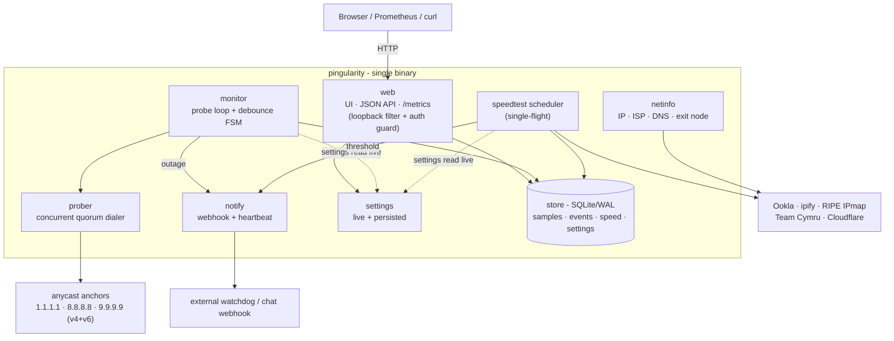
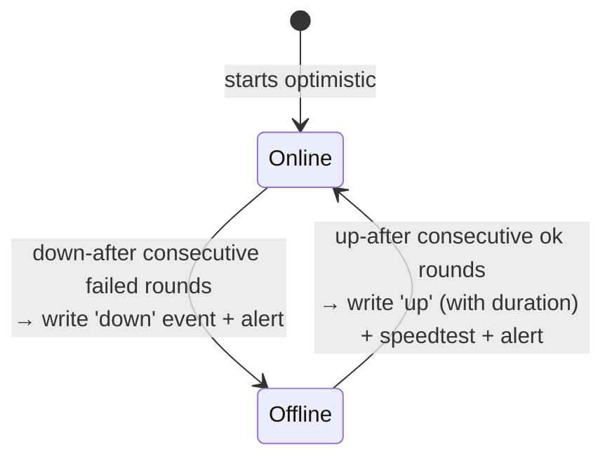
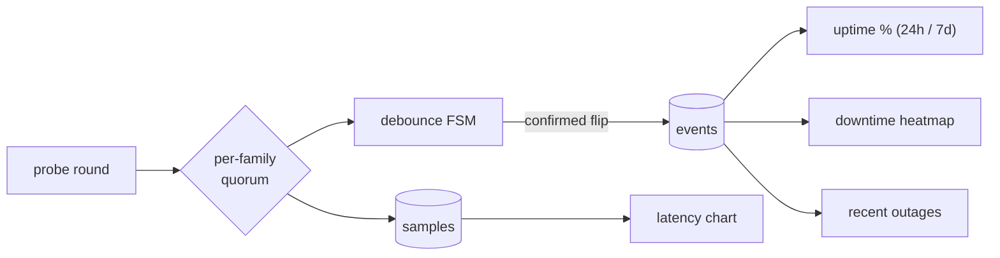
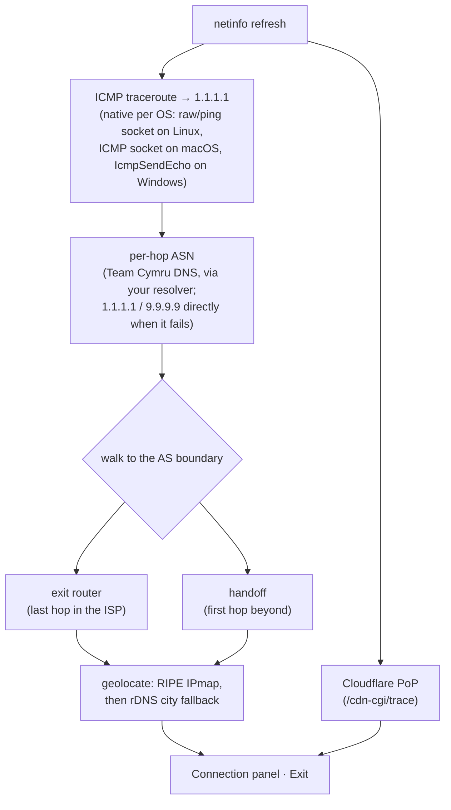
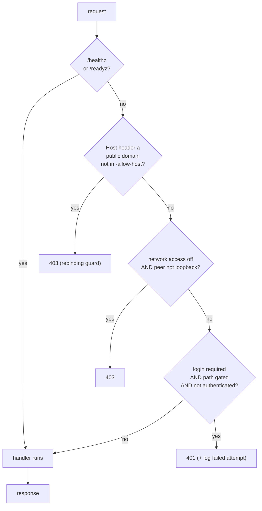

# Architecture

The moving parts inside the binary, how connectivity is judged, what the database holds, and the reasoning behind the defaults.

## IPv4 and IPv6

Connectivity is probed over **both IPv4 and IPv6** (each as an independent
quorum of three anycast anchors). IPv6 is auto-detected - skipped on IPv4-only
hosts - and the families are tracked separately, so an IPv6-only outage is
visible without falsely reporting the whole link down. Overall status is
"online" when *either* family has connectivity. Be precise about where that
shows up: a single-family outage appears in the live status bubbles, the raw
latency samples, and the `monitor.v4_only_down_s` / `monitor.v6_only_down_s`
counters - but **outage events, the downtime heatmap, and the uptime ratios are
driven by the overall state**, so a loss of just one family is not recorded as
downtime there. That is the intended reading of "either family": the link still
carried traffic.

One static binary runs a handful of independent goroutine loops that share a
SQLite store and a live settings controller. Nothing else is required - the UI,
web font, and favicon are embedded; outbound calls are the probes themselves,
optional enrichment (geo/ISP/exit), speedtests (Ookla, or the iperf3 server you
point it at), the update check, and the alert webhook and heartbeat if you
configure them - the full inventory is the outbound-calls table below.

| Package | Responsibility |
| --- | --- |
| `main` | CLI, OS-service lifecycle (`kardianos/service`), wiring |
| `config` | flags, defaults, the anchor target list |
| `prober` | concurrent IPv4/IPv6 quorum dialer |
| `monitor` | probe loop + debounced up/down state machine |
| `store` | SQLite persistence + the uptime/aggregate queries |
| `settings` | runtime-adjustable values, persisted and broadcast live |
| `speedtest` | Ookla + iperf3 testers, single-flight scheduler |
| `netinfo` | public IP/ISP/DNS + exit-node discovery (traceroute) |
| `notify` | webhook alerts + dead-man's-switch heartbeat |
| `web` | embedded UI, JSON API, `/metrics`, access/auth guard |

## How it works

**Connectivity is a debounced state machine.** Every round, the prober dials all
anchors concurrently; each address family is "up" on a strict majority of its
targets, and overall is up when *either* family is. A confirmed flip needs
`down-after` / `up-after` consecutive rounds, which is what suppresses flapping.

Any round that does not meet the threshold leaves the state where it is: a single
bad round while Online, or a run of successes shorter than `-up-after` while
Offline, changes nothing and writes nothing.

**Each round fans out into the raw series and the derived records.** Outage
*events* - not per-probe success - drive uptime and the heatmap, so those views
all agree.

**The store is seven independent time-series tables** (plus a key/value settings
table), tuned for a constant writer with WAL + `synchronous=NORMAL`.

| table | columns |
| --- | --- |
| `samples` | `ts` int · `target` text · `latency_ms` real · `success` int · `family` text |
| `dns` | `ts` int · `latency_ms` real (NULL when the lookup failed) · `success` int |
| `events` | `ts` int · `type` text (`up` \| `down`) · `duration_s` int |
| `pauses` | `ts` int · `duration_s` int - an unobserved span: paused, scheduled-off, or process-down |
| `pauses_quarantine` | `ts` int · `duration_s` int - pause rows held aside by clock repair, returned if the clock corrects |
| `speed` | `ts` int · `down_mbps` `up_mbps` `ping_ms` `jitter_ms` `packet_loss` real · `healthy` int · `server` text · `race_outcome` text (how the centre was chosen: `decided` \| `silent` \| `unanchored` \| `failed` \| `skipped` \| `bypassed_pin`) · `race_origins` text (every city that raced, with its fastest answer) · `race_winner_label` text · `race_winner_ms` real |
| `speed_servers` | `run_ts` int - joins `speed.ts`, one row per candidate in that run's server-selection report · `server_id` text · `rank_ping_ms` real · `score` real · `winner` int · `win_reason` text |
| `settings` | `key` text · `value` text - the key/value table, not a time series |

**Exit-node discovery** traces toward `1.1.1.1`, attributes each hop to an ASN,
and finds the ISP boundary - then geolocates the two boundary hops. The trace is
IPv4-only: on an IPv6-only host the Exit row shows as unavailable, and an
exit-path target that doesn't resolve to an IPv4 address falls back to tracing
the default `1.1.1.1` path (flagged in the UI).

**Every request passes the access guard** before any handler runs, with two
deliberate exceptions: the [`/healthz` and `/readyz` probes](metrics.md#health-endpoints)
are answered ahead of it, so a load balancer hitting a bare IP with no
credentials still gets its verdict (they carry no data to protect). Everything
else meets the DNS-rebinding `Host` check first, then the loopback filter
(judged on the real TCP peer, never the spoofable `X-Forwarded-For`), then
authentication - so a `403` on a public hostname is the rebinding guard talking,
not the filter.

## Design notes

- **Quorum + debounce.** Each round dials several independent anycast anchors and
  applies a majority rule, and a confirmed up/down flip needs `down-after` /
  `up-after` consecutive rounds - so one flapping anchor or a single dropped
  packet can't manufacture a false outage.
- **Address families are independent.** IPv4 and IPv6 are each their own quorum;
  overall status is online when *either* is up, so an IPv6-only outage is
  recorded and shown without falsely reporting the whole link down. (IPv6 is
  skipped entirely on hosts without working IPv6.)
- **Uptime is real downtime, not a probe success rate.** The 24h/7d figures are
  derived from the debounced outage events (so they match the heatmap and outage
  log), clamped to the period actually observed - not the fraction of individual
  probes that succeeded, which would dip whenever a single family flapped.
- **Self-contained on purpose.** Pure-Go SQLite (no cgo) plus an embedded UI, web
  font, and favicon mean a single static binary with no runtime, no CDN, and no
  external database - install and run.
- **SQLite is tuned for a 24/7 writer.** WAL + `synchronous=NORMAL` keep the
  constant probe-write load cheap, a small connection pool lets dashboard reads
  proceed without blocking the writer, and the expensive uptime aggregation is
  cached briefly so the 3-second status poll stays light.
