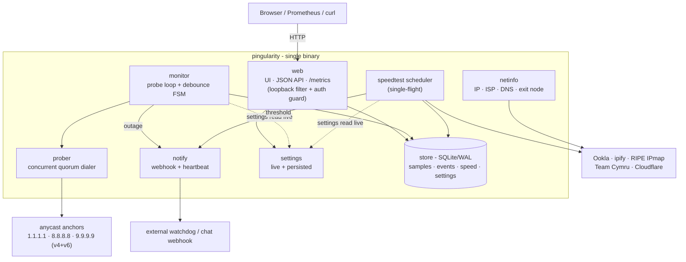
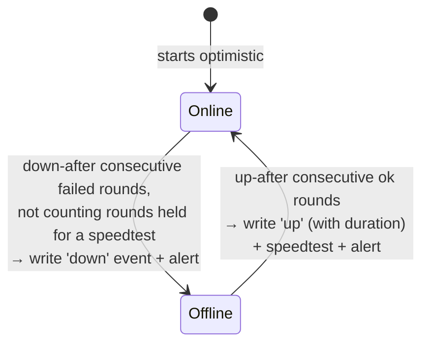
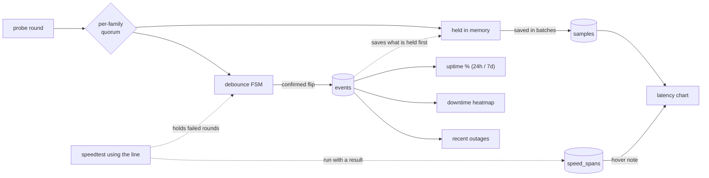
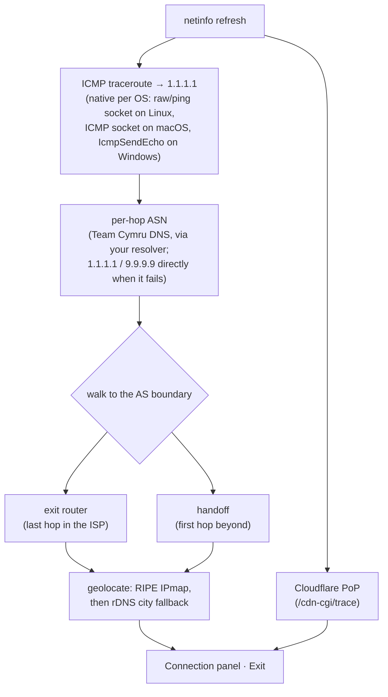
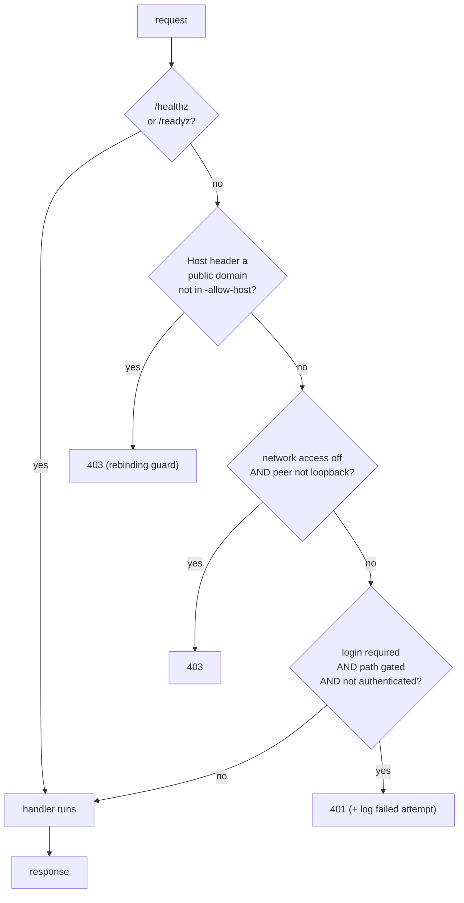

# Architecture

The moving parts inside the binary, how connectivity is judged, what the database holds, and the reasoning behind the defaults.

## IPv4 and IPv6

Connectivity is probed over **both IPv4 and IPv6** (each as an independent
quorum of three anycast anchors). IPv6 is auto-detected - skipped on IPv4-only
hosts - and the families are tracked separately, so an IPv6-only outage is
visible without falsely reporting the whole link down. Overall status is
"online" when *either* family has connectivity. Be precise about where that
shows up: a single-family outage appears in the live status bubbles, the raw
latency samples, and the `monitor.v4_only_down_s` / `monitor.v6_only_down_s`
counters - but **outage events, the downtime heatmap, and the uptime ratios are
driven by the overall state**, so a loss of just one family is not recorded as
downtime there. That is the intended reading of "either family": the link still
carried traffic.

One static binary runs a handful of independent goroutine loops that share a
SQLite store and a live settings controller. Nothing else is required - the UI,
web font, and favicon are embedded; outbound calls are the probes themselves,
optional enrichment (geo/ISP/exit), speedtests (Ookla, or the iperf3 server you
point it at), the update check, and the alert webhook and heartbeat if you
configure them - the full inventory is the outbound-calls table below.

```mermaid
flowchart TB
  browser["Browser / Prometheus / curl"]

  subgraph bin["pingularity - single binary"]
    web["web<br/>UI · JSON API · /metrics<br/>(loopback filter + auth guard)"]
    monitor["monitor<br/>probe loop + debounce FSM"]
    prober["prober<br/>concurrent quorum dialer"]
    sched["speedtest scheduler<br/>(single-flight)"]
    netinfo["netinfo<br/>IP · ISP · DNS · exit node"]
    notify["notify<br/>webhook + heartbeat"]
    settings["settings<br/>live + persisted"]
    store[("store - SQLite/WAL<br/>samples · events · speed · settings")]
  end

  anchors["anycast anchors<br/>1.1.1.1 · 8.8.8.8 · 9.9.9.9 (v4+v6)"]
  ext["Ookla · ipify · RIPE IPmap<br/>Team Cymru · Cloudflare"]
  watchdog["external watchdog / chat webhook"]

  browser -->|HTTP| web
  web --> store
  web --> settings
  monitor --> prober --> anchors
  monitor --> store
  sched --> store
  sched --> ext
  netinfo --> ext
  monitor -. "settings read live" .-> settings
  sched -. "settings read live" .-> settings
  monitor -->|outage| notify
  sched -->|threshold| notify
  notify --> watchdog
```

| Package | Responsibility |
| --- | --- |
| `main` | CLI, OS-service lifecycle (`kardianos/service`), wiring |
| `config` | flags, defaults, the anchor target list |
| `prober` | concurrent IPv4/IPv6 quorum dialer |
| `monitor` | probe loop + debounced up/down state machine |
| `store` | SQLite persistence + the uptime/aggregate queries |
| `settings` | runtime-adjustable values, persisted and broadcast live |
| `speedtest` | Ookla + iperf3 testers, single-flight scheduler |
| `netinfo` | public IP/ISP/DNS + exit-node discovery (traceroute) |
| `notify` | webhook alerts + dead-man's-switch heartbeat |
| `web` | embedded UI, JSON API, `/metrics`, access/auth guard |

## How it works

**Connectivity is a debounced state machine.** Every round, the prober dials all
anchors concurrently; each address family is "up" on a strict majority of its
targets, and overall is up when *either* family is. A confirmed flip needs
`down-after` / `up-after` consecutive rounds, which is what suppresses flapping.

```mermaid
stateDiagram-v2
  [*] --> Online: starts optimistic
  Online --> Offline: down-after consecutive failed rounds,<br/>not counting rounds held for a speedtest<br/>→ write 'down' event + alert
  Offline --> Online: up-after consecutive ok rounds<br/>→ write 'up' (with duration) + speedtest + alert
```

Any round that does not meet the threshold leaves the state where it is: a single
bad round while Online, or a run of successes shorter than `-up-after` while
Offline, changes nothing and writes nothing.

**Rounds our own speedtests overlap are held.** The speedtest scheduler keeps a
counter that moves once as a test's engine starts and once as it returns, so it
is odd exactly while a test is using the network. The monitor reads it before
and after each probe; if it was odd, or moved, a test overlapped the round. A
failed round like that stays in the failing run - it is stored, drawn and
counted in `monitor.bad_rounds` - but does not count toward `down-after`, for
at least two minutes and at least one round, measured from the run's first
failed round. An outage then needs `down-after` failed rounds that were not
held. When one is confirmed that way, it is dated where the build without the
hold dates that failing run: at the round where the run first reached
`down-after`. Only the alert moves later. The same rule holds for the
per-family state (the IPv4/IPv6 pills and `monitor.flap.*`), and the degraded
check treats such a round as having no reading. Rounds kept apart by a gap (a
pause, a suspend, a skipped round) never join one failing run, so the date
never reaches back across one.

**Each round fans out into the raw series and the derived records.** Outage
*events* - not per-probe success - drive uptime and the heatmap, so those views
all agree.

```mermaid
flowchart LR
  round["probe round"] --> quorum{"per-family<br/>quorum"}
  quorum --> held["held in memory"]
  held -->|saved in batches| samples[("samples")]
  quorum --> fsm["debounce FSM"]
  fsm -->|confirmed flip| events[("events")]
  events -.->|saves what is held first| held
  test["speedtest using the line"] -.->|holds failed rounds| fsm
  test -.->|run with a result| spans[("speed_spans")]
  samples --> chart["latency chart"]
  spans -->|hover note| chart
  events --> uptime["uptime % (24h / 7d)"]
  events --> heatmap["downtime heatmap"]
  events --> log["recent outages"]
```

**The store is eight independent time-series tables** (plus a key/value settings
table), tuned for a steady writer that saves in batches, with WAL +
`synchronous=NORMAL`.

| table | columns |
| --- | --- |
| `samples` | `ts` int · `target` text · `latency_ms` real · `success` int · `family` text |
| `dns` | `ts` int · `latency_ms` real (NULL when the lookup failed) · `success` int |
| `events` | `ts` int · `type` text (`up` \| `down`) · `duration_s` int |
| `pauses` | `ts` int · `duration_s` int - an unobserved span: paused, scheduled-off, or process-down |
| `pauses_quarantine` | `ts` int · `duration_s` int - pause rows held aside by clock repair, returned if the clock corrects |
| `speed` | `ts` int · `down_mbps` `up_mbps` `ping_ms` `jitter_ms` `packet_loss` real · `healthy` int · `server` text · `race_outcome` text (how the centre was chosen: `decided` \| `silent` \| `unanchored` \| `failed` \| `skipped` \| `bypassed_pin`) · `race_origins` text (every city that raced, with its fastest answer) · `race_winner_label` text · `race_winner_ms` real |
| `speed_servers` | `run_ts` int - joins `speed.ts`, one row per candidate in that run's server-selection report · `server_id` text · `rank_ping_ms` real · `score` real · `winner` int · `win_reason` text |
| `speed_spans` | `ts` int · `duration_s` int - when a speedtest that produced a result was using the network; only the latency chart reads it (its "During a speedtest" hover note), so it follows the latency retention and clear, and is not exported |
| `settings` | `key` text · `value` text - the key/value table, not a time series |

**Exit-node discovery** traces toward `1.1.1.1`, attributes each hop to an ASN,
and finds the ISP boundary - then geolocates the two boundary hops. The trace is
IPv4-only: on an IPv6-only host the Exit row shows as unavailable, and an
exit-path target that doesn't resolve to an IPv4 address falls back to tracing
the default `1.1.1.1` path (flagged in the UI).

```mermaid
flowchart TB
  refresh["netinfo refresh"] --> trace["ICMP traceroute → 1.1.1.1<br/>(native per OS: raw/ping socket on Linux,<br/>ICMP socket on macOS, IcmpSendEcho on Windows)"]
  trace --> asn["per-hop ASN<br/>(Team Cymru DNS, via your resolver;<br/>1.1.1.1 / 9.9.9.9 directly when it fails)"]
  asn --> boundary{"walk to the AS boundary"}
  boundary --> exit["exit router<br/>(last hop in the ISP)"]
  boundary --> handoff["handoff<br/>(first hop beyond)"]
  exit --> geo["geolocate: RIPE IPmap,<br/>then rDNS city fallback"]
  handoff --> geo
  refresh --> colo["Cloudflare PoP<br/>(/cdn-cgi/trace)"]
  geo --> panel["Connection panel · Exit"]
  colo --> panel
```

**Every request passes the access guard** before any handler runs, with two
deliberate exceptions: the [`/healthz` and `/readyz` probes](metrics.md#health-endpoints)
are answered ahead of it, so a load balancer hitting a bare IP with no
credentials still gets its verdict (they carry no data to protect). Everything
else meets the DNS-rebinding `Host` check first, then the loopback filter
(judged on the real TCP peer, never the spoofable `X-Forwarded-For`), then
authentication - so a `403` on a public hostname is the rebinding guard talking,
not the filter.

```mermaid
flowchart TB
  req["request"] --> hz{"/healthz<br/>or /readyz?"}
  hz -->|yes| handler["handler runs"]
  hz -->|no| rb{"Host header a<br/>public domain<br/>not in -allow-host?"}
  rb -->|yes| d403h["403 (rebinding guard)"]
  rb -->|no| lo{"network access off<br/>AND peer not loopback?"}
  lo -->|yes| d403["403"]
  lo -->|no| au{"login required<br/>AND path gated<br/>AND not authenticated?"}
  au -->|no| handler
  au -->|yes| d401["401 (+ log failed attempt)"]
  handler --> resp["response"]
```

## Design notes

- **Quorum + debounce.** Each round dials several independent anycast anchors and
  applies a majority rule, and a confirmed up/down flip needs `down-after` /
  `up-after` consecutive rounds - so one flapping anchor or a single dropped
  packet can't manufacture a false outage.
- **Our own tests are not outages.** A speedtest fills the line on purpose, so
  probe rounds taken while one runs can fail for that reason alone. They are
  kept as evidence but held from `down-after` for at least two minutes and at
  least one round; failures that outlast the test still become an outage,
  dated where they would have been without it, and only the alert waits.
- **Address families are independent.** IPv4 and IPv6 are each their own quorum;
  overall status is online when *either* is up, so an IPv6-only outage is
  recorded and shown without falsely reporting the whole link down. (IPv6 is
  skipped entirely on hosts without working IPv6.)
- **Uptime is real downtime, not a probe success rate.** The 24h/7d figures are
  derived from the debounced outage events (so they match the heatmap and outage
  log), clamped to the period actually observed - not the fraction of individual
  probes that succeeded, which would dip whenever a single family flapped.
- **Self-contained on purpose.** Pure-Go SQLite (no cgo) plus an embedded UI, web
  font, and favicon mean a single static binary with no runtime, no CDN, and no
  external database - install and run.
- **SQLite is tuned for a 24/7 writer.** WAL + `synchronous=NORMAL` keep the
  steady probe-write load cheap, a small connection pool lets dashboard reads
  proceed without blocking the writer, and the expensive uptime aggregation is
  cached briefly so the 3-second status poll stays light.
- **Latency readings are saved in batches.** A round's samples and its DNS
  reading wait in memory and are written with the rounds around them, in one
  transaction. A round written by itself costs about 4.7 pages of write-ahead
  log. On a dual-stack install at the default 5 second interval that came to
  about 330 MB of writes a day, and six rounds to a save bring it to about
  85 MB. A save runs:
  - when the oldest waiting reading is as old as **Save to disk every** on the
    Latency tab (30 seconds by default, 120 at most, 0 to write every round at
    once);
  - before anything reads the readings: a dashboard or API request,
    `/metrics`, an export;
  - before an outage event, a pause or a speedtest result is written, so none
    of them is ever on disk ahead of the readings taken before it;
  - before a cleanup, a **Delete now** or a restore;
  - when 8,192 readings are waiting;
  - when the daemon stops.

  An open dashboard polls every 3 seconds, and a scraper may poll faster than
  the interval. Each poll saves what is waiting, so the daemon then writes
  about as often as it did before. The saving is for the hours nobody is
  looking. A crash or a power cut loses the readings that were waiting, up to
  the chosen number of seconds of them. Outage events are written at once and
  are never delayed. If the database is busy with a long write, such as a
  restore or a big delete, a request does not wait for it: after a tenth of a
  second it is answered from what is already saved, and the readings are
  written once the database is free. A save that fails keeps its readings in
  memory and is tried again every 5 seconds. Setting the interval to 0 while
  readings wait through failed saves does not drop them: they are retried
  until they are written, and the rounds that arrive meanwhile wait behind
  them.
- **Charts read in time order.** A latency chart reads its window's samples
  through the time index and adds them up into buckets in Go, rather than asking
  SQLite to group them. The rows arrive already in order, so a wide chart needs
  no sort and writes no temp files.
- **Cleanup works in small steps.** The hourly retention cleanup deletes old
  rows a chunk at a time and leaves the database alone for a moment after each
  full chunk, so probe writes get their turn in between. A large cleanup (after
  lowering retention, a long power-off or a restore of old rows) takes longer
  this way, up to a few minutes, and cannot block probe writes while it runs.
  At the default cadence an hour of rows is less than one chunk, so the usual
  cleanup never waits. Outages are removed whole: a chunk never ends between a
  `down` and its `up`. A cleanup stopped by a shutdown keeps what it has
  removed, and the next one removes the rest.
- **Cleanup waits for a clock it can trust.** Every retention cutoff comes
  from the clock, so a clock set wrong would delete history that should stay.
  Cleanup is skipped while the clock reads earlier than 2023 (a board with no
  clock battery, before time sync), and for six hours after the clock jumps by
  more than 15 minutes. A jump is measured against the boot clock
  (`CLOCK_BOOTTIME` on Linux, `CLOCK_MONOTONIC` on macOS), which nothing can
  set and which keeps counting while the computer sleeps, so a laptop that
  sleeps is not taken for a clock that jumped when pingularity runs directly
  on the laptop. On Windows Go's own clock counts sleep already. The six hours
  count time asleep too, as they always did on Windows. Inside a virtual
  machine on a laptop (Docker Desktop, WSL2, Lima) a sleep still reads as a
  jump: the virtual machine's clocks stop while the laptop sleeps, the boot
  clock with them, and its time sync sets the clock forward at wake.
  `db.prune_skipped_clock` on `/metrics` counts the skipped passes.
- **An outage keeps its end when its samples go.** A restart in the middle of
  an outage leaves its `down` with no `up`: the process that wrote it stopped,
  and the next one starts out assuming the link is up. Only the latency
  samples then show when the link came back. Before the hourly cleanup removes
  those samples, and before **Delete now** removes all of them, the outage is
  given an `up` at that second with its observed length. The uptime figures,
  the heatmap and the digest read the same afterwards, and the outage list
  shows the recorded end. The cleanup only reaches samples older than the
  retention window, 30 days by default. **Delete now** reaches the present, so
  it leaves alone every outage the running monitor opened: the monitor may
  still be counting the `up-after` good rounds it needs, or waiting to write
  its `up`, and it records the end itself. If the `up` cannot be written, the
  delete deletes nothing. Such a close decides what to write from what it read
  first, so it takes turns with every other change to the outages but the
  monitor's: another close, the delete of one outage, the downtime **Delete
  now**, the cleanup's sweep of old outages and a restore's outage history. Run
  in between, one of those could leave an outage with two ends, or an end with
  no outage. A restore takes one turn for its whole downtime category, the
  outages and the paused time after them, however many batches of 5,000 rows
  they come in. Taken batch by batch, a close between two batches gave an
  outage whose `up` was still to come a second end, and one between the
  outages and the paused time counted as downtime the time a restarted process
  was not running, which a close takes out of the length it writes only once
  the paused time is in. So a close, an outage delete or a cleanup that comes
  while a restore is sending its outage history waits for the rest of it:
  about a quarter of a second for 20,000 outage rows on a laptop, plus the time
  the upload itself takes. The monitor's own writes never wait for a close or
  a restore.
- **Disk space is reused, not given back.** The main file is never compacted:
  deleted rows leave free pages, and new rows fill them before the file grows.
  The write-ahead log beside it stays near 4 MB in ordinary running. A reader
  that holds its place (an export, a wide chart) can make it grow while a big
  cleanup runs. Every connection carries a size limit of 8 MiB, so the log is
  cut back to that once it restarts, inside whichever commit restarts it,
  which is usually a probe round's. After a cleanup or a delete of 200,000
  rows or more the log is also emptied, when no reader or writer is using it.
  That step never fails the cleanup or the delete.
