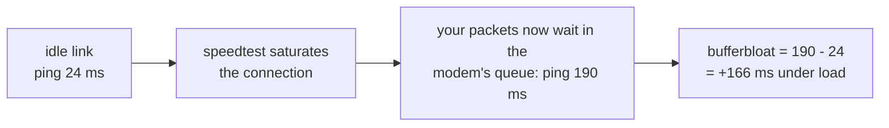

# Speedtests

What a speed test run measures and records, the Ookla and iperf3 engines, when tests run, how an Ookla server is chosen, and what changes for iperf3 inside a container.

A run records download, upload, ping, **jitter**, (best-effort) **packet loss**,
and **bufferbloat**, plus the bytes used and the connection it ran on (public IP,
ISP, DNS resolver). A run also records two facts that used to be
invisible: the **address family** the transfer actually used (IPv4, IPv6, or
`mixed` when one run genuinely used both) - read back from the run's own
connections, never guessed - and **which direction** its
loss/jitter probe sampled. Not every field is present on every run: a download-only
or upload-only run has no figures for the direction it skipped, packet loss is
optional and not always measurable, family and probe direction are recorded
only when the run really established them (the engine notes below say when
that is), and bufferbloat is absent when a transfer
phase was too short to sample, returned too few samples, the latency target
was unreachable, or too few idle probes survived the retransmit filter to leave a
baseline. That last case drops the figure on purpose: a single retransmit in the
idle number is worth about a second, enough on its own to cancel real bloat down
to zero, so a polluted baseline would report a clean link instead of an
unmeasurable one. Missing is stored as missing rather than as a zero, so charts
and thresholds can tell "not measured" from "measured, and it was bad". A run
that failed outright isn't a measurement at all: it is kept only as a flagged
data-usage row, which every measurement view filters out (see the data-usage
bullet under [Metrics](metrics.md)).

The **ping** shown is the engine's own number, a mean over ten samples, so it
keeps matching what speedtest.net would report. A mean has no defence against an
outlier, though: one stalled handshake among nine fast ones reports several times
the real latency (and lands in jitter, which is their standard deviation, as a
much larger distortion still). So the run also keeps the **fastest** of those
same samples - no extra probes - and everything that *decides* on latency uses
that floor instead: which city wins the race for the centre, which server every
automatic run ranks first (and whether last run's server keeps its seat within
the max(2 ms, 15 %) band), which server wins a best-of round, which server the
very first run picks, and whether your ping threshold breached. A pothole shouldn't
pick your server or page you, but a genuinely distant link has a high floor too
and still breaches. iperf3 exposes no per-sample values of its own, so a run
measures the latency itself: five bare TCP handshakes to the server before the
transfer, reported as their **median** (if none of them land, iperf3's own
`min_rtt`, and failing that the idle baseline). There is no separate fastest
figure on those runs, so that median is both what is shown and what decides.

**Bufferbloat** is the extra lag that appears only while the line is busy - the
reason a video call breaks up the moment a big download starts. Pingularity
measures it by pinging before the test (idle) and during it (loaded) - both
against a fixed target of its own (`one.one.one.one`, Cloudflare) rather than
the speedtest server, so only the gap between them is meaningful, and the idle figure will not match the **ping**
recorded above:

Both figures are **medians** of their probes - the idle one over only the probes
that survive a retransmit filter, since on an unloaded link a sample more than
500 ms above that burst's own minimum is an OS retry rather than latency. A burst
whose own fastest probe is already at or above a second holds no honest sample to
measure the rest against, and yields no baseline at all. The loaded phases keep
theirs, where a near-second sample is the bloat itself. The headline bufferbloat
number - the one the tiles show and the one your **max bufferbloat** threshold is
compared against - is `median(loaded) - median(idle)`. The chart also plots a
**p95** per direction, the sustained bad end of the distribution. p95 is
deliberately not the maximum: these are TCP-connect probes, and a single worst
sample on one is usually a SYN retransmission (a fixed ~1000 ms OS retry, and
~2000 ms for a second one) rather than queue delay, so a max-based number
reports round figures that say more about packet loss than about buffering. The
probes go to a fixed dual-stack name, and the address family that wins their
connection race is not taken on trust - a path that drops half its handshakes
still wins races constantly, and its retries would land in the baseline. So the
winner is graded with a short burst first, and only if that burst comes back
lossy is the other family resolved and measured, taking the job only if it grades
cleaner. A host reachable in just one family keeps it however lossy: lossy data
beats none.

There are two engines, picked in the settings drawer:

- **Ookla (speedtest.net)** - the default. Numbers match speedtest.net; no setup.
  Its own knobs: parallel connections (`0` = auto, which is one per logical CPU
  for downloads and at most 8 for uploads; a value you set instead applies to
  both directions, up to 16 - worth raising on a fast or high-latency link, or in
  a small VM that can only see two cores) and the packet-loss probe.
- **iperf3** - opt-in, run against your own `iperf3 -s` box (LAN, homelab, or
  VPS). It measures what Ookla can't: internal/LAN links and honest upload. Used
  only when the `iperf3` binary is installed (otherwise it falls back to Ookla) -
  present on a native install once you've installed iperf3 (a Homebrew, MacPorts
  or Linuxbrew one is found even though the service starts with a bare `PATH`),
  and in the container only in the `-iperf` image variant, not the default image.
  Its own knobs: parallel streams, duration, warm-up, TCP window, congestion
  control, MSS, DSCP, the loss/jitter UDP pass, and - per server - IP version,
  bind source, and optional RSA auth. Congestion control and MSS are Linux (and
  FreeBSD) knobs: macOS and Windows cannot set either, so the daemon runs with the
  system default there and says so once in the log. The TCP window is the kernel's
  to grant, not iperf3's - about 8 MB on stock macOS (`kern.ipc.maxsockbuf`), a few
  hundred KB on stock Linux until `net.core.rmem_max`/`wmem_max` are raised - and a
  window past that fails the run with a message naming the setting, the KB it asked
  for and the sysctl to raise. In a bridged container several of those knobs point
  at things only the host has - see
  [iperf3 in a container](#iperf3-in-a-container) below.

**Direction** (both / download / upload, plus iperf3's simultaneous `--bidir`) and
**retries** (default `1`, at most `3`) are kept **per engine**: the Ookla and iperf3
tabs each carry their own pair, so tuning one never disturbs the other, and
switching engines switches which pair is in force. Releases before 0.100 shared
a single pair: an iperf3 field with no value of its own followed Ookla's. So
the first start after upgrading writes the values iperf3 had been taking from
Ookla under iperf3's own names and says so on stderr (a start that cannot write
to the database runs with those values anyway, warns that it could not record
them, and tries again at the next settings load) - nothing about your runs
changes, and an older build reads those same values back if you step down. A
field that was following an Ookla value nobody had saved - the shipped default -
has nothing to carry and stays unwritten, and there the two releases part company
once Ookla's direction or retries move, on either of them: an older build hands
that field Ookla's value at every start, this one keeps iperf3's default. So if
you step down to a release before 0.100, check the iperf3 direction and retries
after the step and again after coming back up. A database created by 0.70 or
later that 0.100.0-rc.1 has already started is past the carry: that release took
the database's record of its own birth to mean the pair was already split, so
an iperf3 field still following Ookla's came up at the shipped default there
and stays there until you set it. Restoring a settings backup taken before
0.100 is not an upgrade either: an iperf3 field that was still following Ookla's
is in the file only as Ookla's, so that is where the restore puts it and the
iperf3 field keeps whatever this install already had. When the backup names
the release that wrote it, the restore says which of those values differ from
what iperf3 runs here, and what this install keeps instead. A field the backup
holds a value of its own for - a save from the settings drawer on those releases
wrote one whenever the value iperf3 was running differed from the shipped
default - restores like any other setting. On Ookla, retries are also what
let a very slow uplink finish at all: when parallel upload streams are too slow for
any of them to complete inside the capture window, the retry falls back to a single
stream. Set Ookla's retries to `0` and that fallback cannot run, so on a link that
slow the upload always fails and records nothing. The run's download half is kept
either way - a "both" run that loses only its upload stores its download, ping and
jitter as a partial result, with the upload shown as unmeasured (the same contract
iperf3 has always had) - and the warning in the log says why and names the setting.

That UDP pass needs the iperf3 port open for **UDP as well as TCP** - the same
port, both protocols (`ufw allow 5201/tcp` and `ufw allow 5201/udp`, or the
equivalent security-group rules). Allowing only TCP is the usual reason a server
reports throughput perfectly while loss and jitter stay blank forever: the
control connection and both transfers are TCP and connect fine, and the UDP
datagrams are dropped without a refusal, so the pass waits out its window and
gives up. The daemon logs `iperf3 udp pass failed, loss and jitter unrecorded`
each time, and when the run's TCP transfers succeeded it names the firewall as
the likely cause. Nothing is retried later, so runs taken while the port was
closed have no loss or jitter to recover.

For iperf3, the separate UDP loss/jitter pass probes the same direction you
test: downstream normally, upstream for an upload-only run - so a one-direction
test on an asymmetric line reports loss for the direction you asked about. That
also means loss and jitter describe **one direction per run**, never both, and
loss on an asymmetric path genuinely differs by direction - so each sample now
records which way its probe ran. The loss and jitter readouts name the path on
hover, the run tooltip carries it in its Quality line, and it's exported as
`udp_direction` (`down`/`up`) in the API and CSV. An Ookla run records a
direction too: its packet-loss probe sends the datagrams from the client to
the server, so a probe that succeeded is recorded as `up`. Runs that never
measured loss/jitter - either engine's - and rows recorded before the field
carry no direction and are shown unlabeled rather than guessed at.

## iperf3 in a container

A bridged container (the default `docker run`/compose network) has its own
network namespace: its own `localhost`, its own interfaces and addresses, its
own `/etc/hosts`, and NAT between it and everything else. Several iperf3
settings are **host-referential** - they name things that exist on the host but
not inside that namespace. All of them fail loudly rather than mismeasure
quietly, and when the daemon knows it runs in a container, most of the failures
carry a container-specific explanation in the error itself (natively the same
errors mean exactly what they say, and get no such note):

- **A loopback server address** (`localhost`, `127.0.0.1`, `::1`) - inside a
  bridged container that is the *container*, so the connection is refused by
  the container's own (empty) loopback before it ever reaches the `iperf3 -s`
  on the host. The settings drawer warns as soon as a saved
  server points at loopback while the daemon runs bridged (a host-network
  container's loopback *is* the host, so it never warns there; it never blocks
  saving either - the operator may really mean the container), and a failed run's
  error explains the same thing. Use `host.docker.internal` (see the compose
  file below) or the host's LAN IP.
- **Server names the host resolves privately** - entries in the host's
  `/etc/hosts` and mDNS `.local` names resolve natively but not in a bridged
  container, which has its own hosts file and no mDNS responder. The run fails
  with iperf3's own name-resolution error (no container-specific hint for this
  one - the daemon can't tell a host-private name from a typo). Use an IP, or
  a name the container's DNS resolves.
- **Bind source = a host IP** (`--bind`) - the address doesn't exist in the
  container's namespace, so the bind fails ("cannot assign requested
  address"), and the error says so. Bind a container address instead, or use
  host networking.
- **Bind source = a host interface name** (`--bind-dev`) - interface names
  don't cross network namespaces, so it fails ("no such device"), and the
  error says so. Separately, on kernels older than 5.7 `SO_BINDTODEVICE`
  needs `CAP_NET_RAW`, which the `-iperf` image's `iperf3` deliberately does
  not have (the capability is stamped on the `pingularity` binary alone - see
  [docs/security-model.md](https://github.com/pingular/pingularity/blob/main/docs/security-model.md)) - so on those kernels
  `--bind-dev` fails in the container even for an interface that does exist
  inside it. Native installs are unaffected: the deb/rpm unit's *ambient*
  `CAP_NET_RAW` carries into the iperf3 child.
- **IP version = IPv6** - the default Docker bridge carries no IPv6 (unless
  you've enabled it in the daemon config), so a forced IPv6 run fails outright
  ("network unreachable"), and the error says why. The quieter half of the
  same problem is **Auto**: it doesn't fail, it silently measures IPv4 where a
  dual-stack native install would measure IPv6. That is why a run records the
  family its transfers actually used - shown beside the server in the runs
  table and run tooltip, exported as `ip_family` (`4`/`6`/`mixed`) in the API
  and CSV. iperf3 reads it back from each direction's own connection report,
  and `mixed` means the download and upload really landed on different
  families (dual-stack DNS can do that) - labeled `IPv4+IPv6` in the UI
  rather than picking a side. Ookla runs record it from the transfer's real
  connections; a run with no recordable connection - for example one carried
  entirely through an operator's proxy, where only the hop to the proxy is
  visible - stays empty, never guessed, like rows recorded before the field
  existed. An Ookla `mixed` claims less than an iperf3 one: a single recorder
  spans both directions *and* every retry there, so it means both families
  showed up somewhere in the run's transfers - a retried attempt landing on the
  other family is enough, and the two directions need not have differed.

Two more things a bridged container changes without any error at all:

- **MTU.** The Docker bridge defaults to an MTU of 1500 no matter what the
  uplink uses, so over a tunnel or PPPoE uplink with a smaller effective MTU,
  full-size packets fragment along the way. The UDP loss/jitter probe now
  sends **1200-byte datagrams** (1200 + 8 UDP + 40 IPv6 = 1248, under the
  1280-byte IPv6 minimum MTU), so the probe itself can't fragment on any sane
  path - container or not - and its loss figure can't be fabricated by dropped
  or late fragments. An oversized **MSS** setting doesn't error here either:
  the kernel silently clamps it to what the interface takes.
- **LAN line rate.** Bridged traffic crosses a veth pair and conntrack NAT,
  which costs real CPU per packet - against a fast LAN server the measured TCP
  rate can sit measurably below native line rate, most visibly at
  multi-gigabit speeds. The number honestly describes the container's network
  path; it just isn't the host's.

And one setting empties rather than fails: the **congestion control**
dropdown's suggestions come from
`/proc/sys/net/ipv4/tcp_allowed_congestion_control`, which exists only in the
host's initial network namespace - a bridged container can't see it, so the
dropdown arrives with no suggestions, and the UI now says why instead of
letting the empty list read as "this host supports no algorithms". An
algorithm you type or import is still passed to iperf3 unchanged.

**`--network=host` makes nearly all of this go away** on Linux Docker Engine:
the container shares the host's namespace, so loopback is the host, host IPs
bind, IPv6 works, multicast reaches the wire, and LAN tests measure at native
line rate. Two caveats survive it: `.local` *name resolution* still depends on
the image's own resolver (debian-slim has no mDNS module - prefer an IP or
`host.docker.internal`), and on kernels older than 5.7 an interface-name bind
still fails in the container (the capability note above). It is already the recommended way to run the container (see
[Docker](install.md#docker) - including why Docker Desktop can't provide it).

The canonical compose file for the iperf3-enabled image lives at
[install.pingularity.dev/compose-iperf.yaml](https://install.pingularity.dev/compose-iperf.yaml) -
fetch it from there rather than copying a block from this README: the served
file is pinned to the image version it was published with and carries the
current comments, so it cannot drift from the daemon the way an inline
snapshot here could. Three of its pieces are the ones this section is about:

- It defaults to **`network_mode: host`**, for all the reasons above.
- Its `extra_hosts: ["host.docker.internal:host-gateway"]` maps
  `host.docker.internal` to the host's gateway address, so an `iperf3 -s`
  running on the host is reachable from the container by that name on Linux
  Docker Engine too (Docker Desktop resolves the name on its own).
- If you must stay bridged (published ports, Docker Desktop without host
  networking, an orchestrator that owns the network), it keeps the fallback
  as a commented **pair** - `ports: ["9000:9000"]` together with
  `environment: ["PINGULARITY_ACCESS=network"]`. Uncomment both or neither: a
  published port alone answers `403`, because every install starts private
  (see [Docker](install.md#docker)) - and set a login when you opt in.

One honest caveat either way: a test against an `iperf3 -s` on the **same
machine** measures the container-to-host virtual path (or loopback, under
host networking), not any real network - fine as a smoke test, useless as a
line measurement.

## Scheduling and triggers

Scheduled speedtests are **off by default** - turn them on in the Speedtest
settings (or with `-speedtest`). Once enabled, they run on startup and on a
schedule (`-speedtest-interval`, default `1h`). Two extra triggers are governed
separately: a test runs **after a reconnect** (on by default;
`-speedtest-on-reconnect=false` to disable) - spaced out so a flapping line
cannot fire tests back to back: at most one reconnect test per
`-speedtest-interval`, or per 15 minutes when that interval is shorter. There is
also an optional **while degraded**
toggle in the Speedtest settings (off by default, needs scheduled tests on) that
fires a test when latency stays high without the link fully dropping - above
**Degraded above** (default `150` ms, `0` = off) for two probe rounds in a row,
re-arming once latency recovers. **Run now** (or `POST /api/speedtest`) always
works.

Only one speedtest runs at a time, and the triggers do not queue behind each
other. If a **scheduled** slot comes due while any other test is already
running, that slot is **skipped** and the schedule advances to the next one - it
is not retried, and not run late (the counter
`pingularity_stat_total{stat="speed.scheduled_skipped"}` records it). A slot
held back by a **closed window** or a **busy link** behaves the opposite way:
nothing was measured, so it keeps polling and fires as soon as the condition
clears. "Busy" is traffic on the busiest interface above **Busy above** (default
`5` Mbps) - and unlike the alert thresholds, `0` is not "off" here: it makes any
measurable traffic count as busy, so scheduled tests stop firing. Only scheduled
runs consult it; reconnect, degraded and **Run now** go regardless.

## Choosing an Ookla server

For Ookla, choose a server (Find by place or Ookla ID, then pick its row) or
leave **Auto - fastest near you**. A row badged **Unsupported** cannot be
chosen: that server has no HTTP speedtest endpoint (Ookla's legacy upload
path), so every test against it would fail - clicking it says so in the
footer instead of selecting it, and typing its ID into Find lists it with the
badge rather than pinning it (hover the badge for the reason). Such a server
can still be starred, and a server that is already chosen keeps its radio
even if it later earns the badge, so the picker never hides what the next run
will use. That badge comes from a cheap check - fetching the server's latency
file - which a host whose *upload* endpoint refuses everything still passes.
Those only reveal themselves when a run tries them, so when one refuses every
upload the daemon stops offering it to automatic selection for twelve hours,
and remembers that across a restart. A server that comes back and refuses
everything again earns a longer rest each time - twelve hours, then a day,
then three - because re-admitting a still-broken server costs a whole
measurement turn to rediscover. It is never permanent: a repaired server is
back within three days on its own, and one that has behaved for a week starts
over at twelve hours. Auto isn't just "nearest": every server that's effectively equidistant gets to race
(in a big city, a dozen providers all sit "0 km away" - one of each is pinged
rather than an arbitrary few, and the same rule seeds each candidate city's
six in the city race that picks the centre, with distance ties broken by the
echo the server list itself came back with) and the lowest latency wins -
judged on the **floor** of each server's ten probes, not their mean, because one
stalled probe among nine fast ones moves a mean by 20 ms and a floor by nothing
(the city race and the Best-of verdict use the same floor, so the three
decisions agree). Your own ISP's
server, when Ookla lists one nearby **and the sponsor name can be matched to
your ISP**, is guaranteed a place in the race - traffic to it never leaves your
provider's network, so it's the most likely winner - but it still has to win on
ping like everyone else. (That match is a name heuristic: if your ISP is unknown
or trades under a different name than it sponsors servers under, its server
simply competes on distance like any other.) Two ties are broken deliberately
rather than by jitter: a run **keeps the server the last automatic run
measured** while it is still among the servers this run pings (the winning
city's list, seeded as above) and still pings within max(2 ms, 15 %) of the
fastest (win reason `incumbent` when that kept it ahead of a faster server;
plain `fastest_ranked` when it was the fastest anyway), and failing that prefers your
ISP's own server inside the same band (`on_net`) - so the history compares
like with like instead of flipping between equivalent servers, while a server
that has gone bad loses its seat the run it goes bad, because the seat is
re-pinged every run rather than remembered - and an incumbent the winning
city's list does not carry is not pinged at all, and loses the seat the same
way. A server that still *pings* well but can no longer be **measured** - it
answers, then moves no bytes - is the one case pinging cannot see, and a
failed run records no winner for the next run to learn from, so it would hold
its place indefinitely, hourly, with nothing to alert you: the next ranked
candidate rides behind whichever server an automatic run leads with, is
measured when that one cannot be, and takes the place itself (win reason
`fallback`, counter `speed.head_failed`). The run after it leads with the
server that answered, so the failure usually costs one wasted attempt and no
more - though only while that server pings within the same hair of the fastest
that the paragraph above describes. Further out it cannot be preferred over a
faster-pinging server, so the wasted attempt repeats each run until the broken
one recovers or slows down; either way a real measurement is now recorded every
time, where before there was none. A pinned server has no fallback: the pin is
your answer to this question. Ping alone
never learns whether a rival is *faster* to transfer, so after every twelve
automatic tests (any unpinned Ookla run counts; the challenge itself lands on
the next *scheduled* single-server run, and with **Best of** above 1 it never
does, because every round already measures rivals) the run measures the
incumbent's strongest rival instead - one server, no extra data - and the
rival takes the seat only if its one score clears a bar set by the
incumbent's own last dozen same-direction runs: their median plus 15 %, or
their second-best hour if that is higher. So on a steady wired line the rival
needs a clear 15 % win; on a link whose runs swing by a fifth it has to beat
what the incumbent itself reaches on a good hour, or one lucky hour would
steal the seat and the next challenge would steal it back - nobody has to
know their link's noise as a number, the record already says it. A score that
lands more than three times the incumbent's good hour is not treated as a win
at all: one reading has no round to be disbelieved against, and a server that
buffers and acknowledges an upload without delivering it can report several
times the line - so it is judged as the record's median instead and keeps the
seat where it is. The reading itself is still recorded as the test's result;
what the daemon declines to do is hand a seat to a number the line cannot
carry. A fresh seat
needs three runs of record before it is challenged at all, and changing the
test direction starts that record afresh. There is nothing to set: the
cadence is `speed_challenge_every` on the settings API (default 12; 0 turns
the challenger off) and is deliberately not in the drawer. If the rival cannot be measured the incumbent is measured as the
fallback and the attempt still counts. Win reasons `challenger` (tried,
lost), `challenger_won` and `challenger_failed` record it; the
`speed.challenge` / `speed.challenge_won` / `speed.challenge_failed` counters
count it. The **centre** of that search is
measured, not guessed: the candidate cities your connection names - your
**ISP's exit-router city** (found by traceroute), the city your **IP's
geolocation** puts you in, the cities of any servers you have **starred**, the
city that **won the last race** (so a lookup going dark cannot make Auto
forget where its servers are - it is a candidate like the others, and still
has to win), and the one **speedtest.net itself** places you in -
each enter six of their nearest servers (at most five of the cities with a
coordinate of their own are fetched, in the order listed - with the exit and
ISP cities both known that leaves room for stars in three cities, and past it
the last race's city is dropped first, then further starred cities;
speedtest.net's own placement is never displaced) - seeded the way a run's own ranking
is, so a metro whose servers all sit "0 km" apart contributes one per provider
and your ISP's box rather than six by chance - into one deduplicated ping race, and the
city whose server answers fastest becomes the centre. (Ookla returns the
servers *around* a coordinate, so a different centre yields a genuinely
different list rather than the same one reordered - picking the wrong city can
hide the fast servers entirely, which is why it's raced. The lists usually
overlap, and where two candidate cities are close enough to be
interchangeable they collapse, so a server never gets to race twice.) The race
does the run's homework as it goes: the winning city's list and the pings the
race already took are what the run ranks, so it fetches nothing twice and only
pings the servers the race did not reach. Its verdict - which cities raced,
each one's fastest answer, which won and why - is recorded on the run (the
**Centre** column of the runs table; hover it for every city) so a surprising
city is explainable afterwards - and the muted tag after the server name
(`incumbent`, `challenger won`, `pinned`, …) says why that server was the one
measured; hover it for the rule. Searching a place in the picker only moves
the list you are looking at; nothing but a pinned server overrides the race.
